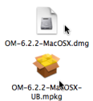
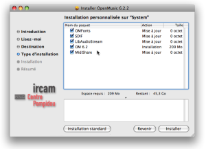
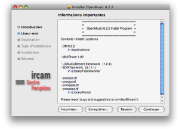

# Mac OS X

Sommaire

  1. System Configuration
  2. Installation
  3. External applications
  4. Uninstallation

## System Configuration

OM 6 is distributed for Macintosh Intel or PPC computers on Mac OS X systems.
It currently runs on Macintosh Intel or PPC computers (Mac OS X 10.4 and
higher).

## Installation

Procedure

|

  1. Double click on the .dmg file to mount the OM installer 

  2. Open the  .mpkg package.

  
  
---|---  
  
Follow the directions of the installer :

  1. Select a destination folder.

  2. Select the `Standard Installation`, or the `Personnalized Installation` to select specific elements to install with OM. 

|

[zoom](../res/installmac-content_scr_1.png "Zoom \(nouvelle fenêtre\)")  
  
---|---  
  
Installed Items

[zoom](../res/installmac-message_scr_1.png "Zoom \(nouvelle fenêtre\)")

|

The following items should be installed on your computer :

  * OM Application : `Applications / OM-6.X.X Application `

  * Midishare utilities and libraries : `Applications / Midishare `

Midishare is MIDI support used for rendering and processing external musical
data and resources. These must be installed prior running OM to include their
corresponding functionalities.

  * Musical fonts : `Library / Fonts`

    * omicron.ttf
    * omheads.ttf
    * omextras.ttf
    * omsign.ttf

These fonts are used by OM score editors.

  * Dynamic libraries[1] for MIDI : `System / Library / Frameworks`

    * SDIF.framework
    * LibAudioStream.framework

These libraries are used by OM for sound rendering and processing.
LibAudioStream is used for playing and representing sounds.

  
  
---|---  
  
## External applications

External applications may be necessary to play sounds or manipulate sound
analysis files when using OM. These tools are :

  * Microplayer : a microtonal player in Max/MSP for the rendering of musical objects using extra sound fonts.
  * [Multiplayer](http://www.music.mcgill.ca/~marlon/OMPrisma/OMPrisma/Multiplayer "http://www.music.mcgill.ca/~marlon/OMPrisma/OMPrisma/Multiplayer \(nouvelle fenêtre\)") : an application for interactive playback of the multichannel files
  * [ SDIF-Edit](http://recherche.ircam.fr/equipes/repmus/bresson/sdifedit/sdifedit "http://recherche.ircam.fr/equipes/repmus/bresson/sdifedit/sdifedit \(nouvelle fenêtre\)") : a 3D editor for SDIF sound description files visualization.

Some OM libraries also use external sound processing or synthesis tools to
manipulate or generate audio files :

  * [SuperVP](http://anasynth.ircam.fr/home/english/software/supervp "http://anasynth.ircam.fr/home/english/software/supervp \(nouvelle fenêtre\)") and [Pm2](http://anasynth.ircam.fr/home/english/software/pm2 "http://anasynth.ircam.fr/home/english/software/pm2 \(nouvelle fenêtre\)") : two sound processing kernels dedicated to sound analysis-synthesis. SuperVP is the kernel of [Audiosculpt](http://anasynth.ircam.fr/home/english/software/audiosculpt "http://anasynth.ircam.fr/home/english/software/audiosculpt \(nouvelle fenêtre\)") and based on Fast Fourier Transform. Pm2 performs a partials analysis based on the additive model. They can be downloaded via the [Ircam Forumnet](http://forumnet.ircam.fr/363 "http://forumnet.ircam.fr/363 \(nouvelle fenêtre\)"). 

  * [Csound](http://www.csounds.com/docs "http://www.csounds.com/docs \(nouvelle fenêtre\)"): a general a sound synthesis and signal processing system. It can be downloaded on the [Csound](http://www.csounds.com/downloads "http://www.csounds.com/downloads \(nouvelle fenêtre\)") website.
  * etc.

## Uninstallation

The elements above must be removed by the user :

  * select the items and press `Cmd` \+ `Backspace`
  * drop them in the trash manually.

References :

  1. Library

A library is a set of tools, or framework, used by an application - like OM -
to execute specific tasks.

Plan :

  * [OpenMusic Documentation](OM-Documentation)
  * [OM 6.6 User Manual](OM-User-Manual)
    * [Introduction](00-Sommaire)
    * [System Configuration and Installation](Installation)
      * Mac OS X
      * [Windows](InstallationWindows)
    * [Going Through an OM Session](Goingthrough)
    * [The OM Environment](Environment)
    * [Visual Programming I](BasicVisualProgramming)
    * [Visual Programming II](AdvancedVisualProgramming)
    * [Basic Tools](BasicObjects)
    * [Score Objects](ScoreObjects)
    * [Maquettes](Maquettes)
    * [Sheet](Sheet)
    * [MIDI](MIDI)
    * [Audio](Audio)
    * [SDIF](SDIF)
    * [Lisp Programming](Lisp)
    * [Errors and Problems](errors)
  * [OpenMusic QuickStart](QuickStart-Chapters)

Navigation : [page precedente](Installation "page précédente\(System
Configuration and Installation\)") | [page suivante](InstallationWindows
"page suivante\(Windows\)")

