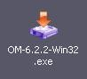
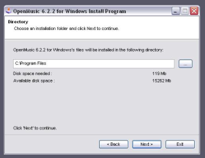
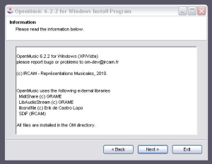
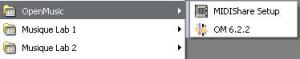
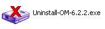

Navigation : [Previous](InstallationMac "page précédente\(Mac OS
X\)") | [Next](Goingthrough "Next\(Going Through an OM
Session\)")

# Windows

Sommaire

  1. System Configuration
  2. Installation
  3. Installed Items
  4. Uninstallation

## System Configuration

OM currently runs on Windows XP/Vista/7.

## Installation

Procedure

Double click on the executable file icon  to launch the installer.

|

  
  
---|---  
  
Installation Folder

The OM default installation folder is `C:/Program Files/OM x.x.x/`. Another
location can be chosen for the installation.

|

[zoom](../res/install3_scr_1.png "Zoom \(nouvelle fenêtre\)")  
  
---|---  
  
## Installed Items

Application, Libraries and Fonts

[zoom](../res/install2_scr_1.png "Zoom \(nouvelle fenêtre\)")

|

The following elements will be installed in the OM `C:/Program Files/OM
x.x.x/` folder :

  * OM Application : `OM 6.X.X.exe` application file.

  * External libraries[1] : ")

    * [Midishare](http://midishare.sourceforge.net/ "http://midishare.sourceforge.net/ \(nouvelle fenêtre\)") (C) GRAME
    * [libsndfile](http://www.mega-nerd.com/libsndfile/ "http://www.mega-nerd.com/libsndfile/ \(nouvelle fenêtre\)") (C) Erik de Castro Lopo
    * [SDIF](http://sdif.sourceforge.net/ "http://sdif.sourceforge.net/ \(nouvelle fenêtre\)") Library (C) IRCAM
    * [LibAudiostream](http://libaudiostream.sourceforge.net/ "http://libaudiostream.sourceforge.net/ \(nouvelle fenêtre\)") (C) GRAME

  
  
---|---  
  
Musical fonts will be installed in ` C:/Windows/Fonts`.

  * omicron.ttf
  * omheads.ttf
  * omextras.ttf
  * omsign.ttf

Shortcuts

|

Two shortcuts are created when installing OM :

  * one on the desktop

  * one as an item of the  `Start` menu.

The `Start` menu also includes a shortcut for the Msdrivers.exe application,
which can be used for the MIDI ports configuration prior lauching OM.  
  
---|---  
  
External Applications

External applications compatible with OM on Mac OS are not available on
Windows.

## Uninstallation

Use the executable file that was created in the `C:/Program Files`.

|

  
  
---|---  
  
References :

  1. Library

A library is a set of tools, or framework, used by an application - like OM -
to execute specific tasks.

Plan :

  * [OpenMusic Documentation](OM-Documentation)
  * [OM User Manual](OM-User-Manual)
    * [Introduction](00-Sommaire)
    * [System Configuration and Installation](Installation)
      * [Mac OS X](InstallationMac)
      * Windows
    * [Going Through an OM Session](Goingthrough)
    * [The OM Environment](Environment)
    * [Visual Programming I](BasicVisualProgramming)
    * [Visual Programming II](AdvancedVisualProgramming)
    * [Basic Tools](BasicObjects)
    * [Score Objects](ScoreObjects)
    * [Maquettes](Maquettes)
    * [Sheet](Sheet)
    * [MIDI](MIDI)
    * [Audio](Audio)
    * [SDIF](SDIF)
    * [Lisp Programming](Lisp)
    * [Errors and Problems](errors)
  * [OpenMusic QuickStart](QuickStart-Chapters)

Navigation : [Previous](InstallationMac "page précédente\(Mac OS
X\)") | [Next](Goingthrough "Next\(Going Through an OM
Session\)")

