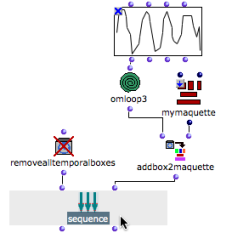
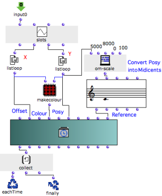
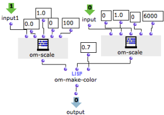
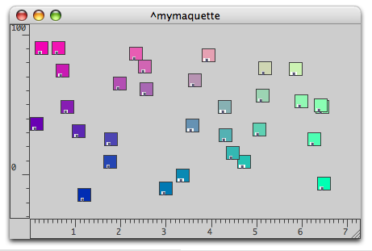
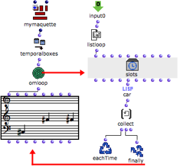
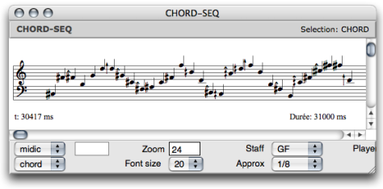

Navigation : [Previous](REF5 "page précédente\(Interaction
\(1\)\)") | [Next](Sheet "Next\(Sheet\)")

# TemporalBoxes Interaction : Examples (2)

## Determining Colour and Pitch From "Posy" and "Offset"

The " **posy** " of TemporalBoxes in the maquette can be applied to both
**pitches** and  **colour** of the boxes. The graphic appearance of the
maquette may be more or less musically significant.

Program

|

The position of the boxes is determined by a BPF. The same BPF is used for
determining their pitch and colour. OMLoop iterates this operation to apply it
to the a series of boxes located in a maquette.

  1. Boxes are added in the maquette when evaluating Addbox2maquette. Sequence and removealltemporalboxes "clean" the maquette at each evaluation, before new boxes are added. 

  2. OMLoop is returned the value of the points in the BPF. Coordinates allow to modify the TemporalBoxes colour on one hand, and their musical value on the other hand.

  
  
---|---  
  
OMLoop

The "colour program" used in the [preceding example](addexamples) is
integrated in an internal patch.

  1. y-points are returned by listloop to om-scale successively : the pitch of a note object is defined.

  2. X and y-points are returned to the "make-colour" patch, to the "offset" and to the "posy" inputs of the temporalbox instance : the colour, offset and "posy" are defined.

  3. At each step of the loop, collect stores the value of a TemporalBox. 

  4. At the end of the loop, a list of values is returned to addbox2maquette by finally.

Inside the "make-colour" patch, x-points and y-points are converted into red
and green values.

|

  
  
---|---  
  
Resulting Maquette

The result is visible after evaluating sequence. The corresponding musical
sequence can be visualized with a small program.

## Musical Sequence

Program

|

Temporalboxes is connected to the output of the maquette. OMLoop returns the
series of pitches produced by the TemporalBoxes to a chord-seq.

  1. Listloop returns the successive values of each TemporalBoxes to a corresponding slots box. This value is a note. 

  2. The "value" of slots is returned to car so that we get a list of notes. Otherwise, we would get a list of lists, which cannot produce a chord-seq, by convention.

  3. Collect stores the successive notes values

  4. Finally returns the resulting list of values. 

  
  
---|---  
  
Resulting Sequence

The evaluation of the chord-seq box in the patch yields the following sequence
:

References :

Contents :

  * [OpenMusic Documentation](OM-Documentation)
  * [OM User Manual](OM-User-Manual)
    * [Introduction](00-Contents)
    * [System Configuration and Installation](Installation)
    * [Going Through an OM Session](Goingthrough)
    * [The OM Environment](Environment)
    * [Visual Programming I](BasicVisualProgramming)
    * [Visual Programming II](AdvancedVisualProgramming)
    * [Basic Tools](BasicObjects)
    * [Score Objects](ScoreObjects)
    * [Maquettes](Maquettes)
      * [Creating a Maquette](Maquette)
      * [TemporalBoxes](TemporalBoxes)
      * [The Maquette Editor](Editor)
      * [Maquette Programming](Programming%20Maquette)
      * [Maquettes in Patches](Maquettes%20in%20Patches)
        * [Build Mode](Build)
        * [Functional Mode](Maquettes%20in%20Patches1)
        * [Reference Mode](Maquettes%20in%20Patches2)
          * [Adding TemporalBoxes](addprocedure)
          * [Examples](addexamples)
          * [Accessing Boxes](REF3)
          * [Removing Boxes](REF4)
          * [Interaction (1)](REF5)
          * Interation (2)
    * [Sheet](Sheet)
    * [MIDI](MIDI)
    * [Audio](Audio)
    * [SDIF](SDIF)
    * [Reactive mode](Reactive)
    * [Lisp Programming](Lisp)
    * [Errors and Problems](errors)
  * [OpenMusic QuickStart](QuickStart-Chapters)

Navigation : [Previous](REF5 "page précédente\(Interaction
\(1\)\)") | [Next](Sheet "Next\(Sheet\)")

