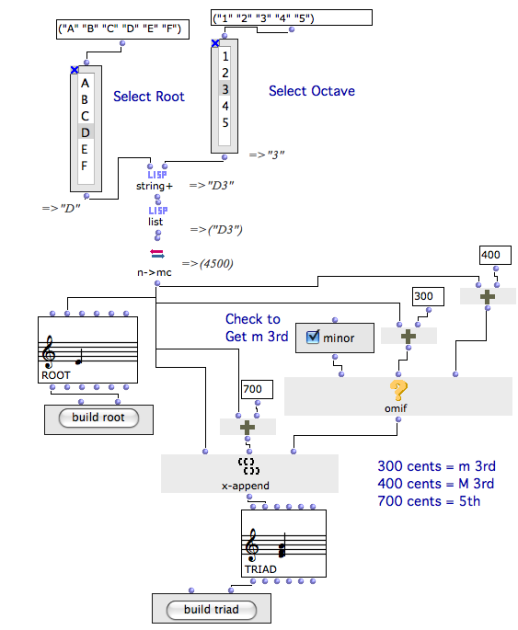
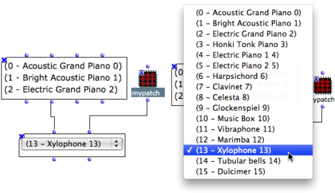
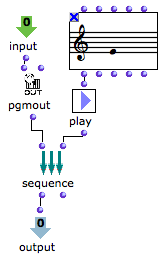

Navigation : [Previous](MenuBoxes "page précédente\(Pop-Up Menu
Box\)") | [Next](Files "Next\(Files\)")

# Using the Interface Boxes : Example

## Building a Triad with an Item-List-Box, a Button-Box, and a Check Box

 A minor or major triad is created with three interface boxes : multiple-
items-list-box, button-box, and check-box.

  * On the left the `build note!` button calls a series of boxes :

    1. two list-boxes allow to choose a note name from A to G, and an octave index, from 1 to 5.

    2. the resulting reference is returned as a list with three lisp functions to  n->mc[1] , 

    3. n->mc returns a midicents value to a  chord box.

  * On the right, the `build chord!` button calls another series of boxes :

    1. The `minor` check box is checked and returns "true" to [OMIF](OMIF), 

    2. OMIF returns 300, which makes a minor third. If it isn't checked, OMIF returns the value of a major third - 400 mc.

    3. The value of the root is added with 300 and 700 to build a minor triad, via two om+ boxes.

    4. The resulting values are gathered by x-append into one single list and returned to a chord box.

Note

As  n->mc returns **a list** , we have to use a  chord box, and not a  note
box, to create the root of the chord. A  note box doesn't accept lists, but
atoms.

## Choosing and Listening to a Sound with a Pop-Up-Menu Box

Arguments of the Pop-Up-Menu

This pop-up box returns two types of results :

  * Input #1 is connected to a [textfile](textfile) box, which contains a **list of midi channel names** . When output #1 is evaluated, it returns the **midichannel number**. 

  * Input #2 is connected to a lambda patch, which can **play the sound of a selected sample**.

About MIDI Functions in OM

  * [MIDI](MIDI)

Inside the Lambda Patch

|

A  sequence function evaluates two elements successively :

  1. The  pgm-out function sets the MIDI program from the midichannel index value passed as argument to the lambda patch.

  2. The  play function plays a note with the chosen midi sound.

The action programmed in the patch is executed when an item is selected in the
pop-up-menu box.  
  
---|---  
  
References :

  1. n->mc

Converts a note name or list of note names into corresponding midi cents
values. The reference is the standard notation, where the medium C (6000
midicents) = C3.

Contents :

  * [OpenMusic Documentation](OM-Documentation)
  * [OM User Manual](OM-User-Manual)
    * [Introduction](00-Contents)
    * [System Configuration and Installation](Installation)
    * [Going Through an OM Session](Goingthrough)
    * [The OM Environment](Environment)
    * [Visual Programming I](BasicVisualProgramming)
    * [Visual Programming II](AdvancedVisualProgramming)
      * [Abstraction](Abstraction)
      * [Evaluation Modes](EvalModes)
      * [Higher-Order Functions](HighOrder)
      * [Control Structures](Control)
      * [Iterations: OMLoop](OMLoop)
      * [Instances](Instances)
      * [Interface Boxes](InterfaceBoxes)
        * [General Features](GeneralFeatures)
        * [Text Boxes](TextBoxes)
        * [Check Box](CheckBox)
        * [List Boxes](ListBoxes)
        * [Button](Button)
        * [Slider Box](Slider)
        * [Pop-Up Menu Box](MenuBoxes)
        * Examples of Use
      * [Files](Files)
    * [Basic Tools](BasicObjects)
    * [Score Objects](ScoreObjects)
    * [Maquettes](Maquettes)
    * [Sheet](Sheet)
    * [MIDI](MIDI)
    * [Audio](Audio)
    * [SDIF](SDIF)
    * [Reactive mode](Reactive)
    * [Lisp Programming](Lisp)
    * [Errors and Problems](errors)
  * [OpenMusic QuickStart](QuickStart-Chapters)

Navigation : [Previous](MenuBoxes "page précédente\(Pop-Up Menu
Box\)") | [Next](Files "Next\(Files\)")

