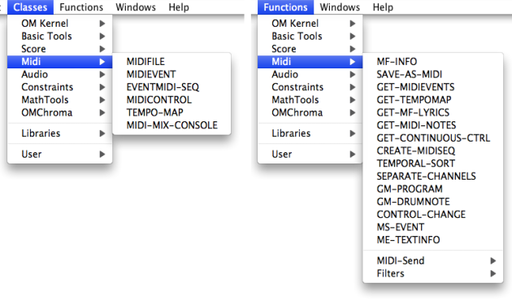

Navigation : [Previous](MIDI "page précédente\(MIDI\)") | [page
suivante](MIDI-Concepts "Next\(Important MIDI Concepts\)")

## The MIDI Protocol

MIDI stands for Musical Instrument Digital Interface. It is a music industry
standard **communication protocol** that lets MIDI instruments, sequencers,
computers and other electronic equipment to synchronize and communicate with
each other in order to play and record music. MIDI **does not transmit any
audio signal** : It can be considered as a set of musical **command messages**
(note on/off, volume or other effect control, clock signals, etc.), which
electronic instruments send to control each other.

MIDI data are commonly stored and interchanged in files following the MIDI
Standard Format.

About MIDI

[http://www.midi.org/aboutmidi/](http://www.midi.org/aboutmidi/
"http://www.midi.org/aboutmidi/ \(nouvelle fenêtre\)")

## MIDI in OpenMusic

The MidiShare Library

In OpenMusic, musical objects are played or recorded with MIDI using the
**MidiShare library**. In a basic configuration, MIDI messages are sent by
OpenMusic via MidiShare to the default built-in MIDI device of the computer.
However, other MIDI instruments, such as synthesizers, expanders, samplers can
be connected to the application - see [MIDI ports setup](MIDI-Ports)).

About MIDIShare

[http://midishare.sourceforge.net/](http://midishare.sourceforge.net/
"http://midishare.sourceforge.net/ \(nouvelle fenêtre\)")

The OpenMusic MIDI Tools

The MIDI classes and functions allow the control of the communication between
OpenMusic and MIDI instruments or applications from OM patches.

It includes MIDI data analysis, filter, conversion tools.

All MIDI items are accessed via the `Classes - Functions / MIDI` menu.

References :

Plan :

  * [OpenMusic Documentation](OM-Documentation)
  * [OM 6.6 User Manual](OM-User-Manual)
    * [Introduction](00-Sommaire)
    * [System Configuration and Installation](Installation)
    * [Going Through an OM Session](Goingthrough)
    * [The OM Environment](Environment)
    * [Visual Programming I](BasicVisualProgramming)
    * [Visual Programming II](AdvancedVisualProgramming)
    * [Basic Tools](BasicObjects)
    * [Score Objects](ScoreObjects)
    * [Maquettes](Maquettes)
    * [Sheet](Sheet)
    * [MIDI](MIDI)
      * Introduction
      * [Important MIDI Concepts](MIDI-Concepts)
      * [Rendering and Playback](MIDI-Playback)
      * [MIDI Objects](MIDI-Objects)
    * [Audio](Audio)
    * [SDIF](SDIF)
    * [Lisp Programming](Lisp)
    * [Errors and Problems](errors)
  * [OpenMusic QuickStart](QuickStart-Chapters)

Navigation : [Previous](MIDI "page précédente\(MIDI\)") | [page
suivante](MIDI-Concepts "Next\(Important MIDI Concepts\)")

