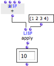

Navigation : [Previous](EvOnceMode "page précédente\(Evaluate-Once
Mode\)") | [Next](RefMode "Next\(Reference Mode\)")

# Lambda Mode

## Properties

The "lambda" mode plays a major part in the design of complex programs, and is
used in various configurations. Boxes on "lambda" mode return functions.
Hence, a box on "lambda" mode doesn't perform a calculation and yields a
result, but will yield **itself as a function** when the evaluation takes
place.

|

The om+ box doesn't return the result of an addition, but an "anonymous"
function.  
  
---|---  
  
Procedure

To set a box on "lambda" mode, select it, press `b` and click twice on the
upper left cross. A small λ letter  icon
appears.

## Use

Higher Order Functions and Functional Arguments

Some functions wait for arguments that are not as simple as numbers or lists.
In particular, **higher-order functions** are functions whose arguments **are
functions themselves** , or which **return functions** as resulting values.

To be used as a functional argument, a box must be set on "lambda" mode. It is
then called a "lambda function".

Higher-Order Programming in OM

  * [Higher-Order Programs and Functions](HighOrder)

Example

For instance, apply is a higher-order Lisp function that applies a functional
argument, which must be a function, to a second argument, which must be a list
containing the arguments to pass to the function. Here, apply applies + to a
list of numbers.

|

  
  
---|---  
  
References :

Contents :

  * [OpenMusic Documentation](OM-Documentation)
  * [OM User Manual](OM-User-Manual)
    * [Introduction](00-Contents)
    * [System Configuration and Installation](Installation)
    * [Going Through an OM Session](Goingthrough)
    * [The OM Environment](Environment)
    * [Visual Programming I](BasicVisualProgramming)
    * [Visual Programming II](AdvancedVisualProgramming)
      * [Abstraction](Abstraction)
      * [Evaluation Modes](EvalModes)
        * [Lock Mode](LockMode)
        * [Evaluate-Once Mode](EvOnceMode)
        * Lambda Mode
        * [Reference Mode](RefMode)
      * [Higher-Order Functions](HighOrder)
      * [Control Structures](Control)
      * [Iterations: OMLoop](OMLoop)
      * [Instances](Instances)
      * [Interface Boxes](InterfaceBoxes)
      * [Files](Files)
    * [Basic Tools](BasicObjects)
    * [Score Objects](ScoreObjects)
    * [Maquettes](Maquettes)
    * [Sheet](Sheet)
    * [MIDI](MIDI)
    * [Audio](Audio)
    * [SDIF](SDIF)
    * [Reactive mode](Reactive)
    * [Lisp Programming](Lisp)
    * [Errors and Problems](errors)
  * [OpenMusic QuickStart](QuickStart-Chapters)

Navigation : [Previous](EvOnceMode "page précédente\(Evaluate-Once
Mode\)") | [Next](RefMode "Next\(Reference Mode\)")

