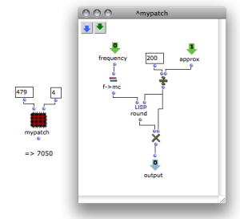
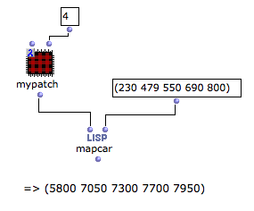

Navigation : [Previous](Mapcar "page précédente\(Mapcar -
Iterations\)") | [Next](LambdaTest "Next\(Test
Functions\)")

# Lambda Mode Examples: Lambda Patches

Predefined functions on "lambda" mode may not always be adapted for higher-
order processes. [Patch boxes](AbsBoxes) can also be set on [ "lambda"
evaluation mode](LambdaMode) : they can represent more flexible
functional arguments.

**Any patch** designed to process data can be used as a lambda function and
perform its process in a higher-order function.

Example

|

This patch converts a frequency (Hz) in a midicent value and rounds it to the
closest fraction of a tone expressed in midicents. Note that a tone represents
200 midicents.

  * The frequency value is assigned to the first input.

  * The fraction is defined in the second input. 

In this case, 479Hz = 7048. This value is rounded to the closest 1/4 tone,
that is, 200/4 = 50.  
  
---|---  
  
The same patch box can be used on lambda mode with  mapcar in order to process
a list of input values.  Mapcar applies a function to the items of one or more
lists, successively.

|

  
  
---|---  
  
The mapcar function

  * [Lambda Mode Examples: Mapcar \- Iterations](Mapcar)

References :

Plan :

  * [OpenMusic Documentation](OM-Documentation)
  * [OM User Manual](OM-User-Manual)
    * [Introduction](00-Sommaire)
    * [System Configuration and Installation](Installation)
    * [Going Through an OM Session](Goingthrough)
    * [The OM Environment](Environment)
    * [Visual Programming I](BasicVisualProgramming)
    * [Visual Programming II](AdvancedVisualProgramming)
      * [Abstraction](Abstraction)
      * [Evaluation Modes](EvalModes)
      * [Higher-Order Functions](HighOrder)
        * [Using Functions as Data](Funcall)
        * [Mapcar \- Iterations](Mapcar)
        * Lambda Patches
        * [Test Functions](LambdaTest)
      * [Control Structures](Control)
      * [Iterations: OMLoop](OMLoop)
      * [Instances](Instances)
      * [Interface Boxes](InterfaceBoxes)
      * [Files](Files)
    * [Basic Tools](BasicObjects)
    * [Score Objects](ScoreObjects)
    * [Maquettes](Maquettes)
    * [Sheet](Sheet)
    * [MIDI](MIDI)
    * [Audio](Audio)
    * [SDIF](SDIF)
    * [Lisp Programming](Lisp)
    * [Errors and Problems](errors)
  * [OpenMusic QuickStart](QuickStart-Chapters)

Navigation : [Previous](Mapcar "page précédente\(Mapcar -
Iterations\)") | [Next](LambdaTest "Next\(Test
Functions\)")

