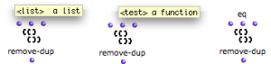
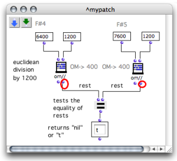

Navigation : [Previous](LambdaPatch "page précédente\(Lambda
Patches\)") | [Next](Control "Next\(Control
Structures\)")

# Lambda Mode Examples: Test Functions

Some functions have a **test** argument. This test argument determines the way
the function operates on data. For instance, it can set comparaison rules for
a sorting process, conditions to fulfill reject items from a list, etc.

This test can therefore be modified by specifying a function, or more
generally a lambda function, which allows to modify the behaviour of the
initial function.

Example : Removing Duplicates in a List

The remove-dup function tests if the items of a list are **equal**
**pairwise** , and if so, removes duplicates from the pair.

  * Its first argument is a list.

  * Its second argument is a **test function**. This test function determines the nature of the "equal" test. It has a default value : **'eql**. Values are compared with the Lisp  eql function. 

|

  
  
---|---  
  

removing duplicates : One of the two occurences of 6300 has been removed from
the input list.

Defining a New Test Function

We would like to remove octaves from a list of pitches, but there is no such
function in OM. To do so, we can use remove-dup with **a new test function**
that can detect octaves in the input pitch list. For instance, the previous
example has two duplicates : 6000 and 7200, a C4 and a C5.

Values can be considered equal according to the octave interval, if they are
compared modulo[1] the octave interval .

Note that an octave = 1200 cents.

The following patch tests if the pitches are equal **modulo an octave** with
the function om//.

  * The first output of om// returns **the quotient** of the division.

  * The second output returns **the remainder** of the division. 

The =  predicate tests if the remainders of the division by 1200 of two
elements are equal, that is, if these two elements are equal modulo 1200.

|

  
  
---|---  
  
Modulo and Octave

  * Two values are "equal the same modulo" when their division by the **same divisor** produces the **same remainder** . 

An octave = 1200 cents. If two values are "equal modulo 1200" they have an
octave relation. This mieans that an euclidean division by 1200 should return
the same remainder.

  * For instance : C4 is equal to 6000, C5 to 7200. F#4 is equal to 6400, F#5 to 7600.

C4 : (6000 / 1200) = 5, **remainder 0**

C5 : (7200 / 1200) = 6, **remainder 0**

|

F#4 : (6400 / 1200) = 5, **remainder 4**

F#5 : (7600 / 1200) = 6, **remainder 4**  
  
---|---  

Modifying the Function Behaviour

The new test function can now become the  test argument and replace the
defautt  eql test of  remove-dup .

  * The patch, now on ["lambda" mode](LambdaMode) is connected to remove-dup as a test argument.

  * The two inlets of the patch indicate that the lambda function takes two arguments.

Remove-dup can now remove all values whose modulo 1200 is equal to the modulo
1200 of another value.

Lambda Patch

  * [Lambda Mode Examples: Lambda Patches](LambdaPatch)

General Issues with Lambda Functions

  * [Higher-Order Programs and Functions](HighOrder)

References :

  1. Modulo

In computing, the modulo operation finds the **remainder** of division of one
number by another. If two numbers,  a and  b , when divided by the same  n
**divisor** , have the same remainder, they are **" equal modulo  n ".**

-> If remainder ( a  /  n ) = remainder ( b /  n ),  a =  b , modulo  n . 

Contents :

  * [OpenMusic Documentation](OM-Documentation)
  * [OM User Manual](OM-User-Manual)
    * [Introduction](00-Contents)
    * [System Configuration and Installation](Installation)
    * [Going Through an OM Session](Goingthrough)
    * [The OM Environment](Environment)
    * [Visual Programming I](BasicVisualProgramming)
    * [Visual Programming II](AdvancedVisualProgramming)
      * [Abstraction](Abstraction)
      * [Evaluation Modes](EvalModes)
      * [Higher-Order Functions](HighOrder)
        * [Using Functions as Data](Funcall)
        * [Mapcar \- Iterations](Mapcar)
        * [Lambda Patches](LambdaPatch)
        * Test Functions
      * [Control Structures](Control)
      * [Iterations: OMLoop](OMLoop)
      * [Instances](Instances)
      * [Interface Boxes](InterfaceBoxes)
      * [Files](Files)
    * [Basic Tools](BasicObjects)
    * [Score Objects](ScoreObjects)
    * [Maquettes](Maquettes)
    * [Sheet](Sheet)
    * [MIDI](MIDI)
    * [Audio](Audio)
    * [SDIF](SDIF)
    * [Reactive mode](Reactive)
    * [Lisp Programming](Lisp)
    * [Errors and Problems](errors)
  * [OpenMusic QuickStart](QuickStart-Chapters)

Navigation : [Previous](LambdaPatch "page précédente\(Lambda
Patches\)") | [Next](Control "Next\(Control
Structures\)")

