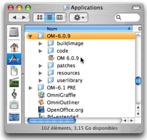
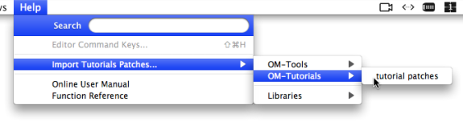

Navigation : [Previous](Goingthrough "page précédente\(Going
Through an OM Session\)") | [Next](Workspace(s) "page
suivante\(Workspace(s) Management\)")

# Launching OM

## Start Up

The OM application -  **OM X.X.X** - is located in
the `OM` folder.

  * A standard installation locates this folder in the  `Applications` folder (MacOS X) or in `C:/Program Files/` (Windows). 
  * A custom installation allows to locate the `OM` folder in any desired directory. 

|

  
  
---|---  
  

|

OM can also be started from an alias anywhere in the machine hard drive or
from the dock.

To start the application, double click on the OM icon.  
  
---|---  
  
## Creation of a Workspace

An OM session begins with the opening of a workspace[1], a working environment
which is used at a session.

OM Start Up Dialogue Window

The OM dialogue window allows to choose or create a workspace. A name and
location are chosen by the user when creating a new
workspace.[Zoom](../res/InstalWindow_scr_1.png "Zoom \(nouvelle fenêtre\)")

The start up dialogue window opens after starting OM. It offers three options
:

  * **`Open a workspace` **

This workspace must already be located in you hard drive. Any existing
workspace can be open with this option. Pick the workspace root directory in
the dialogue window.

  * **`Create a new workspace` **

Choose a name and location in order to create a workspace, which will then
open automatically.

  * **`Open previous workspace` **

Refers to the workspace that was open at the last session. This option is not
available for a first use.

Workspace(s) in the OM Environment, Workspaces Management :

  * [Workspace](Workspace)
  * [Workspace(s) Management](Workspace\(s\))

Former Ircam Workspaces

If you already have some experience with OM, note that the Ircam workspaces
whose installation was previously offered are not available anymore. The
tutorial patches contained in these workspaces can now be imported
independently to any current workspace via the `Help` menu.

Loading Tutorial Patches - Former Ircam Workspaces

  * [Examples Patches and Tutorials](Tutorials)

Workspaces Location

Workspaces must be created in the user's home directory or one of its sub
folders. Creating a workspace without writing permission can cause important
crashes and data loss.

References :

  1. Workspace

OpenMusic's working environment. Each session starts with choosing a
workspace, the equivalent of a desktop where programs are created and
organized, and where items can be stored.

Plan :

  * [OpenMusic Documentation](OM-Documentation)
  * [OM User Manual](OM-User-Manual)
    * [Introduction](00-Sommaire)
    * [System Configuration and Installation](Installation)
    * [Going Through an OM Session](Goingthrough)
      * Launching OM
      * [Workspace(s) Management](Workspace\(s\))
      * [Quitting OM and Saving](QuittingSaving)
    * [The OM Environment](Environment)
    * [Visual Programming I](BasicVisualProgramming)
    * [Visual Programming II](AdvancedVisualProgramming)
    * [Basic Tools](BasicObjects)
    * [Score Objects](ScoreObjects)
    * [Maquettes](Maquettes)
    * [Sheet](Sheet)
    * [MIDI](MIDI)
    * [Audio](Audio)
    * [SDIF](SDIF)
    * [Lisp Programming](Lisp)
    * [Errors and Problems](errors)
  * [OpenMusic QuickStart](QuickStart-Chapters)

Navigation : [Previous](Goingthrough "page précédente\(Going
Through an OM Session\)") | [Next](Workspace(s) "page
suivante\(Workspace(s) Management\)")

