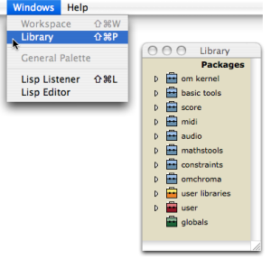

Navigation : [Previous](WS-ImportExport "page précédente\(Import /
Export\)") | [Next](Packages "Next\(Packages\)")

# Library

The Library window encloses the OM programming tools, which are organized in
**packages** and  **sub packages** . They can be used in various OM documents.
These tools are classes[1], functions[2] and methods[3], among which a number
can be created by the user.

To open the Library window, use the main menu or shortcut :

  * select `Windows / Library`
  * press `SHIFT`\+ `Cmd` \+ `p`.

|

  
  
---|---  
  
References :

  1. Class

A category of objects sharing common properties - characteristics and
behaviour. A class specifies the internal structure and behaviour of an
object. In OM, it is represented in a patch by a factory box that can produce
an instance of a class.

See also : Object, Instance

  2. Function

A  portion of code within a larger program, which performs a specific task.
Operates upon 0 or more parameters and returns a value.

  3. Method

An elementary function or part of a generic function defining rules for its
behaviour depending on a type of argument. Defining a generic function amounts
to defining at least one method.

For instance, the OM+ function is made of four methods : 1. number + list / 2.
list + number / 3. number + number / 4. list + list

Plan :

  * [OpenMusic Documentation](OM-Documentation)
  * [OM User Manual](OM-User-Manual)
    * [Introduction](00-Sommaire)
    * [System Configuration and Installation](Installation)
    * [Going Through an OM Session](Goingthrough)
    * [The OM Environment](Environment)
      * [Environment Windows](MainWindows)
      * [Preferences](Preferences)
      * [Workspace](Workspace)
      * Library
        * [Packages](Packages)
        * [Extra Libraries](UserLibraries)
      * [Tutorials](Tutorials)
      * [Resources](resources)
    * [Visual Programming I](BasicVisualProgramming)
    * [Visual Programming II](AdvancedVisualProgramming)
    * [Basic Tools](BasicObjects)
    * [Score Objects](ScoreObjects)
    * [Maquettes](Maquettes)
    * [Sheet](Sheet)
    * [MIDI](MIDI)
    * [Audio](Audio)
    * [SDIF](SDIF)
    * [Lisp Programming](Lisp)
    * [Errors and Problems](errors)
  * [OpenMusic QuickStart](QuickStart-Chapters)

Navigation : [Previous](WS-ImportExport "page précédente\(Import /
Export\)") | [Next](Packages "Next\(Packages\)")

