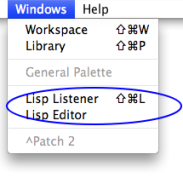

Navigation : [Previous](SDIF-Write "page précédente\(Writing SDIF
Files\)") | [Next](LispIntro "Next\(Introduction to
Lisp\)")

# Lisp Programming

OpenMusic is a visual programming language entirely built on top of the
[Common Lisp](https://common-lisp.net/
"https://common-lisp.net/ \(nouvelle fenêtre\)")
programming language. Hence, the visual environment can be linked with this
underlying language in many different ways.

Programming in Lisp is sometimes a convenient and efficient way to work with
OM, where all Lisp-programmed tools and modules can be accessed and used.

|

OM has two main interfaces to Lisp : The Listener[1] window and the Lisp
editor. These two windows are accessible from the `Windows` menu.  
  
---|---  
  
References :

  1. Lisp Listener

A Lisp communication interface displaying results of computations, warnings or
error messages, and where Lisp expressions - programs - can be evaluated.

Contents :

  * [OpenMusic Documentation](OM-Documentation)
  * [OM User Manual](OM-User-Manual)
    * [Introduction](00-Contents)
    * [System Configuration and Installation](Installation)
    * [Going Through an OM Session](Goingthrough)
    * [The OM Environment](Environment)
    * [Visual Programming I](BasicVisualProgramming)
    * [Visual Programming II](AdvancedVisualProgramming)
    * [Basic Tools](BasicObjects)
    * [Score Objects](ScoreObjects)
    * [Maquettes](Maquettes)
    * [Sheet](Sheet)
    * [MIDI](MIDI)
    * [Audio](Audio)
    * [SDIF](SDIF)
    * [Reactive mode](Reactive)
    * Lisp Programming
      * [Introduction to Lisp](LispIntro)
      * [The Lisp Editor](LispEditor)
      * [The Listener](LispListener)
      * [Lisp Code in OM](LispInOM)
      * [Lisp Function Boxes](LispFunctions)
      * [Lisp Tools](LowLevel)
      * [Writing an OM Library](LispUserLib)
      * [Writing Code for OM](LispForOM)
    * [Errors and Problems](errors)
  * [OpenMusic QuickStart](QuickStart-Chapters)

Navigation : [Previous](SDIF-Write "page précédente\(Writing SDIF
Files\)") | [Next](LispIntro "Next\(Introduction to
Lisp\)")

