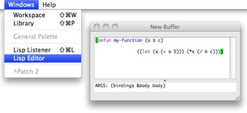
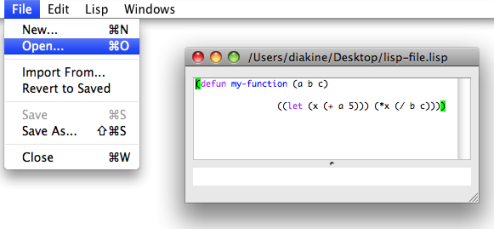
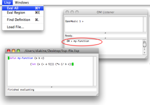
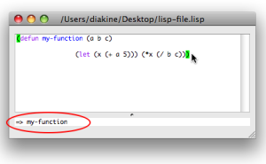
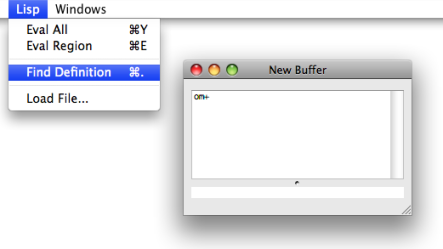
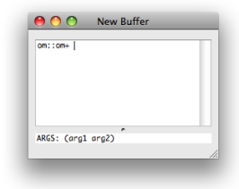

Navigation : [Previous](LispIntro "page précédente\(Introduction
to Lisp\)") | [Next](LispListener "Next\(The
Listener\)")

# Writing/Evaluating Lisp Code : The Lisp Editor

The Lisp Editor allows to write Lisp code, or even a simple text. It basically
works as a standard text editor, providing all usual text editing commands
such as Cut/Copy/Paste, Open/Save/Save as, Find/Replace...

## Lisp Buffers and Files

  * To open a Lisp editor window from a patch, choose `Windows / Lisp Editor`. 

  * To open another window from a current Lisp editor, choose `File / New`. 

In both cases, the window is entitled "New Buffer".

|

  
  
---|---  
  
Lisp editors are text buffers, whose content may  or not be attached or saved
in any file.

To save the content of the buffer, select `File / Save - Save As`, choose a
name and location in the dialogue window. The file name will appear at the top
of the window

  * To open an existing file **from a current buffer** , choose `File / Open` and select a text or lisp file. 

The buffer window will show the name of the file. the (that is, created with
`File/Open`).

## Evaluation Commands

Main Commands

  * To evaluate one or several expression, select them and choose `Lisp / Eval Region` or type `Cmd` \+ `e`.

  * To evaluate the whole buffer, use `Lisp / Eval All` or type `Cmd` \+ `y`.

The results from the evaluations of the different expressions will appear **in
the Listener**.

|

[zoom](../res/evalall_scr_1.png "Zoom \(nouvelle fenêtre\)")  
  
---|---  
  
Alternative Procedure

|

It is also possible to use internal Lisp buffer commands to evaluate
expressions :

  1. put the cursor at the end of the expression to evaluate - that is, after the last closing parenthesis -

  2. type `Ctrl` \+ `x` +`e`.

The result will appear in the lower text area of the window.  
  
---|---  
  
Loading a Lisp File from the Listener

Lisp files can be loaded without opening them in the Lisp editor, using the
`Lisp / Load File` command menu in the Lisp Listener.

The Lisp Listener

  * [The Listener](LispListener)

## Finding Definitions and Information

Finding the definition of a given function or symbol may be useful when
programming. This is possible from the Lisp editor or the Listener.

In the editor window or in the Listener, put the cursor on a symbol and use
the `Lisp / Find Definition` menu or `Cmd` \+ `.` .

The Lisp Listener

  * [The Listener](LispListener)

When available, the file or text buffer containing the recorded definition for
this symbol will open in a new editor window.

In case of multiple definitions - for instance, several meth[1]ods[1] with the
same name - select an item in the list with a double click.

[Zoom](../res/selectdefinition_scr_1.png "Zoom \(nouvelle fenêtre\)")

Arguments Information

At typing a space after a function name in a Lisp editor, the arguments of the
function will appear at the bottom of the window.

|

  
  
---|---  
  
Pay attention to the package[2] of the function (and type it before the
function name if necessary) or the function arguments will not be displayed
(and the function itself will probably not be found at evaluation).

References :

  1. Method

An elementary function or part of a generic function defining rules for its
behaviour depending on a type of argument. Defining a generic function amounts
to defining at least one method.

For instance, the OM+ function is made of four methods : 1. number + list / 2.
list + number / 3. number + number / 4. list + list

  2. Lisp Package

In Lisp, a package is a means to gather symbols, such as functions, variables
or class names, within a same specific name space. You are always working in a
"current" package, which can be changed with the command (in-package "my-
package").

In orde to use items defined in other packages (unless these item's names are
"exported" to the current package), it is generally necessary to type the
package name (or "nickname"), separated by " : :", before the usual name ( Ex.
: om : :om+ ).

The default package in OM is "OPENMUSIC" or "OM". The default package in
Common Lisp is "CL-USER".

Contents :

  * [OpenMusic Documentation](OM-Documentation)
  * [OM User Manual](OM-User-Manual)
    * [Introduction](00-Contents)
    * [System Configuration and Installation](Installation)
    * [Going Through an OM Session](Goingthrough)
    * [The OM Environment](Environment)
    * [Visual Programming I](BasicVisualProgramming)
    * [Visual Programming II](AdvancedVisualProgramming)
    * [Basic Tools](BasicObjects)
    * [Score Objects](ScoreObjects)
    * [Maquettes](Maquettes)
    * [Sheet](Sheet)
    * [MIDI](MIDI)
    * [Audio](Audio)
    * [SDIF](SDIF)
    * [Lisp Programming](Lisp)
      * [Introduction to Lisp](LispIntro)
      * The Lisp Editor
      * [The Listener](LispListener)
      * [Lisp Code in OM](LispInOM)
      * [Lisp Function Boxes](LispFunctions)
      * [Lisp Tools](LowLevel)
      * [Writing an OM Library](LispUserLib)
      * [Writing Code for OM](LispForOM)
    * [Errors and Problems](errors)
  * [OpenMusic QuickStart](QuickStart-Chapters)

Navigation : [Previous](LispIntro "page précédente\(Introduction
to Lisp\)") | [Next](LispListener "Next\(The
Listener\)")

