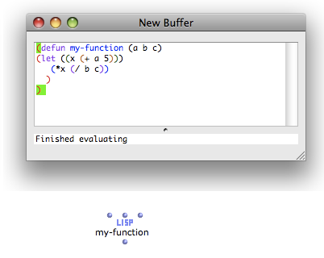
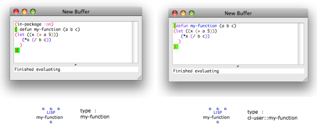
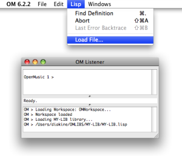
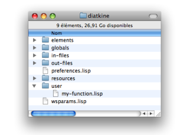
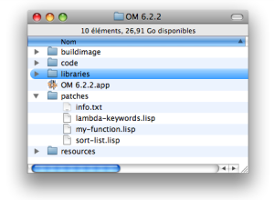
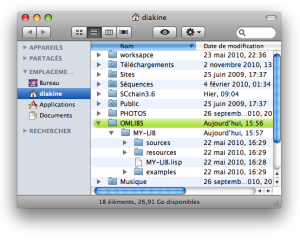
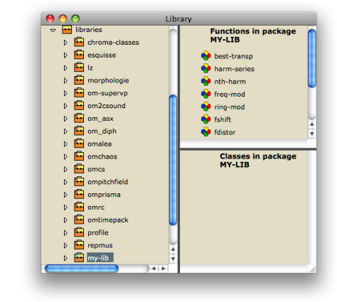
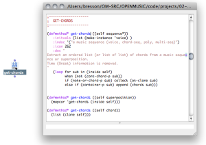
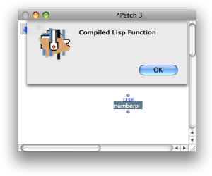

Navigation : [Previous](LispListener "page précédente\(The
Listener\)") | [Next](LispFunctions "Next\(Lisp
Function Boxes\)")

# Lisp Code in OM

## Use of User-Defined Lisp Functions in OM

Example

All functions and classes defined and evaluated in the Lisp editor can be used
in OM patches immediately.

  1. Evaluate the function or class in the Lisp editor.

  2. `Cmd` click in the patch and type the name of the function or class. 

See also

  * [Writing/Evaluating Lisp Code : The Lisp Editor](LispEditor)

Package Name

The default package of a function or class edited in the Lisp Editor is the
**Cl-user package**. In this case, its name must be preceeded by "cl-user::".

To be able to type a name directly in the patch editor, add "(in-package :om)"
before the corresponding code in the lisp editor.

[Zoom](../res/typefunction_scr_1.png "Zoom \(nouvelle fenêtre\)")

Reloading Patches

User-defined functions or classes can appear as "dead boxes" if the patch they
belong to is saved and reloaded at another OM session. You will then have to
reload the function or class.

It is advised to create user libraries : your own Lisp classes and functions
will be preserved and available for use at any time.

Dead Boxes

  * [Missing References : Dead Boxes](DeadBox)

User Libraries in OM

  * [Extra Libraries](UserLibraries)
  * [Writing an OM Library](LispUserLib)

## Loading Lisp Code in OM

There exist several ways to load existing Lisp code in OM :

  * **Open a Lisp file and evaluate it, or load it directly from the Listener.** This applies to temporary experiments, since the code has to be loaded manually at each session.

|

  
  
---|---  
  
Listener and Lisp Editor

  * [The Listener](LispListener)
  * [Writing/Evaluating Lisp Code : The Lisp Editor](LispEditor)

|

  * **Put the Lisp file in the`Workspace / User` directory.** The file will be loaded with the workspace : it will always be available for use in the patches of the same workspace.

  
  
---|---  
  
  * **Put the Lisp file in the`OM / Patches` directory. **The file will be loaded at the OM start up. Bug fixes and global environment changes are generally provided and applied to the OM application this way.

|

  
  
---|---  
  

|

  * **Use a user library.** The most reliable way of loading Lisp code, although it requires extra formatting work for the library. 

  
  
---|---  
  

Create Your Own Library

  * [Writing an OM Library](LispUserLib)

## Finding OM Functions Sources

To access the source code of a component within a patch, select it and press
`e`. It will be displayed when available.

Access Conditions

|

The source code is accessible if the function or class is

  * defined in OM : the Lisp sources of the OM environment are provided with the application
  * defined in an open text buffer or a loaded Lisp file.

  
  
---|---  
  
The source code is not accessible if

  * the function or class is defined in a buffer or class which is not accessible anymore : it can have been removed or moved since its was originally evaluated or compiled
  * the function or class is part of the inbuilt Lisp environment : in this case, the sources are not accessible.

|

  
  
---|---  
  
Redefining Sources : Find Source Utility

The sources of existing OM functions can be found, edited and reevaluated with
the ** Find Source ** utility. Nevertheless, it is advised to copy, rename and
modify these functions. This allows to avoid disorders or conflicts, and to
track and reload changes at the next session.

References :

Contents :

  * [OpenMusic Documentation](OM-Documentation)
  * [OM User Manual](OM-User-Manual)
    * [Introduction](00-Contents)
    * [System Configuration and Installation](Installation)
    * [Going Through an OM Session](Goingthrough)
    * [The OM Environment](Environment)
    * [Visual Programming I](BasicVisualProgramming)
    * [Visual Programming II](AdvancedVisualProgramming)
    * [Basic Tools](BasicObjects)
    * [Score Objects](ScoreObjects)
    * [Maquettes](Maquettes)
    * [Sheet](Sheet)
    * [MIDI](MIDI)
    * [Audio](Audio)
    * [SDIF](SDIF)
    * [Lisp Programming](Lisp)
      * [Introduction to Lisp](LispIntro)
      * [The Lisp Editor](LispEditor)
      * [The Listener](LispListener)
      * Lisp Code in OM
      * [Lisp Function Boxes](LispFunctions)
      * [Lisp Tools](LowLevel)
      * [Writing an OM Library](LispUserLib)
      * [Writing Code for OM](LispForOM)
    * [Errors and Problems](errors)
  * [OpenMusic QuickStart](QuickStart-Chapters)

Navigation : [Previous](LispListener "page précédente\(The
Listener\)") | [Next](LispFunctions "Next\(Lisp
Function Boxes\)")

