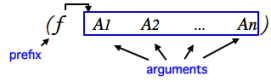
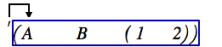
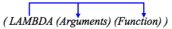
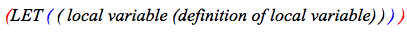
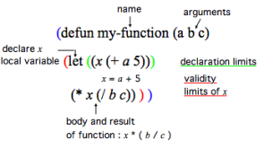

Navigation : [Previous](Lisp "page précédente\(Lisp
Programming\)") | [Next](LispEditor "Next\(The Lisp
Editor\)")

# Introduction to Lisp

This section is **not** a Common Lisp tutorial, but just expounds a few
important notions.

## Origins

A Bit of History

Lisp is a functional language influenced by the lambda calculus that was
specified in 1958. It is one of the oldest high-level programming languages.

[Common Lisp](http://www.cs.cmu.edu/Groups/AI/cltl/cltl2
"http://www.cs.cmu.edu/Groups/AI/cltl/cltl2 \(nouvelle fenêtre\)")
is a Lisp dialect, among others such as  Scheme .

An Interpreted Language

Lisp is an **" interpreted" language** : it works on top of a low-level
process, or underlying **interpreter** , which evaluates Lisp code. Functions
and data are defined and evaluated by this process, which incrementally
enriches the running environment with new functionalities. Each time a new
function, variable or class is defined, it becomes part of the environment.
This characteristics makes Lisp programming very flexible and dynamic, since
code can still be interpreted while Lisp programs are running.

Links of Interest

For a more complete overview of the language, the reader should consult
specialized books or references. Here are some links of interest :

  * [Common Lisp the Language, 2nd edition](http://www.cs.cmu.edu/Groups/AI/html/cltl/clm/clm.html "http://www.cs.cmu.edu/Groups/AI/html/cltl/clm/clm.html \(nouvelle fenêtre\)")  : a reference book on the common Lisp standard by Guy L. Steele
  * [Lisp as a second language, composing programs and music](http://recherche.ircam.fr/equipes/repmus/LispSecondLanguage/index.html "http://recherche.ircam.fr/equipes/repmus/LispSecondLanguage/index.html \(nouvelle fenêtre\)")  : a music-oriented tutorial by Peter Desain and Henkjan Honing

## S-expressions

S-expression stands for "symbolic expression". S-expressions are **list-based
representations**. They are typically represented in text by parenthesized,
whitespace-separated sequences of character strings.

Prefix Notation

Lisp expressions are written as lists with a **prefix notation**. The first
element in the list is an **operator or a function** , while the remaining
elements are treated as data : they are the arguments[1] of this operator.

When an expression is evaluated[2], the first element is applied to the
arguments. For instance :

  * An addition such as 1 + 2 + 3 is expressed **(+ 1 2 3)** , which evaluates to : **6**. The  + function is applied to 1 2 and 3.

  * In the **(list 1 2 3)** expression, the  list operator creates a list with the other elements in the expression, which evaluates to : **(1 2 3)**

Quoted Expressions : QUOTE Operator

The **QUOTE** operator **" ' "** allows to get a list from a lisp expression
without evaluating it. This operator must be put **before the targetted list
first parenthesis** , and applies to all the elements located between the pair
of parenthesis.

For instance :

When the following expression : '(+ 5 6) is evaluated, (+ 5 6) is returned.
The list is merely quoted.When the following expression (+ 5 6) is evaluated,
11 is returned. The list is evaluated, because there is no quote.

Lambda Expressions : the LAMBDA Operator

The **LAMBDA operator** binds - associates - variables to values in an
expression. In other words, it allows to define functions.

The syntax of a lambda expression is : **(lambda (arg1 arg2 ...) [body of the
function] )** . This expression evaluates to a function, which can be applied
to arguments. At application time, these arguments are bound to variables
represented by  arg1 ,  arg2 , ...

For instance, the lambda expression that defines (4 + (a * b)) with a and b as
variables is written :

(lambda (a b) (+ 4 (* a b))) .

## Functions

Defining Functions : DEFUN

Most Lisp programming consists into defining functions. **DEFUN** is a
particular operator that defines a function bound to a  name  :

(defun my-function-name (arg1 arg2 arg3)

       [ Lisp expression(s) ] 

            result ) 

Once the function is defined, its name represents the function.

Defining Local Variables within a Function : LET

**LET** is a special operator that "declares" local variables in the body of
the function. The declaration and the content of the declaration must both be
delineated by parenthesis.

For instance, the following expression declares an  x local variable :

**(let (( x (+  a 5)) )** means :  x is a local variable, such as  x =  a \+
5.

Example : Defining My-Function

Let's define "my-function".

**(defun my-function (a b c) (let ((x (+ a 5))) (* x (/ b c))))**

|

We can also write it :

**(defun my-function (a b c)**

**      (let ((x (+ a 5))) **

**           (* x (/ b c))**

**       )** **)**  
  
---|---  
  
  * A ,  b and  c are the **arguments** of the function, the variables that are bound to values, when the function is  called . We also have a local variable :  (x = a + 5) .

  * The last expression is the **result** returned by the function itself : ( x * (b / c )).

In other words, the expression means : " my-function applies to  a ,  b and  c
. Besides x = ( a \+ 5). This function is : x * (b / c) ."

My-function is called when its name followed by the relevant set of arguments
is evaluated : **(my-function 1 2 3)** => 4

|

  
  
---|---  
  
References :

  1. Argument

An argument represents a parameter upon which a function operates. For
instance, the (om+ x y) function has two arguments : x and y.

  2. Evaluation

In Lisp, evaluating an expression amounts to interpreting and reducing its
contents in order to return a result.

In OM, visual programs represent Lisp expressions and evaluating a box
triggers the calculus that will determine the value of these expressions.

Any kind of box can be evaluated and return something. To evaluate a box, ⤷
Click and press `v` or `Cmd` click on an outlet.

Contents :

  * [OpenMusic Documentation](OM-Documentation)
  * [OM User Manual](OM-User-Manual)
    * [Introduction](00-Contents)
    * [System Configuration and Installation](Installation)
    * [Going Through an OM Session](Goingthrough)
    * [The OM Environment](Environment)
    * [Visual Programming I](BasicVisualProgramming)
    * [Visual Programming II](AdvancedVisualProgramming)
    * [Basic Tools](BasicObjects)
    * [Score Objects](ScoreObjects)
    * [Maquettes](Maquettes)
    * [Sheet](Sheet)
    * [MIDI](MIDI)
    * [Audio](Audio)
    * [SDIF](SDIF)
    * [Lisp Programming](Lisp)
      * Introduction to Lisp
      * [The Lisp Editor](LispEditor)
      * [The Listener](LispListener)
      * [Lisp Code in OM](LispInOM)
      * [Lisp Function Boxes](LispFunctions)
      * [Lisp Tools](LowLevel)
      * [Writing an OM Library](LispUserLib)
      * [Writing Code for OM](LispForOM)
    * [Errors and Problems](errors)
  * [OpenMusic QuickStart](QuickStart-Chapters)

Navigation : [Previous](Lisp "page précédente\(Lisp
Programming\)") | [Next](LispEditor "Next\(The Lisp
Editor\)")

