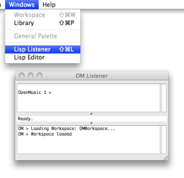
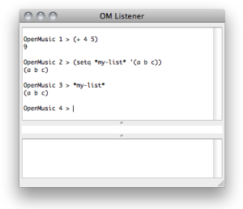
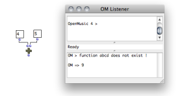
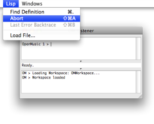

Navigation : [Previous](LispEditor "page précédente\(The Lisp
Editor\)") | [Next](LispInOM "Next\(Lisp Code in OM\)")

# The Listener Window

The Listener window is the main interface with the Lisp under OM. It can be
used for evaluating Lisp expressions or reading results and messages.

To open or bring the Listener window to the front, select `Windows/Lisp
Listener` or type `CMD` \+ `l`.

|

  
  
---|---  
  
Listener Window

The OM Listener window is made of two main frames, or "panes".

The **input** pane - upper part -allows to enter Lisp expressions. These
expressions will be evaluated by the Lisp interpreter. They can be either
simple variables, calls to Lisp functions, or definitions of new variables or
functions.

|

  
  
---|---  
  
The **output** pane - lower part - displays the results returned by the boxes
evaluated in OM patches

|

  
  
---|---  
  

|

It also prints the results of different processes in OM patches or
environment.  
  
---|---  
  
## Lisp Files

Use

Lisp files generally have a ".lisp" or ".lsp" extension. They can also be
compiled, that is interpreted and converted to optimized binary instructions
for a given platform. They will then be loaded in their compiled form.

Loading Files

To **load** a file that contains Lisp code, select `Lisp/Load File`.

The Lisp code it contains is evaluated : all the functions and data defined in
this file are added to the current Lisp environment, so that they can be used
subsequently.

## Control of Execution

The Listener is also a fundamental tool for controlling the execution of OM
programs.

Abort Command

|

To abort an ongoing evaluation, select the Listener, choose `Lisp / Abort` or
type `Cmd`+`a`.

The message displayed in return is often very useful for debugging or
understanding the process at stake.  
  
---|---  
  
Additional Information

A small text field located between the two panes displays additional info,
such as

  * the status of the evaluation process - "Running", "Ready", "Aborted" -

  * completion hints about the functions typed in the  input pane.

|

To get information about an item, type its name and add a space.  
  
---|---  
  
References :

Contents :

  * [OpenMusic Documentation](OM-Documentation)
  * [OM User Manual](OM-User-Manual)
    * [Introduction](00-Contents)
    * [System Configuration and Installation](Installation)
    * [Going Through an OM Session](Goingthrough)
    * [The OM Environment](Environment)
    * [Visual Programming I](BasicVisualProgramming)
    * [Visual Programming II](AdvancedVisualProgramming)
    * [Basic Tools](BasicObjects)
    * [Score Objects](ScoreObjects)
    * [Maquettes](Maquettes)
    * [Sheet](Sheet)
    * [MIDI](MIDI)
    * [Audio](Audio)
    * [SDIF](SDIF)
    * [Lisp Programming](Lisp)
      * [Introduction to Lisp](LispIntro)
      * [The Lisp Editor](LispEditor)
      * The Listener
      * [Lisp Code in OM](LispInOM)
      * [Lisp Function Boxes](LispFunctions)
      * [Lisp Tools](LowLevel)
      * [Writing an OM Library](LispUserLib)
      * [Writing Code for OM](LispForOM)
    * [Errors and Problems](errors)
  * [OpenMusic QuickStart](QuickStart-Chapters)

Navigation : [Previous](LispEditor "page précédente\(The Lisp
Editor\)") | [Next](LispInOM "Next\(Lisp Code in OM\)")

