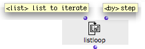
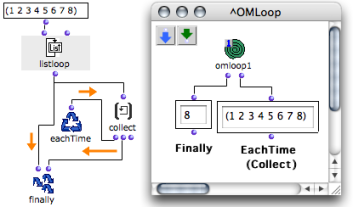
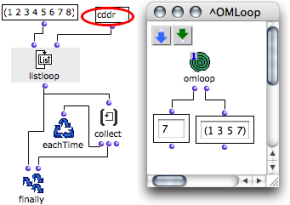
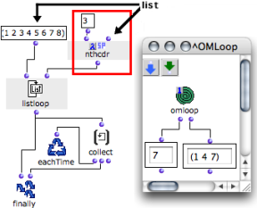

Navigation : [Previous](LoopIterators "page
précédente\(Iterators\)") | [Next](OnListLoop "page
suivante\(OnList Loop\)")

# ListLoop : Enumerating the Elements of a List

## General Properties

** Listloop ** enumerates and returns the elements of a list one by one.

In other words, at each step of the iteration, listloop takes a smaller chunk
of the list, and returns its first element. The execution ends once the list
is exhausted.

|

Listloop has one default input and one optional input :

  * "list" : a list
  * "by" : a box defining **the way the list is exhausted**. 

  
  
---|---  
  
Here, listloop enumerates a list and returns its items one by one.

  1. At each step of the loop, EachtTime evaluates collect.

  2. Collect stores the items of the list.

  3.     * The first input of Finally returns the last value of the iteration.
    * Its second input returns the result of collect. 

## "By" : Changing Enumeration Modalities

"By"

The default value of the " **by** " optional input is a  cdr[1] .

This means that, at each loop, listloop returns :

  1. the first element of the list, 

  2. and then, the first element of the remaining chunk, 

  3. and so on.

In Lisp, this means that listloop returns successive  cadrs[1] .

"By" can be replaced by another function  meant to return a smaller chunk of a
list, such as :  cddr [1] or nthcdr for instance.

It can be either a function box on ["lambda" mode](LambdaMode), or a
function name.

Examples : Selecting Items to Return

|

If "by" is a cddr,  listloop returns

  1. the first element of the list, 

  2. then, the first element of the cddr, 

  3. and repeats the operation until the list is exhausted.

  
  
---|---  
  
If "by" is an nthcdr,  listloop returns

  1. the first element of the list, 

  2. then the first element of the nthcdr, 

  3. and repeats the operation until the list is exhausted.

|

  
  
---|---  
  
Choosing the Right Function

Applying an irrelevant "by" argument to listloop may prevent the list from
being exhausted. In this case, if no other iterator is present, the loop may
go on for infinite iterations.

References :

  1. CAR, CDR, CADR, CDDR, CADDR...

Elementary Lisp functions, allowing the access to one or more elements in a
list.

Lisp fonctions are actually linked list. Lists are actually "conses" (or
"pairs") made of a first element and a pointer to the rest (or "tail") of the
list (another cons). These two parts of the list are accessed with the CAR and
CDR functions, respectively.

Let the following list be : (A B C D).

CAR (A B C D) = A.

CDR (A B C D) = (B C D).

CDR (B) => NIL [this list has no CDR]

"CAR" and "CDR" are technical terms which originally refer to the way data is
handled by the computer. CAR is the acronym of "Contents of the Address part
of Register number". CDR is the acronym of "Contents of the Decrement part of
Register number".

The rest of the functions below are built upon these two kernel accessors.

CADR (A B C D) = B. CADR means CAR of the CDR.

CDDR (A B C D) = (C D). CDDR means CDR of the CDR.

CADDR (A B C D) = C. CADDR means CAR of the CDDR.

NTHCDR (A B C D) = NTH CDR of the list - N must be specified as argument.
NTHCDR 3 (A B C D) = (D).

And so on...

Contents :

  * [OpenMusic Documentation](OM-Documentation)
  * [OM User Manual](OM-User-Manual)
    * [Introduction](00-Contents)
    * [System Configuration and Installation](Installation)
    * [Going Through an OM Session](Goingthrough)
    * [The OM Environment](Environment)
    * [Visual Programming I](BasicVisualProgramming)
    * [Visual Programming II](AdvancedVisualProgramming)
      * [Abstraction](Abstraction)
      * [Evaluation Modes](EvalModes)
      * [Higher-Order Functions](HighOrder)
      * [Control Structures](Control)
      * [Iterations: OMLoop](OMLoop)
        * [Iteration](LoopIntro)
        * [General Features](LoopGeneral)
        * [Evaluators](LoopEvaluators)
        * [Iterators](LoopIterators)
          * List Loop
          * [OnList Loop](OnListLoop)
          * [For Loop](ForLoop)
          * [While Loop](WhileLoop)
          * [Infinite Loops](InfiniteLoops)
        * [Accumulators](LoopAccumulators)
        * [Example : A Random Series](LoopExample)
      * [Instances](Instances)
      * [Interface Boxes](InterfaceBoxes)
      * [Files](Files)
    * [Basic Tools](BasicObjects)
    * [Score Objects](ScoreObjects)
    * [Maquettes](Maquettes)
    * [Sheet](Sheet)
    * [MIDI](MIDI)
    * [Audio](Audio)
    * [SDIF](SDIF)
    * [Lisp Programming](Lisp)
    * [Reactive mode](Reactive)
    * [Errors and Problems](errors)
  * [OpenMusic QuickStart](QuickStart-Chapters)

Navigation : [Previous](LoopIterators "page
précédente\(Iterators\)") | [Next](OnListLoop "page
suivante\(OnList Loop\)")

