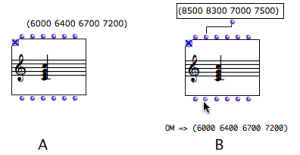
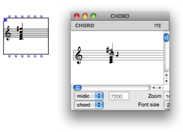

Navigation : [Previous](EvalModes "page précédente\(Evaluation
Modes\)") | [Next](EvOnceMode "Next\(Evaluate-Once
Mode\)")

# Lock Mode

## Properties

Use

A locked box returns the last computed or edited value. Any parametric
modification will be ineffective.

Procedure

To set a box on "lock" mode, select it and press `b`. A small cross icon
 appears on the upper left corner of the box.

## Examples

Locked Function Boxes

The values of a locked box in a program remain in the box and are returned at
the next evaluation.

|

A locked function always returns the same value.  
  
---|---  
  
Locked Factory Boxes

New input values don't affect a locked factory box.

  * (A) Here, a chord is edited as a C4 triad and is locked (A). 

  * (B) When new values are assigned to the chord, the pitches don't change at the evaluation.

|

  
  
---|---  
  
Automatic Locking

|

When an object is modified from its editor, its box gets locked automatically
in order to prevent the contents to be reinitalized at a next evaluation.  
  
---|---  
  
References :

Plan :

  * [OpenMusic Documentation](OM-Documentation)
  * [OM 6.6 User Manual](OM-User-Manual)
    * [Introduction](00-Sommaire)
    * [System Configuration and Installation](Installation)
    * [Going Through an OM Session](Goingthrough)
    * [The OM Environment](Environment)
    * [Visual Programming I](BasicVisualProgramming)
    * [Visual Programming II](AdvancedVisualProgramming)
      * [Abstraction](Abstraction)
      * [Evaluation Modes](EvalModes)
        * Lock Mode
        * [Evaluate-Once Mode](EvOnceMode)
        * [Lambda Mode](LambdaMode)
        * [Reference Mode](RefMode)
      * [Higher-Order Functions](HighOrder)
      * [Control Structures](Control)
      * [Iterations: OMLoop](OMLoop)
      * [Instances](Instances)
      * [Interface Boxes](InterfaceBoxes)
      * [Files](Files)
    * [Basic Tools](BasicObjects)
    * [Score Objects](ScoreObjects)
    * [Maquettes](Maquettes)
    * [Sheet](Sheet)
    * [MIDI](MIDI)
    * [Audio](Audio)
    * [SDIF](SDIF)
    * [Lisp Programming](Lisp)
    * [Errors and Problems](errors)
  * [OpenMusic QuickStart](QuickStart-Chapters)

Navigation : [Previous](EvalModes "page précédente\(Evaluation
Modes\)") | [Next](EvOnceMode "Next\(Evaluate-Once
Mode\)")

