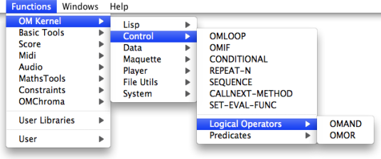
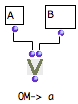
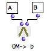
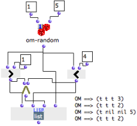
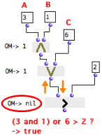
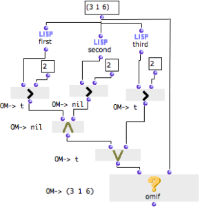

Navigation : [Previous](Conditional "page
précédente\(Conditional\)") | [Next](Sequencial "page
suivante\(Sequential Operators\)")

# Logical Operators

Omor, Omand

Omor and omand  are ** boolean
logical operators ** that stand for the "and" and "or" coordinating
conjunctions.

  * A proposition that contains an "and" is true if  **all** its elements are true. 
  * A proposition that contains an "or" is true if  **at least one** of its elements is true. 

For instance, the following propositions are respectively true and false :

  * A : "Men are living creatures". B : "Cats are living creatures". "A and B" is true, and "A or B" is true.
  * A : "Men are human beings." B : "Cats are human beings". "A or B" is true, but "A and B" is not true. 

In OM

  * the omand box returns "true" if  ** all ** its inputs return "true". Otherwise, it returns "nil". 
  * the omor box returns "true" if one of its inputs return "true". Otherwise, it returns "nil".

Logical operators are accessed via the  `Functions / OM Kernel / Control /
Logical Operators`, menu.

## Functionalities and Behaviour

Inputs

Operators have one default input, "self" and as many additional "rest" inputs
as necessary

  * "self" : any data
  * "rest" : any data.

Their output returns data, or "nil".

Use

  * Logical operators evaluate their inputs successively. Any non "nil" data is "true". 

Consequently, operators don't have to verify the truth-value of a proposition,
to return "true". Numbers, as well as symbols and other non nil values are
always "true" for logical operators.

  * Logical operators are also used for associating **several predicates** in a single proposition. 

Behaviour

Inputs are evaluated from left to right.

|

Omor **tests a first input** , and stops if **it is true**.

If not, it goes on until it gets "true". As a consequence, omor returns the
first non-nil value, or "nil" if all inputs return "nil".

In this example, omor will always return the first input, "A".  
  
---|---  
  

|

Omand **** stops the evaluation if **one of its inputs is not true**. It goes
on until it gets "nil", or until it reaches the last input.

**** All inputs have to be true for the condition to be verified, and omand
then returns the last non-nil value.

In this example, omand will always return the last input, "B".  
  
Example

The following program tests if a random number between 1 and 5 is superior to
1 and inferior to 4.

  1. The number returned by om-random is compared with 1 and 3 by the om> and om< predicates. 

  2. Omand evaluates the predicates and returns "true" or "nil". 

  3. List makes a list with :

    * the result of both predicates evaluation, 
    * the result of the omand operator,
    * the number returned by om-random.

|

  
  
---|---  
  
Note that om-random is on "evaluate-once" mode, so that the same result is
sent to all boxes during the same evaluation.

About EvalOnce Mode :

  * [Evaluate-Once Mode](EvOnceMode)

## Composing Propositions : Associating Logical Operators with Predicates

Operators behave with predicates **like with any other boxes**. Predicates are
evaluated **one by one,** from left to right and return "true" or  "nil".

  * Omand returns "true" if all predicates return "true", and returns "nil" if one predicate returns "nil".
  * Omor returns "true" as soon as one predicate passes "true", and returns "nil" if all predicates return "nil".

An Incorrect Formalization

We might use logical operators to compare more than one value to another, as
in the following proposition : "If A **and** B **or** C are superior to D,
then return A, B, and C."

If we formalize the proposition **literally** , the program will be
ineffective and will lead to a miscalculation.

|

Let's test if 3 and 1 or 6 are superior to 2 :

  1. Omand is evaluated and returns **the numeric value** of its last input 

  2. Omor is evaluated and returns **the numeric value** of its first input 

  3. Om> compares the numeric value of its first input with 2, and returns "nil".

  
  
---|---  
  
6 should be compared with 2, and 6 is superior to 2. Om> should return "true".
The error comes from the way predicates have been applied with logical
operators.

Basic Formalization Principles

Formalizing a comparison with predicates and logical operators implies that :

  1. First, **predicates** must compare values by **pairs.**

  2. Then, **logical operators** must be applied to **the result** **of each comparison** .

A correct Formalization

|

Be a list. Each number of the list is compared with a number.

  1. Omif evaluates omor. 

  2. Omand is evaluated and returns the value of the two om> predicates on the left. 

It gets "nil" and "t", so it returns "nil". 3 and 1 are not **both** superior
to 2.

  3. The last om> predicate is evaluated. It returns "true".

  4. Omor gets "nil" and "t", so it returns "t" . 6 is **at least** superior to 2.

  5. Omif gets the result of omor : "t", and hence returns the list.

  
  
---|---  
  
References :

Plan :

  * [OpenMusic Documentation](OM-Documentation)
  * [OM User Manual](OM-User-Manual)
    * [Introduction](00-Sommaire)
    * [System Configuration and Installation](Installation)
    * [Going Through an OM Session](Goingthrough)
    * [The OM Environment](Environment)
    * [Visual Programming I](BasicVisualProgramming)
    * [Visual Programming II](AdvancedVisualProgramming)
      * [Abstraction](Abstraction)
      * [Evaluation Modes](EvalModes)
      * [Higher-Order Functions](HighOrder)
      * [Control Structures](Control)
        * [Predicates](Predicates)
        * [Conditional Operators](ConditionalOps)
        * Logical Operators
        * [Sequential Operators](Sequencial)
      * [Iterations: OMLoop](OMLoop)
      * [Instances](Instances)
      * [Interface Boxes](InterfaceBoxes)
      * [Files](Files)
    * [Basic Tools](BasicObjects)
    * [Score Objects](ScoreObjects)
    * [Maquettes](Maquettes)
    * [Sheet](Sheet)
    * [MIDI](MIDI)
    * [Audio](Audio)
    * [SDIF](SDIF)
    * [Lisp Programming](Lisp)
    * [Errors and Problems](errors)
  * [OpenMusic QuickStart](QuickStart-Chapters)

Navigation : [Previous](Conditional "page
précédente\(Conditional\)") | [Next](Sequencial "page
suivante\(Sequential Operators\)")

