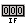
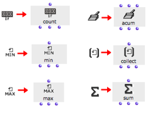
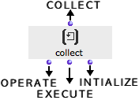

Navigation : [Previous](InfiniteLoops "page précédente\(Infinite
Loops\)") | [Next](Collect "Next\(Collect\)")

# Accumulators

## Function

At each step of an iteration, resulting data can be memorized and stored with
the OMLoop **accumulators** . Accumulators execute storage or other operation
upon the elements they are returned successively.

There are six accumulators :

  * : ** Collect ** gathers the result of each step of a loop into a list.

  *  : **Sum** returns the sum of the collected elements.

  *  :  **Min** and  **max** return the lowest and highest value among a set of collected elements.

  * :  ** Counter ** counts the number of non-nil collected elements.

  * :  **Acum** allows to define specific accumulation procedures.

## Adding Iterators

|

To add an accumulator in the OMLoop editor .

  * click on an icon

  * `Cmd` click and type a name directly in the editor. 

  
  
---|---  
  
## Inputs and Outputs

  * All accumulators but acum have a single input : this input is used for **collecting the successive values** during a loop.

  * All accumulator have three outputs, allowing to access their current "memory"  :

    * first output : **executes a specific operation** with each new collected element.
    * second output : **returns the current stat** e of the accumulator's memory,
    * third output : **reinitializes** the memory.

References :

Contents :

  * [OpenMusic Documentation](OM-Documentation)
  * [OM User Manual](OM-User-Manual)
    * [Introduction](00-Contents)
    * [System Configuration and Installation](Installation)
    * [Going Through an OM Session](Goingthrough)
    * [The OM Environment](Environment)
    * [Visual Programming I](BasicVisualProgramming)
    * [Visual Programming II](AdvancedVisualProgramming)
      * [Abstraction](Abstraction)
      * [Evaluation Modes](EvalModes)
      * [Higher-Order Functions](HighOrder)
      * [Control Structures](Control)
      * [Iterations: OMLoop](OMLoop)
        * [Iteration](LoopIntro)
        * [General Features](LoopGeneral)
        * [Evaluators](LoopEvaluators)
        * [Iterators](LoopIterators)
        * Accumulators
          * [Collect](Collect)
          * [Sum](Sum)
          * [Min / Max](MinMax)
          * [Count](Count)
          * [Acum](Acum)
        * [Example : A Random Series](LoopExample)
      * [Instances](Instances)
      * [Interface Boxes](InterfaceBoxes)
      * [Files](Files)
    * [Basic Tools](BasicObjects)
    * [Score Objects](ScoreObjects)
    * [Maquettes](Maquettes)
    * [Sheet](Sheet)
    * [MIDI](MIDI)
    * [Audio](Audio)
    * [SDIF](SDIF)
    * [Reactive mode](Reactive)
    * [Lisp Programming](Lisp)
    * [Errors and Problems](errors)
  * [OpenMusic QuickStart](QuickStart-Chapters)

Navigation : [Previous](InfiniteLoops "page précédente\(Infinite
Loops\)") | [Next](Collect "Next\(Collect\)")

