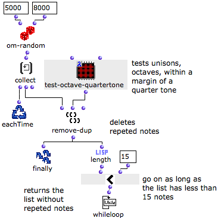
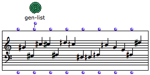
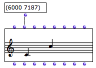
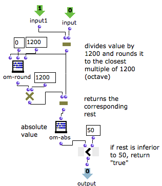
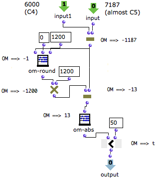

Navigation : [Previous](Acum "page précédente\(Acum\)") | [Next](Instances "Next\(Instances\)")

# A Basic Example : Building a Random Series

We will build a random series of fifteen notes withing a range of 5000 and
8000 midicents. We defined a series of constraints.

  * All notes must be different, including octaves. 
  * Intervals can consist of semitones and quartertones. 
  * Intervals can be repeated.

## Designing the Iterative Process

"Keep on Until the List Has 15 Items"

  1. Om-random returns a random value within the given range. 

  2. At each step of the loop, collect stores the value. 

  3. The resulting list is returned to remove-dup, which removes equal values and octaves, give or take a quarter tone.

  4. Length returns the number of items in the list. 

  5. This number is compared to 15 by om<. 

  6. The process goes on as long as the list has less then 15 items, as specified by whileloop. 

Resulting Chord-Seq

The resulting chord-seq is returned to the outside of OMLoop by Finally.

## Redefining the Equality Test

Constraint : Rounded Intervals

Usually, remove-dup checks if two values are strictly equal. We have modified
this predicate with a lambda patch.

Indeed, here is what happens if two pitches make almost an octave - 1200
midicents :

|

  
  
---|---  
  
Lambda Patch

  1. The values tested by the remove-dup are returned by two inputs, and substracted by om-. 

  2. The difference is divided by 1200 and rounded give or take a multiple of 1200. 

  3. It is then multiplied again by 1200 to calculate the rest of the original difference.

If this value is inferior to 50, it will be rounded so that we will get an
octave or its multiple in the score.

  4. The absolute value of the rest is compared with 50 by om-.

  5. If om- returns "true", the value is rejected by remove-dup

Test Arguments and Lambda Functions

  * [Lambda Mode Examples: Lambda Patches](LambdaPatch)

Example : Rejecting a Rounded Octave

If the test is applied to 6000 and 7187 midicents - preceding values -, we get
the following evaluations :

Om< returns "t", and pitches are considered equal.

References :

Contents :

  * [OpenMusic Documentation](OM-Documentation)
  * [OM User Manual](OM-User-Manual)
    * [Introduction](00-Contents)
    * [System Configuration and Installation](Installation)
    * [Going Through an OM Session](Goingthrough)
    * [The OM Environment](Environment)
    * [Visual Programming I](BasicVisualProgramming)
    * [Visual Programming II](AdvancedVisualProgramming)
      * [Abstraction](Abstraction)
      * [Evaluation Modes](EvalModes)
      * [Higher-Order Functions](HighOrder)
      * [Control Structures](Control)
      * [Iterations: OMLoop](OMLoop)
        * [Iteration](LoopIntro)
        * [General Features](LoopGeneral)
        * [Evaluators](LoopEvaluators)
        * [Iterators](LoopIterators)
        * [Accumulators](LoopAccumulators)
        * Example : A Random Series
      * [Instances](Instances)
      * [Interface Boxes](InterfaceBoxes)
      * [Files](Files)
    * [Basic Tools](BasicObjects)
    * [Score Objects](ScoreObjects)
    * [Maquettes](Maquettes)
    * [Sheet](Sheet)
    * [MIDI](MIDI)
    * [Audio](Audio)
    * [SDIF](SDIF)
    * [Lisp Programming](Lisp)
    * [Reactive mode](Reactive)
    * [Errors and Problems](errors)
  * [OpenMusic QuickStart](QuickStart-Chapters)

Navigation : [Previous](Acum "page précédente\(Acum\)") | [Next](Instances "Next\(Instances\)")

