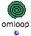
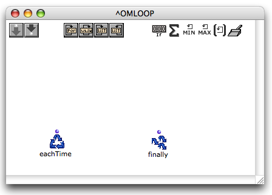
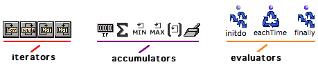
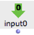
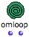

Navigation : [Previous](LoopIntro "page précédente\(Iteration\)")
| [Next](LoopEvaluators "Next\(Evaluators\)")

# General Features

|

The OMLoop module is a specific type of abstraction - or patch. It encloses a
number of specialized components, which allow to design iterative programs.
Programming takes place in the internal editor of OMLoop.  
  
---|---  
  
## OMLoop Editor and Components

Editor

To open the OMLoop editor, double click on the OMLoop box.

The OMLoop editor resembles a patch editor.

Components

OMLoop provides three types of programming components :

  * **iterators** : determine and stop the iteration process.

  * **accumulators** : gather the result at each step of the iteration in the ongoing process until the iteration is over.

Iterators and accumulators are visible at the top of the OMLoop editor and can
be added with a click. The choice of iterators and accumulators depends on the
iteration program.

  * **evaluators** : trigger the evaluation and return the results, at each step or at the end of the iteration. 

The  eachtime and  finally evaluators are essential components which are
displayed by default in the editor.  Initdo can be added typing its name in
the editor.

## Adding Inputs and Outputs

|

Initially, the OMLoop box has only **one output** **and no input** :
programming can be done without the use of external data, like with a patch.

Additional outputs and inputs can be added using the following procedures.  
  
---|---  
  
Inputs

|

**Inputs** transfer incoming data to the programming functions of OMLoop. They
are represented green top-down arrow inside the editor.  
  
---|---  
  

The OMLoop editor shows additional inputs, as well as a number of default
internal components.

|

**** To add or delete an input in the OMLoop box,

  * press `Alt` +  `->` or `<-`

  * press  `>` or `<`.

  
  
---|---  
  
Outputs

OMLoop outputs are managed with another procedure.

|

The finally evaluator represents the  **visible output(s)** of OMLoop. It
returns the results of the iteration. ** Outputs ** can therefore be added and
deleted by adding or deleting ** optional inputs **to and from Finally.  
  
---|---  
  

|

To add or delete inputs to  finally :

  * press `Alt` \+ `->` or `<- `

  * press `>` or `<` .

  
  

|

Outputs also represented on the OMLoop icon once added.  
  
About Evaluators :

  * [Evaluators : Eachtime, Finally, Initdo](LoopEvaluators)

About Evaluation in OMLoops

  * An OMLoop can't be evaluated from the inside of its editor. It will be ineffective until its internal program is defined correctly. 

  * Do not evaluate it before it is completed : an infinite loop might get OM stuck for a while...

References :

Plan :

  * [OpenMusic Documentation](OM-Documentation)
  * [OM User Manual](OM-User-Manual)
    * [Introduction](00-Sommaire)
    * [System Configuration and Installation](Installation)
    * [Going Through an OM Session](Goingthrough)
    * [The OM Environment](Environment)
    * [Visual Programming I](BasicVisualProgramming)
    * [Visual Programming II](AdvancedVisualProgramming)
      * [Abstraction](Abstraction)
      * [Evaluation Modes](EvalModes)
      * [Higher-Order Functions](HighOrder)
      * [Control Structures](Control)
      * [Iterations: OMLoop](OMLoop)
        * [Iteration](LoopIntro)
        * General Features
        * [Evaluators](LoopEvaluators)
        * [Iterators](LoopIterators)
        * [Accumulators](LoopAccumulators)
        * [Example : A Random Series](LoopExample)
      * [Instances](Instances)
      * [Interface Boxes](InterfaceBoxes)
      * [Files](Files)
    * [Basic Tools](BasicObjects)
    * [Score Objects](ScoreObjects)
    * [Maquettes](Maquettes)
    * [Sheet](Sheet)
    * [MIDI](MIDI)
    * [Audio](Audio)
    * [SDIF](SDIF)
    * [Lisp Programming](Lisp)
    * [Errors and Problems](errors)
  * [OpenMusic QuickStart](QuickStart-Chapters)

Navigation : [Previous](LoopIntro "page précédente\(Iteration\)")
| [Next](LoopEvaluators "Next\(Evaluators\)")

