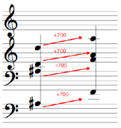

Navigation : [Previous](OMLoop "page précédente\(Iterations:
OMLoop\)") | [Next](LoopGeneral "Next\(General
Features\)")

# Iteration (Introduction)

**OMLoop** is a visual program that executes iterative processes such as
transposition, combinatorial manipulations, scale building, or more
sophisticated operations. As such, it is frequently needed and may be required
as soon as the user gets to the thick of things.

Iteration

Iteration is the repetition of a process in order to apply it to a series of
items.

Example : Transposing a Chord

Transposing a chord actually amounts to adding the same value to each note it
is composed of. Therefore, this process requires the iteration of an addition
corresponding to the number of pitches in the chord.

|

  
  
---|---  
  
Widespread Use of Iteration

Simple combinatorial operations may require much more sophisticated programs
as it seems, and  cannot be designed without resorting to iteration.

For instance, building a series is a basic, frequent process, which can be
easily executed with a pen and a staff. But as long as we wish to systematize
it, extend it, or reproduce it a number of time, we need to resort to programs
requiring an iteration. [ At the end of the OMLoop section](LoopExample),
you will find a detailed example showing how such program can be designed and
extended beyond the context of the traditional 12 semitones series.

**You are nevertheless invited to assimilate the notions expounded in the
following sections before looking this example out**.

References :

Contents :

  * [OpenMusic Documentation](OM-Documentation)
  * [OM User Manual](OM-User-Manual)
    * [Introduction](00-Contents)
    * [System Configuration and Installation](Installation)
    * [Going Through an OM Session](Goingthrough)
    * [The OM Environment](Environment)
    * [Visual Programming I](BasicVisualProgramming)
    * [Visual Programming II](AdvancedVisualProgramming)
      * [Abstraction](Abstraction)
      * [Evaluation Modes](EvalModes)
      * [Higher-Order Functions](HighOrder)
      * [Control Structures](Control)
      * [Iterations: OMLoop](OMLoop)
        * Iteration
        * [General Features](LoopGeneral)
        * [Evaluators](LoopEvaluators)
        * [Iterators](LoopIterators)
        * [Accumulators](LoopAccumulators)
        * [Example : A Random Series](LoopExample)
      * [Instances](Instances)
      * [Interface Boxes](InterfaceBoxes)
      * [Files](Files)
    * [Basic Tools](BasicObjects)
    * [Score Objects](ScoreObjects)
    * [Maquettes](Maquettes)
    * [Sheet](Sheet)
    * [MIDI](MIDI)
    * [Audio](Audio)
    * [SDIF](SDIF)
    * [Lisp Programming](Lisp)
    * [Reactive mode](Reactive)
    * [Errors and Problems](errors)
  * [OpenMusic QuickStart](QuickStart-Chapters)

Navigation : [Previous](OMLoop "page précédente\(Iterations:
OMLoop\)") | [Next](LoopGeneral "Next\(General
Features\)")

