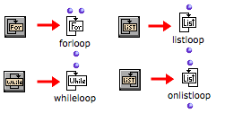

Navigation : [Previous](Initdo "page précédente\(Initdo\)") |
[Next](ListLoop "Next\(List Loop\)")

# Iterators

## Function

An iterative operation must be driven by an **enumeration** , or at least
stopped at some point by a given **condition** . In an OMLoop, this control is
enabled by four **iterators** :

  *  **Forloop**

|

  *  **Whileloop**

|

  *  **Listloop**

|

  *  **OnListloop**

  
---|---|---|---  
  
Iterators can enumerate items in lists, but above all, they can stop the
OMloop once this enumeration is over. This is why a loop must always have at
least one iterator : otherwise, it goes on with infinite iterations.

If several iterators are used simultaneously, the loop stops as soon as **one
of them** stops.

## Adding Iterators

|

To add an iterator in the editor :

  * click on the icon on top of the window

  * `Cmd` click and type a name.

  
  
---|---  
  
All the examples provided here make use the eachtime and finally evaluators of
OMLoop :

  * [Evaluators : Eachtime, Finally, Initdo](LoopEvaluators)

References :

Plan :

  * [OpenMusic Documentation](OM-Documentation)
  * [OM 6.6 User Manual](OM-User-Manual)
    * [Introduction](00-Sommaire)
    * [System Configuration and Installation](Installation)
    * [Going Through an OM Session](Goingthrough)
    * [The OM Environment](Environment)
    * [Visual Programming I](BasicVisualProgramming)
    * [Visual Programming II](AdvancedVisualProgramming)
      * [Abstraction](Abstraction)
      * [Evaluation Modes](EvalModes)
      * [Higher-Order Functions](HighOrder)
      * [Control Structures](Control)
      * [Iterations: OMLoop](OMLoop)
        * [Iteration](LoopIntro)
        * [General Features](LoopGeneral)
        * [Evaluators](LoopEvaluators)
        * Iterators
          * [List Loop](ListLoop)
          * [OnList Loop](OnListLoop)
          * [For Loop](ForLoop)
          * [While Loop](WhileLoop)
          * [Infinite Loops](InfiniteLoops)
        * [Accumulators](LoopAccumulators)
        * [Example : A Random Series](LoopExample)
      * [Instances](Instances)
      * [Interface Boxes](InterfaceBoxes)
      * [Files](Files)
    * [Basic Tools](BasicObjects)
    * [Score Objects](ScoreObjects)
    * [Maquettes](Maquettes)
    * [Sheet](Sheet)
    * [MIDI](MIDI)
    * [Audio](Audio)
    * [SDIF](SDIF)
    * [Lisp Programming](Lisp)
    * [Errors and Problems](errors)
  * [OpenMusic QuickStart](QuickStart-Chapters)

Navigation : [Previous](Initdo "page précédente\(Initdo\)") |
[Next](ListLoop "Next\(List Loop\)")

