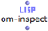
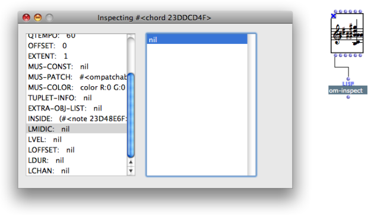
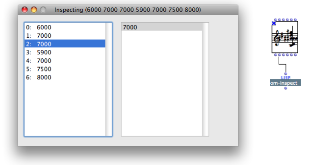
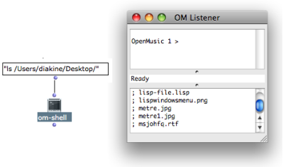
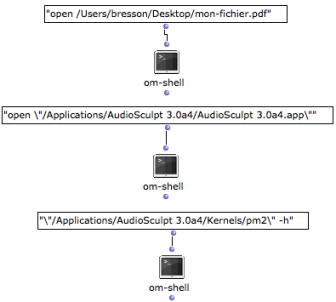

Navigation : [Previous](LispFunctions "page précédente\(Lisp
Function Boxes\)") | [Next](LispUserLib "Next\(Writing
an OM Library\)")

# Lisp Tools

Several underlying Lisp functionalities are available from the OM patches, as
show the few examples presented below.

## The Object Inspector : Om-Inspect

Properties

|

The ** om-inspect ** function allows an **interactive inspection** of the
contents of a data structure. All slots or elements of the structure can be
browsed and inspected recursively, via a a simple list display interface.  
  
---|---  
  
Browsing an Object

To browse the structure of the object, connect the "self" output of the object
to the "object" input of the function.

To get information about the current value of an specific slot, connect the
relevant output to the function.

## System Calls : Om-Shell

Properties

The ** om-shell ** function sends **system calls** to the Unix Terminal --
MacOSX -- or to the Win32 Console -- Windows. It is a useful and easy way to
run external programs from OM.

Example #1 : Browsing a Folder

The "ls" command in Unix allows to list the contents of a directory. The
command "ls " \+ pathname to the folder will be display this list in the
Listener.

Examples #2 : Launching an Application or a File

An application of a file can be launched via the "open ", "open \" commands,
or with a a command line.

References :

Contents :

  * [OpenMusic Documentation](OM-Documentation)
  * [OM User Manual](OM-User-Manual)
    * [Introduction](00-Contents)
    * [System Configuration and Installation](Installation)
    * [Going Through an OM Session](Goingthrough)
    * [The OM Environment](Environment)
    * [Visual Programming I](BasicVisualProgramming)
    * [Visual Programming II](AdvancedVisualProgramming)
    * [Basic Tools](BasicObjects)
    * [Score Objects](ScoreObjects)
    * [Maquettes](Maquettes)
    * [Sheet](Sheet)
    * [MIDI](MIDI)
    * [Audio](Audio)
    * [SDIF](SDIF)
    * [Reactive mode](Reactive)
    * [Lisp Programming](Lisp)
      * [Introduction to Lisp](LispIntro)
      * [The Lisp Editor](LispEditor)
      * [The Listener](LispListener)
      * [Lisp Code in OM](LispInOM)
      * [Lisp Function Boxes](LispFunctions)
      * Lisp Tools
      * [Writing an OM Library](LispUserLib)
      * [Writing Code for OM](LispForOM)
    * [Errors and Problems](errors)
  * [OpenMusic QuickStart](QuickStart-Chapters)

Navigation : [Previous](LispFunctions "page précédente\(Lisp
Function Boxes\)") | [Next](LispUserLib "Next\(Writing
an OM Library\)")

