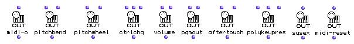
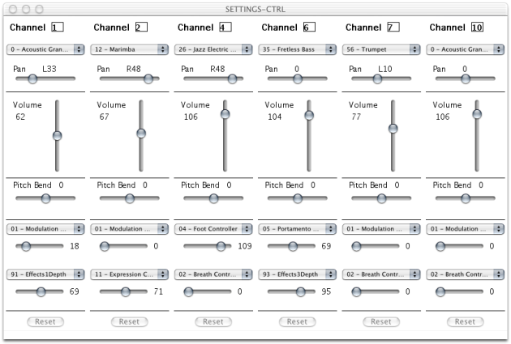
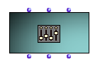

Navigation : [Previous](MIDI-Params "page précédente\(MIDI
Parameters\)") | [Next](MIDI-Utils "Next\(MIDI
Selection Tools\)")

# MIDI Player Controls

In addition to playing notes, several other types of playback control commands
can be sent to a MIDI synthesizer. For instance : changing the timbre (or
"program") for a given channel, changing the volume, etc.

All such MIDI control events are also generally sent for a specific channel.
There exist several ways to send them in OM.

## The "MIDI Send" Boxes

The functions of the `MIDI/MIDI Send` menu send events to the MIDI player when
they are evaluated.

Typically, such evaluation will modify the state of the MIDI devices or
synthesizers connected to a given port (and often for a given channel).

One of the input of the "MIDI Send" boxes is the MIDI channel (or list of
channels) on which the event will be sent.

Another optionnal input is the MIDI port. If no port is specified, the event
are sent to the default MIDI port.

  *  **midi-o** : General output function. Sends raw input data to a given port.

  *  **pitchbend** / **pitchwheel** : Send PitchBend events (Change tuning of MIDI instrument)

    * Pitchweel use 14 bits precision (-8192 to 8191) ; 

    * PitchBend use 7 bits precision (-64 to 63)

  * **ctrlchg** : Sends control change events. 

Parameters of a Control Change event are a controller number and a value
(0-127). For example (10 64) stands for "set controller 10 (pan) to 64
(middle)".

  *  **volume** : Sends volume event with a volume value.

Note : volume is a particular Control Change event (controller number 7)

  *  **pgmout** : Sends Program Change events with a program number (0 - 127)

Used to set instrumental timbre to be applyed to the different MIDI channels.

  * **aftertouch** : sends a channel pressure event with pressure value.

  *  **polykeypres** : sends a key pressure event with pressure and pitch values.

  *  **sysex** : Sends a system exclusive message.

  *  **midi-reset** : Resets default MIDI settings

Selecting Values for MIDI Events

The "selection" utilities provided in OM may make the use of the "MIDI Send"
boxes easier...

MIDI Select Utilities

  * [MIDI Selection Tools](MIDI-Utils)

## The Midi-Mix-Console

The  **MIDI-MIX-CONSOLE** is a special object allowing to send control
messages to MIDI channels through a graphic editor similar to a standard
multi-channel mixing console.

Messages can be sent to control, for instance, the volume, pan, instrument
(timbre), pitch bend or any other MIDI control, for a given number of
channels.

The MIDI-MIX-CONSOLE Box

The MIDI-MIX-CONSOLE object has two main insitialization parameters :

  * A port number (where all MIDI events will be sent)

  * A number of channels controlled by the console.

Specific control and messages is done exclusively via the graphical interface.

|

  
  
---|---  
  
Sending controls

Every move or manipulation in the MIDI-MIX-CONSOLE interface immediately
triggers MIDI messages.

Alternatively, the MIDI-MIX-CONSOLE can be considered as a "standard" musical
object , and therefore be "played" using the standard playback controls in the
patch or maquette editors (see below).

## Playing MIDI Objects

All MIDI objects created in OM can be "played". Playing these objects will not
necessarily sound, but yet sends corresponding MIDI events and therefore
possibly modifies some (sounding or not) MIDI parameters.

Playing an object occurs in the patches using playback shortcuts, or in the
maquettes when the playing cursor reaches a given object.

More about MIDI Objects

  * [MIDI Objects](MIDI-Objects)

How to "Play" the Boxes

  * [Playback and Players](1-Play)

References :

Contents :

  * [OpenMusic Documentation](OM-Documentation)
  * [OM User Manual](OM-User-Manual)
    * [Introduction](00-Contents)
    * [System Configuration and Installation](Installation)
    * [Going Through an OM Session](Goingthrough)
    * [The OM Environment](Environment)
    * [Visual Programming I](BasicVisualProgramming)
    * [Visual Programming II](AdvancedVisualProgramming)
    * [Basic Tools](BasicObjects)
    * [Score Objects](ScoreObjects)
    * [Maquettes](Maquettes)
    * [Sheet](Sheet)
    * [MIDI](MIDI)
      * [Introduction](Intro)
      * [Important MIDI Concepts](MIDI-Concepts)
      * [Rendering and Playback](MIDI-Playback)
        * [MIDI Parameters](MIDI-Params)
        * MIDI Player Controls
        * [MIDI Selection Tools](MIDI-Utils)
        * [Managing MIDI Ports](MIDI-Ports)
        * [Microintervals](Microintervals)
        * [Recording / MIDI In](Record%20MIDI)
      * [MIDI Objects](MIDI-Objects)
    * [Audio](Audio)
    * [SDIF](SDIF)
    * [Lisp Programming](Lisp)
    * [Errors and Problems](errors)
  * [OpenMusic QuickStart](QuickStart-Chapters)

Navigation : [Previous](MIDI-Params "page précédente\(MIDI
Parameters\)") | [Next](MIDI-Utils "Next\(MIDI
Selection Tools\)")

