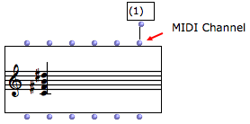
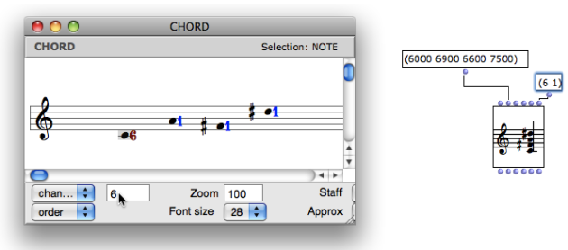

Navigation : [Previous](MIDI-Playback "page précédente\(Rendering
and Playback\)") | [Next](MIDI-Controls "Next\(MIDI
Player Controls\)")

# MIDI Parameters in OM Score Objects

MIDI Channel

Midi notes and events are played on a **channel** , numbered from 1 to 16.

Each channel can be assigned a timbre - in MIDI, this timbre is called a
"program" - as well as a volume, pan, pitchbend and other effects.

In OM objects, the MIDI channel is controlled via "chan" or "lchan" slots.

Each note has its own MIDI channel.

|

  
  
---|---  
  
To display the channel(s) in a score editor, select the `channel` item of the
editor control menu.

|

Visualizing MIDI channels : Here, every note is on channel 1  
  
---|---  
  
The MIDI channel can then be set note by note or for the whole object.

  * Use the corresponding inlet of the box : enter a list with one or several channels. (Remember that if the list in incomplete, the last item will be repeated and assigned to the remaining notes.)

  * Use the editor control menu or the score inspector : 

    1. choose the `channel` menu item in the menu

    2. select one or several notes

    3. enter a number or scroll the mouse in the adjacent text box. 

MIDI "Tracks"

In addition to the channels, MIDI also has a notion of tracks (as used by most
common multitrack sequencers). In OM, we consider each voice in a POLY or
MULTI-SEQ object as a different track when playing these objects in MIDI. This
is not the same thing as if they were on different channels : a track can
include events (notes) corresponding to several diferent channels, and
conversely, several tracks can play notes or events on the same channel.

MIDI Ports

MIDI communication messages can be sent to different MIDI **ports**.

Depending on the MIDI port setting, a port can be connected to one or several
specific synthesizer(s) who will receive exclusively messages sent on this
port.

The **MIDI port** parameter is not represented in the inputs of the box, but
can be set and changed in the score editors.

To change the port number of one or several notes :

  1. select the `port` menu item in the editor control menu

  2. proceed as described above with the channel parameter

|

The MIDI port can be modified in score editors, like the channel parameter.  
  
---|---  
  
MIDI Ports Setup and Assignation

  * [Managing MIDI Ports](MIDI-Ports)

References :

Contents :

  * [OpenMusic Documentation](OM-Documentation)
  * [OM User Manual](OM-User-Manual)
    * [Introduction](00-Contents)
    * [System Configuration and Installation](Installation)
    * [Going Through an OM Session](Goingthrough)
    * [The OM Environment](Environment)
    * [Visual Programming I](BasicVisualProgramming)
    * [Visual Programming II](AdvancedVisualProgramming)
    * [Basic Tools](BasicObjects)
    * [Score Objects](ScoreObjects)
    * [Maquettes](Maquettes)
    * [Sheet](Sheet)
    * [MIDI](MIDI)
      * [Introduction](Intro)
      * [Important MIDI Concepts](MIDI-Concepts)
      * [Rendering and Playback](MIDI-Playback)
        * MIDI Parameters
        * [MIDI Player Controls](MIDI-Controls)
        * [MIDI Selection Tools](MIDI-Utils)
        * [Managing MIDI Ports](MIDI-Ports)
        * [Microintervals](Microintervals)
        * [Recording / MIDI In](Record%20MIDI)
      * [MIDI Objects](MIDI-Objects)
    * [Audio](Audio)
    * [SDIF](SDIF)
    * [Lisp Programming](Lisp)
    * [Reactive mode](Reactive)
    * [Errors and Problems](errors)
  * [OpenMusic QuickStart](QuickStart-Chapters)

Navigation : [Previous](MIDI-Playback "page précédente\(Rendering
and Playback\)") | [Next](MIDI-Controls "Next\(MIDI
Player Controls\)")

