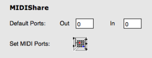
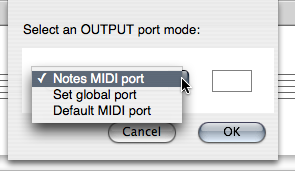
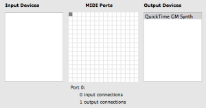

Navigation : [Previous](MIDI-Utils "page précédente\(MIDI
Selection Tools\)") | [Next](Microintervals "page
suivante\(Microintervals\)")

# Managing MIDI Ports

The MIDI port selection determines how MIDI events are directed to one or
several synthesizers.

This can be configured at several levels.

## Default MIDI Ports

In the OM `MIDI` Preferences tab, the default **IN** and **OUT** ports allow
to set a default port where MIDI events are sent if no other port is specified
explicitely.

|

  
  
---|---  
  
The `Set MIDI Ports` button allows to set the different MIDI ports to the
devices connected (and detected) on the computer (see below).

## MIDI Port Setting for Score Objects

In the score objects, it is possible to assign a MIDI Port to each individual
note. A global behavior for the object can however be controlled.

  *  **Notes MIDI port**  : this option just respects the port assigned to the different notes (or use the default MIDI Port from the preferences if no port is specified).

  *  **Set global port**  : this option allows you to set a single port to apply to the whole object, whatever the note ports are

  *  **Default MIDI port  **: this option uses the MIDI port specified in the OM Preferences.

|

  
  
---|---  
  

|

These options are available at selecting the MidiShare player for a given box
(in a patch or in a maquette) or in the score editors via the `...` button
next to the player selection menu.  
  
---|---  
  
## MidiShare Setup

OM MIDI Preferences

MidiShare is OM's default MIDI player. The input / output connections to the
various devices of the system are defined in the OM `MIDI` preferences tab via
the `Set MIDI Ports` button.

By default, port #0 is the only input and output connection to the system's
MIDI inbuilt synthesizer (when available).

The notes in the score objects (if directed to port 0) are therefore sent to
this synthesizer.

To change the input/output devices connected to a given port, select the
corresponding cell in the `MIDI Ports` table and then check/uncheck the
desired items in the `Input Devices` and `Output Devices` lists.

|

  
  
---|---  
  
References :

Contents :

  * [OpenMusic Documentation](OM-Documentation)
  * [OM User Manual](OM-User-Manual)
    * [Introduction](00-Contents)
    * [System Configuration and Installation](Installation)
    * [Going Through an OM Session](Goingthrough)
    * [The OM Environment](Environment)
    * [Visual Programming I](BasicVisualProgramming)
    * [Visual Programming II](AdvancedVisualProgramming)
    * [Basic Tools](BasicObjects)
    * [Score Objects](ScoreObjects)
    * [Maquettes](Maquettes)
    * [Sheet](Sheet)
    * [MIDI](MIDI)
      * [Introduction](Intro)
      * [Important MIDI Concepts](MIDI-Concepts)
      * [Rendering and Playback](MIDI-Playback)
        * [MIDI Parameters](MIDI-Params)
        * [MIDI Player Controls](MIDI-Controls)
        * [MIDI Selection Tools](MIDI-Utils)
        * Managing MIDI Ports
        * [Microintervals](Microintervals)
        * [Recording / MIDI In](Record%20MIDI)
      * [MIDI Objects](MIDI-Objects)
    * [Audio](Audio)
    * [SDIF](SDIF)
    * [Reactive mode](Reactive)
    * [Lisp Programming](Lisp)
    * [Errors and Problems](errors)
  * [OpenMusic QuickStart](QuickStart-Chapters)

Navigation : [Previous](MIDI-Utils "page précédente\(MIDI
Selection Tools\)") | [Next](Microintervals "page
suivante\(Microintervals\)")

