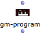
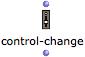
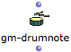
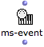
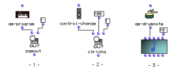

Navigation : [Previous](MIDI-Controls "page précédente\(MIDI
Player Controls\)") | [Next](MIDI-Ports "Next\(Managing
MIDI Ports\)")

# MIDI Selection Tools

In order to make Midi objects and functions easier to set, some "menu-
functions" allow to choose parameters with their standard names (according to
General MIDI specifications) internally converted into corresponding integer
values.

About General MIDI

[http://www.midi.org/techspecs/gm.php](http://www.midi.org/techspecs/gm.php
"http://www.midi.org/techspecs/gm.php \(nouvelle fenêtre\)")

This functions can be used to parameterize the "MIDI Send" control boxes or to
instanciate MIDI objects in OM patches.

MIDI Controls

  * [MIDI Player Controls](MIDI-Controls)

MIDI Objects in OM

  * [MIDI Objects](MIDI-Objects)

|

 **GM-PROGRAM**

|

Selects a MIDI program and returns the corresponding General MIDI program
number.  
  
---|---|---  
  

|

 **CONTROL-CHANGE**

|

Selects a control change and returns the corresponding General MIDI control
number.  
  

|

 **GM-DRUMNOTE**

|

Selects a note and return the corresponding drum element pitch value according
to General MIDI.  
  

|

 **MS-EVENT**

|

Selects an Event type and returns the corresponding MidiShare event number.  
  

|

1) GM-PROGRAM is used to select the program number for changing the timbre of
channel 1 with PGMOUT.

2) CONTROL-CHANGE is used to select the control number to modify on channel 1
with CTRLCHG

3) GM-DRUMNOTE is used to select the correct pitch to assign to a NOTE object
in order to get the desired drum sound (Note that the MIDI channel is 10,
which is generally the channel reserved for drums in MIDI synthesizers).  
  
---|---  
  
References :

Contents :

  * [OpenMusic Documentation](OM-Documentation)
  * [OM User Manual](OM-User-Manual)
    * [Introduction](00-Contents)
    * [System Configuration and Installation](Installation)
    * [Going Through an OM Session](Goingthrough)
    * [The OM Environment](Environment)
    * [Visual Programming I](BasicVisualProgramming)
    * [Visual Programming II](AdvancedVisualProgramming)
    * [Basic Tools](BasicObjects)
    * [Score Objects](ScoreObjects)
    * [Maquettes](Maquettes)
    * [Sheet](Sheet)
    * [MIDI](MIDI)
      * [Introduction](Intro)
      * [Important MIDI Concepts](MIDI-Concepts)
      * [Rendering and Playback](MIDI-Playback)
        * [MIDI Parameters](MIDI-Params)
        * [MIDI Player Controls](MIDI-Controls)
        * MIDI Selection Tools
        * [Managing MIDI Ports](MIDI-Ports)
        * [Microintervals](Microintervals)
        * [Recording / MIDI In](Record%20MIDI)
      * [MIDI Objects](MIDI-Objects)
    * [Audio](Audio)
    * [SDIF](SDIF)
    * [Lisp Programming](Lisp)
    * [Reactive mode](Reactive)
    * [Errors and Problems](errors)
  * [OpenMusic QuickStart](QuickStart-Chapters)

Navigation : [Previous](MIDI-Controls "page précédente\(MIDI
Player Controls\)") | [Next](MIDI-Ports "Next\(Managing
MIDI Ports\)")

