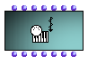
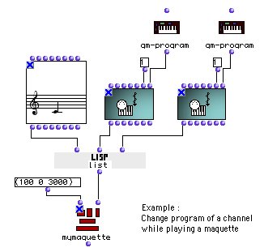

All OM score and MIDI objects can be traduced (with more or less precision or
data loss) into a list of time-tagged MIDI events.

The **MIDIEvent** box represents this basic MIDI element as an object in OM
visual programs.

## The MIDIEvent Box

The **MidiEvent** box represents a single MIDI event in OpenMusic.

The slots of the MidiEvent class are type, date, track, port, channel, and
fields.

In-popup menus and MIDI selection tools can help setting the MidiEvent box
inputs.

|

  
  
---|---  
  
Attributes of MIDI Events

  * [Important MIDI Concepts](MIDI-Concepts)

Selection Tools for Setting MIDI Event Inputs

  * [MIDI Selection Tools](MIDI-Utils)

A "Musical" Object

As other musical objects, MIDIEvent can be "played", that is, sent to a MIDI
output port. It can also be used and send MIDI messages at a given time in a
maquette.

Playing Objects

  * [Playback and Players](1-Play)

Delay

If a date is set for a **MidiEvent** , it will be sent at the corresponding
time (in miliseconds) after playing starts.

## Extracting / Processing MIDI Events

Any types of MIDI or musical object (chord-seq, voice, note, eventmidi-seq,
midifile, midicontrol, midi-mix-console,...) can be converted into a list of
MidiEvents using the method **get-midievents**. It's a very useful function,
allowing all kinds of conversions and "MIDI processing" of the objects.

|

  
  
---|---  
  
This function has an optional input where a lambda function can be connected
to test and filter the MidiEvents.

Some predefined functions in the `MIDI / Filters` menu can be used for this
purpose :

 **test-date** : tests if the MidiEvents occurs beween a min date and a max
date.

 **test-type** : tests the MidiEvent type.

 **test-track** : tests the MidiEvent track.

 **test-port** : tests the MidiEvent port.

 **test-channel** : tests the MidiEvent channel.

 **MidiEvent-filter** : test various of the MidiEvent slots (type, track,
port, channel).

Test on a MIDI Event

Filter MIDI Events from a Container Object

In this example, we filter all MidiEvents from a MidiFile with the same test
as in the previous example. **Get-midievents** outputs a list containing all
MidiEvents which channel = 1.

The resulting list can be saved as a new MidiFile, or stored in a EventMidi-
seq object.

|

  
  
---|---  
  
About EventMidi-seqs

  * [MIDI Containers](MIDIContainer)

Tests as Lambda Boxes

The test function is a parameter of **get-midievent** ; it must be a lambda
function and have only one free input (for the MidiEvents to be tested).

More About Lambda Boxes

  * [Lambda Mode](LambdaMode)
  * [Lambda Mode Examples: Test Functions](LambdaTest)

Designing Filter Functions

For more complex filtering functions, a patch (also set as a lambda box, with
a single free input) can also be plugged to the **get-midievents** test input
:

|

  
  
---|---  
  
This is an example of what could be inside the patch test-func :

|

  
  
---|---  
  
textual Events

Some MIDI events types are called "textual" (e.g. SeqName, InstrumentName,
Lyrics, Copyright, ...). It means that their contents (or "fields") are a
encoded textual data. To translate these fields into text (strings), use the
**me-textinfo** method (can be applyed to MidiEvents or MidiEvents lists).

|

  
  
---|---  
  
References :

Plan :

  * [OpenMusic Documentation](OM-Documentation)
  * [OM 6.6 User Manual](OM-User-Manual)
    * [Introduction](00-Sommaire)
    * [System Configuration and Installation](Installation)
    * [Going Through an OM Session](Goingthrough)
    * [The OM Environment](Environment)
    * [Visual Programming I](BasicVisualProgramming)
    * [Visual Programming II](AdvancedVisualProgramming)
    * [Basic Tools](BasicObjects)
    * [Score Objects](ScoreObjects)
    * [Maquettes](Maquettes)
    * [Sheet](Sheet)
    * [MIDI](MIDI)
      * [Introduction](Intro)
      * [Important MIDI Concepts](MIDI-Concepts)
      * [Rendering and Playback](MIDI-Playback)
      * [MIDI Objects](MIDI-Objects)
        * [MIDI File](MIDIFile)
        * MIDI Events
        * [MIDI Containers](MIDIContainer)
    * [Audio](Audio)
    * [SDIF](SDIF)
    * [Lisp Programming](Lisp)
    * [Errors and Problems](errors)
  * [OpenMusic QuickStart](QuickStart-Chapters)

Navigation : [page precedente](MIDIFile "page précédente\(MIDI File\)") |
[page suivante](MIDIContainer "page suivante\(MIDI Containers\)")

