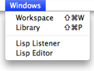
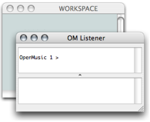
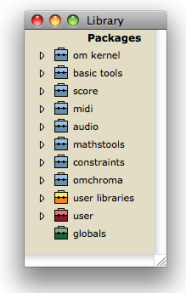
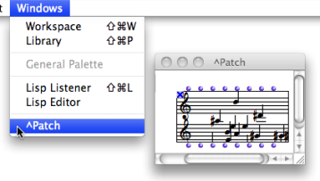
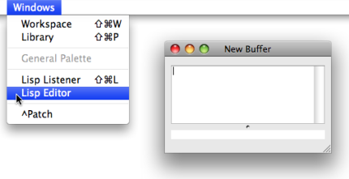

Navigation : [Previous](Environment "page précédente\(The OM
Environment\)") | [Next](Preferences "page
suivante\(Preferences\)")

# Windows of the OM Environment

Sommaire

  1. Workspace Window
  2. Lisp Listener
  3. Library Window
  4. Other Windows

|

The OM interface is declined through a set of windows and editors, which can
be accessed through the `Windows` menu. Among them are three major items :

  * the  **Workspace** window
  * the  **Lisp Listener**
  * the  **Library** window.

  
  
---|---  
  
## Workspace Window

The  **workspace** is designed to host all files and folders related with the
user's projects.

To open or show the workspace window :

  * press `Cmd` \+ `SHIFT` \+ `w`
  * select the `Windows / Workspace` menu.

**The Workspace and the Lisp Listener appear at the start of a session.**

|

  
  
---|---  
  
Full information about the Workspace :

  * [Workspace](Workspace)

Reminder

The window of a new workspace always comes empty first. Material must be added
there by the user.

## Lisp Listener

The OM+ box performs an addition, whose result is given in the Listener.

|

The **Listener** is a Lisp communication interface : results of computations,
warnings or error messages are displayed there. It also allows to send
commands to OM, in other words, to evaluate Lisp expressions.

User inputs are typed and interpreted in the upper part of the Listener
window. Output messages are printed in the lower part of the window.

To open or show a listener window :

  * press `Cmd` `SHIFT` \+ `l`
  * select the `Windows / Listener` menu.

  
  
---|---  
  
More Information about the Lisp Listener :

  * [The Listener](LispListener)

## Library Window

The  **Library** window gives access to a whole set of preexistent programming
items that are ready to use, as well as imported or user-defined elements.
Items are located and organized within the Library in various packages[1].

To open the Library window :

  * go to `Windows / Library`
  * press `Cmd` \+ `SHIFT` \+ `p`.

|

  
  
---|---  
  
Full information about the Library :

  * [Library](Library)

## Other Windows

Programming items are represented in various window types. The `Windows` menu
shows the name of  ** any ** open window. Selecting a name brings the
corresponding window to the foreground.

Preview : the Lisp Editor

The Lisp Editor is a Lisp programming interface which allows to edit and
evaluate programs.

To open the Lisp Editor, go to `Windows / Lisp Editor`.

More Information about the Lisp Editor :

  * [Lisp Programming](Lisp)

References :

  1. Package

Contains functions or classes components belonging to a common category of
programming items. Packages are provided at the installation of OM, but the
can also be loaded dynamically or added by the user.

Plan :

  * [OpenMusic Documentation](OM-Documentation)
  * [OM User Manual](OM-User-Manual)
    * [Introduction](00-Sommaire)
    * [System Configuration and Installation](Installation)
    * [Going Through an OM Session](Goingthrough)
    * [The OM Environment](Environment)
      * Environment Windows
      * [Preferences](Preferences)
      * [Workspace](Workspace)
      * [Library](Library)
      * [Tutorials](Tutorials)
      * [Resources](resources)
    * [Visual Programming I](BasicVisualProgramming)
    * [Visual Programming II](AdvancedVisualProgramming)
    * [Basic Tools](BasicObjects)
    * [Score Objects](ScoreObjects)
    * [Maquettes](Maquettes)
    * [Sheet](Sheet)
    * [MIDI](MIDI)
    * [Audio](Audio)
    * [SDIF](SDIF)
    * [Lisp Programming](Lisp)
    * [Errors and Problems](errors)
  * [OpenMusic QuickStart](QuickStart-Chapters)

Navigation : [Previous](Environment "page précédente\(The OM
Environment\)") | [Next](Preferences "page
suivante\(Preferences\)")

