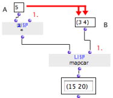
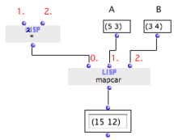

Navigation : [Previous](Funcall "page précédente\(Using Functions
as Data\)") | [Next](LambdaPatch "Next\(Lambda
Patches\)")

# Lambda Mode Examples: Mapcar \- Iterations

Mapcar is a very useful Lisp function, which can apply a function to the items
of one or more lists successively. The function is assigned is the first
argument of mapcar. The lists are assigned as other argument(s).

Usign Mapcar for Iterations

Mapcar constitutes a simple an elegant way to implement **iterative
processes**.

An Other Way of Doing Iterations in OM :

  * [Iterations: OMLoop](OMLoop)

Applying a Function to a List with Mapcar

The first input of the  mapcar box must be a **lambda function** - or a box in
["lambda" mode](LambdaMode). The other argument is a list to operate.

Here, the box *  has

  * one fixed argument : a number (5)

  * one free input, which represents the argument of the lambda function.

Therefore, (A) represents the "f(x) = x * 5" function.

Mapcar goes through the list (B) and applies (A) to each of its items
successively. Results are collected and returned as a list :

((3 * 5) (4 * 5)) = (15 20)

|

  
  
---|---  
  
Multiple Lists Processing

Mapcar accepts a **variable number of lists** to operate, and can process them
simultaneously. Items are matched and processed by the lambda function
successively.

|

Here, the* function box has **two free inputs**. It represents the function "
f(x,y) = x * y ".

The  * function is connected to input #0. It is applied successively to the
first elements of inputs #1 and #2, then to the second elements of inputs #1
and 2, then to the third elements, and so on. A list is built a out of the
successive results.  
  
---|---  
  
Free Inputs and Lists Size

The number of **free inputs** of the lambda box must be equal to the number of
**additional arguments** of the mapcar function.

Mapcar can only process lists with the same number of items.

General Issues with Lambda Functions

  * [Higher-Order Programs and Functions](HighOrder)

References :

Contents :

  * [OpenMusic Documentation](OM-Documentation)
  * [OM User Manual](OM-User-Manual)
    * [Introduction](00-Contents)
    * [System Configuration and Installation](Installation)
    * [Going Through an OM Session](Goingthrough)
    * [The OM Environment](Environment)
    * [Visual Programming I](BasicVisualProgramming)
    * [Visual Programming II](AdvancedVisualProgramming)
      * [Abstraction](Abstraction)
      * [Evaluation Modes](EvalModes)
      * [Higher-Order Functions](HighOrder)
        * [Using Functions as Data](Funcall)
        * Mapcar \- Iterations
        * [Lambda Patches](LambdaPatch)
        * [Test Functions](LambdaTest)
      * [Control Structures](Control)
      * [Iterations: OMLoop](OMLoop)
      * [Instances](Instances)
      * [Interface Boxes](InterfaceBoxes)
      * [Files](Files)
    * [Basic Tools](BasicObjects)
    * [Score Objects](ScoreObjects)
    * [Maquettes](Maquettes)
    * [Sheet](Sheet)
    * [MIDI](MIDI)
    * [Audio](Audio)
    * [SDIF](SDIF)
    * [Lisp Programming](Lisp)
    * [Errors and Problems](errors)
  * [OpenMusic QuickStart](QuickStart-Chapters)

Navigation : [Previous](Funcall "page précédente\(Using Functions
as Data\)") | [Next](LambdaPatch "Next\(Lambda
Patches\)")

