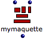
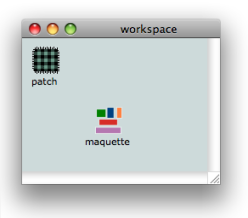
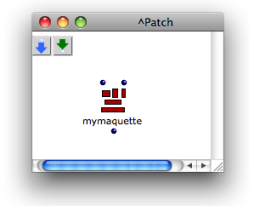
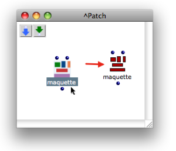

Navigation : [Previous](Maquettes "page précédente\(Maquettes\)")
| [Next](TemporalBoxes "Next\(TemporalBoxes\)")

# Creating a Maquette

Contents

  1. General Features
  2. Creating General Maquettes
  3. Using Maquettes inside Patches
  4. Using Maquettes inside Other Maquettes
  5. Saving a Maquette

Like patches, maquettes be used as autonomous programs, or within other
patches and maquettes, like blue and red patches. Consequently, OM also offers
two types of maquettes :

  * general maquettes : 

|

|

  * internal maquettes : 

|

  
  
---|---|---|---  
  
See also

  * [Abstraction Boxes](AbsBoxes)

## General Features

General and Local Maquetttes

**General maquettes** can be :

  * added in a workspace and used as main programs.
  * dropped and used in a patch, like an abstraction.

** Local ** **maquettes** can be added directly into a patch like an internal
abstraction.

Using Maquettes in Other Maquettes

Maquettes can also be used within other maquettes, according to similar
principles :

  * an existing maquette can be dropped and used into another maquette.
  * a maquette can be created directly within another maquette.

Conversions

Last, like blue and red patches again, general maquettes can be ** converted
** into local maquettes, and vice-versa.

## Creating General Maquettes

Procedure

|

General maquettes are equivalent to standard blue patches. Like them, they can
be created in the workspace, or one of its folders.

To add a maquette in a workspace :

  * select `File / New Maquette`
  * press `Ctrl` click and choose `New Maquette` in the contextual menu
  * press `Cmd` \+ `2`

  
  
---|---  
  
Maquette Files

General maquettes are persistent files that can be manipulated like patches.
They can be :

  * imported and exported from a workspace
  * duplicated and renamed
  * used in other maquettes and patches.

Managing Items in the Workspace

  * [The Workspace Window](WS-Window)

## Using Maquettes inside Patches

Using a General Maquette in a Patch

Once a maquette is added in a workspace, it can be dropped in a patch, on the
same basis as an abstraction : like a "global" abstraction, or blue patch, the
maquette keeps it original reference, which means any modification will affect
all of its representations.

Adding an Internal Maquette in a Patch

|

Internal maquettes are the equivalent to internal - red - patches .They can be
created inside a patch.

To add a maquette in a patch :

  * `Cmd` click and type "maquette" in the editor 
  * `Ctrl` / right click and choose `Maquette` in the contextual menu.

  
  
---|---  
  
Converting Maquettes

General maquettes can be converted into internal maquettes, and reciprocally,
internal maquettes can be converted into global abstractions.

  * To convert a general maquette into an internal maquettes, select it and type `a`.
  * To convert an internal maquette into a general maquette, drop it from the patch into the workspace, or one of its folders. 

|

  
  
---|---  
  
Patch Conversion Procedures

  * [Conversions](AbsConversion)

## Using Maquettes inside Other Maquettes

This use of maquettes mostly sets forth a number of specificities dealing with
the use of TemporalBoxes[1].

Creating and Using Objects within Maquettes

  * [Maquette Programming](Programming%20Maquette)
  * [TemporalBoxes](TemporalBoxes)

## Saving a Maquette

To save a maquette :

  * press `Cmd` \+ `s`
  * choose `File / Save `
  * `Ctrl` / right click in the maquette and choose `Last Saved` in the contextual menu.

The `Last Saved` command allows to reset the maquette to its last saved
version.

References :

  1. TemporalBox

A TemporalBox refers to an object in a maquette : an instance, a patch, or
another maquette.

Contents :

  * [OpenMusic Documentation](OM-Documentation)
  * [OM User Manual](OM-User-Manual)
    * [Introduction](00-Contents)
    * [System Configuration and Installation](Installation)
    * [Going Through an OM Session](Goingthrough)
    * [The OM Environment](Environment)
    * [Visual Programming I](BasicVisualProgramming)
    * [Visual Programming II](AdvancedVisualProgramming)
    * [Basic Tools](BasicObjects)
    * [Score Objects](ScoreObjects)
    * [Maquettes](Maquettes)
      * Creating a Maquette
      * [TemporalBoxes](TemporalBoxes)
      * [The Maquette Editor](Editor)
      * [Maquette Programming](Programming%20Maquette)
      * [Maquettes in Patches](Maquettes%20in%20Patches)
    * [Sheet](Sheet)
    * [MIDI](MIDI)
    * [Audio](Audio)
    * [SDIF](SDIF)
    * [Reactive mode](Reactive)
    * [Lisp Programming](Lisp)
    * [Errors and Problems](errors)
  * [OpenMusic QuickStart](QuickStart-Chapters)

Navigation : [Previous](Maquettes "page précédente\(Maquettes\)")
| [Next](TemporalBoxes "Next\(TemporalBoxes\)")

