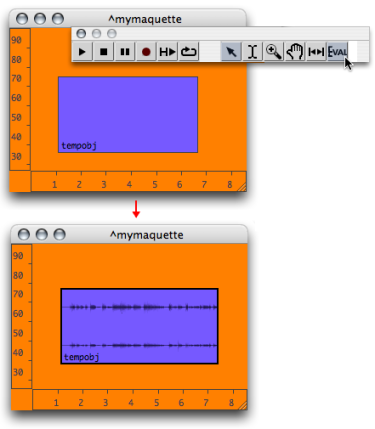
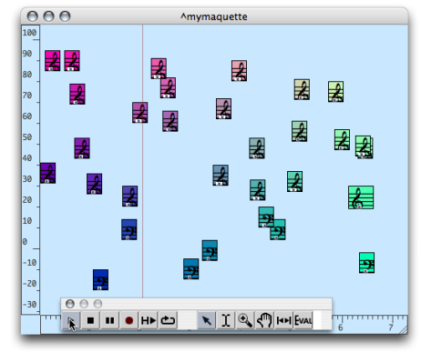
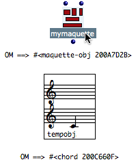

Navigation : [Previous](InputsOutputs "page précédente\(Functional
Components\)") | [Next](Synthpatchprog "Next\(The
Synthesis Patch\)")

# Evaluation of the Maquette

## Evaluation Procedures

Global Evaluation of the Maquette

To evaluate a whole maquette, select `Eval` in the palette. OM evaluates
**all the boxes** located at the end of the programming chain, which will
eventually lead to the evaluation of all the TemporalBoxes of the maquette.

The global evaluation of the maquette returns a  **maquetteobj** . The
listener displays a message of the type " => #<maquette-obj 34678965>".

Note that this command applies to the whole maquette even if a specific
TemporalBox is selected.

Associated Files

In some cases, OM asks to choose a file when the box is evaluated, event if it
was already attributed a file. This is the case when a TemporalBox refers to a
sound file, for instance.

**Boxes can be locked** to avoid the systematic opening of the dialogue
window.

Evaluating TemporalBoxes

Choose a TemporalBox and press `v`. The selected box and  **all other
connected boxes** are be evaluated.

Controlling TemporalBoxes Evaluation

TemporalBoxes can be set on "[lock](LockMode)" or "[evaluate-
once](EvOnceMode)" mode, so as their content is protected, or to limit
the number of internal evaluations.

## Default Calculation of a Maquette's Value

The value of a maquette is the musical object, or container, yielded when the
maquette is evaluated. Very basically, this musical object is actually what is
played by the player, just as with a sequencer.

The default type of this object is a  **maquetteobj** : a musical sequence, a
whole that combines TemporalBoxes, with a given musical value and temporal
position.

This is especially visible when a local maquette is evaluated from a patch :
the Listener displays a "maquetteobj" reference. It can be compared with the
object connected to a Tempout.

|

  
  
---|---  
  
Synthesis Patches

Maquettes can represent many other types of objects : sounds, chords, melodic
sequences... The way a maquette is calculated can also be modified, so that
the values of its TemporalBoxes is interpreted differently. To do so, a
**synthesis patch** can be integrated in the maquette, like an " **output
evaluation tool** ".

About Synthesis Patches

  * [Calculating the Value of a Maquette](Synthesispatch)

References :

Plan :

  * [OpenMusic Documentation](OM-Documentation)
  * [OM 6.6 User Manual](OM-User-Manual)
    * [Introduction](00-Sommaire)
    * [System Configuration and Installation](Installation)
    * [Going Through an OM Session](Goingthrough)
    * [The OM Environment](Environment)
    * [Visual Programming I](BasicVisualProgramming)
    * [Visual Programming II](AdvancedVisualProgramming)
    * [Basic Tools](BasicObjects)
    * [Score Objects](ScoreObjects)
    * [Maquettes](Maquettes)
      * [Creating a Maquette](Maquette)
      * [TemporalBoxes](TemporalBoxes)
      * [The Maquette Editor](Editor)
      * [Maquette Programming](Programming%20Maquette)
        * [Functional Components](InputsOutputs)
        * Evaluation
        * [The Synthesis Patch](Synthpatchprog)
        * [TempBoxes Programming](TempProgramming)
      * [Maquettes in Patches](Maquettes%20in%20Patches)
    * [Sheet](Sheet)
    * [MIDI](MIDI)
    * [Audio](Audio)
    * [SDIF](SDIF)
    * [Lisp Programming](Lisp)
    * [Errors and Problems](errors)
  * [OpenMusic QuickStart](QuickStart-Chapters)

Navigation : [Previous](InputsOutputs "page précédente\(Functional
Components\)") | [Next](Synthpatchprog "Next\(The
Synthesis Patch\)")

