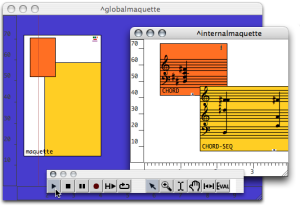
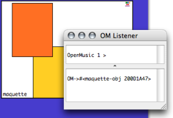

Navigation : [Previous](PatchValue "page précédente\(Patches\)") |
[Next](InstancesValue "Next\(Instances\)")

# Sub Maquettes

Like patches, maquettes can be dropped or created in a maquette editor.

|

  
  
---|---  
  
## Sub Maquettes Value

|

Maquettes are like "containers", whose value is the produce of the whole set
of values returned by its inner components. This container is called
"maquetteobj", as shown in the Listener at the evaluation.

A maquette doesn't need a Tempout to express its value.  
  
---|---  
  
Calculation Procedure

However, the calculation procedure of this value can be modified.

Calculating the Value of a Maquette : Alternate Tools

  * [Calculating the Value of a Maquette](Synthesispatch)

## Maquettes and Musical Content

Maquettes can also exist  **without being expressed musically** . This is the
case when a maquette contains elements with no musical expression.
Consequently, nothing happens when the maquette is played.

References :

Plan :

  * [OpenMusic Documentation](OM-Documentation)
  * [OM User Manual](OM-User-Manual)
    * [Introduction](00-Sommaire)
    * [System Configuration and Installation](Installation)
    * [Going Through an OM Session](Goingthrough)
    * [The OM Environment](Environment)
    * [Visual Programming I](BasicVisualProgramming)
    * [Visual Programming II](AdvancedVisualProgramming)
    * [Basic Tools](BasicObjects)
    * [Score Objects](ScoreObjects)
    * [Maquettes](Maquettes)
      * [Creating a Maquette](Maquette)
      * [TemporalBoxes](TemporalBoxes)
        * [Adding TemporalBoxes](AddingTempbox)
        * [Elementary Manipulations](elementary)
        * [Temporalboxes Appearance](Appearance)
        * [TemporalBoxes Value](TempValues)
          * [Patches](PatchValue)
          * Sub Maquettes
          * [Instances](InstancesValue)
      * [The Maquette Editor](Editor)
      * [Maquette Programming](Programming%20Maquette)
      * [Maquettes in Patches](Maquettes%20in%20Patches)
    * [Sheet](Sheet)
    * [MIDI](MIDI)
    * [Audio](Audio)
    * [SDIF](SDIF)
    * [Lisp Programming](Lisp)
    * [Errors and Problems](errors)
  * [OpenMusic QuickStart](QuickStart-Chapters)

Navigation : [Previous](PatchValue "page précédente\(Patches\)") |
[Next](InstancesValue "Next\(Instances\)")

