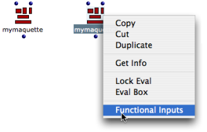
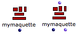
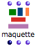
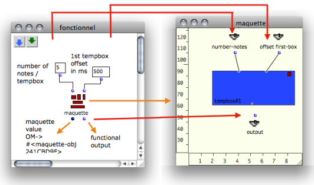
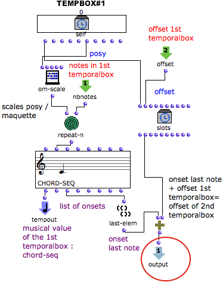
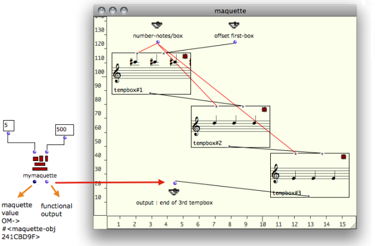

Navigation : [Previous](Build "page précédente\(Build Mode\)") |
[Next](Maquettes%20in%20Patches2 "Next\(Reference
Mode\)")

# Functional Mode

## Use

A maquette on "functional" mode can be compared to a function. This is
especially significant when a maquette is to receive or to return values, from
the inside of a patch or another maquette.

Procedure

When a maquette is added in a patch, it is by default on "build" mode, as show
its dark blue inputs and outputs.

To set a maquette box on "functional" mode, `Ctrl` / right click on the
maquette box and select `Functional Inputs`.

|

  
  
---|---  
  

|

The maquette then shows only one "build" output. "Build" inputs disappear.

When inputs and outputs are added from the maquette editor, they appear on the
outside of the maquette as standard inputs and outputs. The "value" output
remains visible in first position.  
  
---|---  
  
Functionalities

|

Functional inputs allow

  * to pass values from the patch to the maquette
  * possibly to get outcoming values back. 

  
---|---  
  
The content of the maquette is not built from the patch, but used as a
preexistent full-fledged function.

## Example : Defining a Sequence from the Outside and Inside of the Maquette

In this example,a maquette is used inside a patch for building a sequence with
three TemporalBoxes.

Organizing the Maquette

On one hand, a number of notes and an initial offset are defined  **from the
outside of the maquette** .

On the other hand

  * pitches are determined by the  **vertical position of each box**
  * the successive offsets of the second and third box are calculated from **inside the maquette** .

  * The  **first functional input** of the maquette is assigned a  **number of notes** and connected to the first input of a TemporalBox.
  * The  **second functional input** is assigned an offset - starting point in milliseconds - and connected to the second input of the TemporalBox.
  * The output of the maquette can possibly send data  **from the TemporalBox** to the  **outside** of the maquette.

Programming TemporalBox #1

Values are returned to the functional inputs of the maquette to define a
chord-seq in the TemporalBox.

  * The "posy" is scaled from 5000 to 8000 by om-scale.
  * The resulting pitch is repeated five times by repeat-n and returned to the chord-seq.
  * The chord-seq box is connected to the Tempout : it is now the musical value of the TemporalBox.
  * The offset of the TemporalBox is added to the onset of the chord-seq's last note, and returned to the functional output. This determines the position of the next box in the maquette.

Defining TemporalBoxes #2 and 3 and Evaluating the Maquette

TemporalBox #1 is duplicated to create two new TemporalBoxes, which are
connected to each other and to the maquette inputs.

Completing the sequence

  1. The same number of notes is returned by the first input of the maquette to all TemporalBoxes.

  2. The ending offset value  of a TemporalBox is connected to the second input of the next TemporalBox. Boxes follow each other in a temporal sequence.

  3. Pitches match the vertical position of the boxes.

  4. The ending offset calculated in TemporalBox #3 is returned to the  **functional output** of the maquette. It can possibly be used for subsequent computations in the patch editor, or in another maquette. 

References :

Contents :

  * [OpenMusic Documentation](OM-Documentation)
  * [OM User Manual](OM-User-Manual)
    * [Introduction](00-Contents)
    * [System Configuration and Installation](Installation)
    * [Going Through an OM Session](Goingthrough)
    * [The OM Environment](Environment)
    * [Visual Programming I](BasicVisualProgramming)
    * [Visual Programming II](AdvancedVisualProgramming)
    * [Basic Tools](BasicObjects)
    * [Score Objects](ScoreObjects)
    * [Maquettes](Maquettes)
      * [Creating a Maquette](Maquette)
      * [TemporalBoxes](TemporalBoxes)
      * [The Maquette Editor](Editor)
      * [Maquette Programming](Programming%20Maquette)
      * [Maquettes in Patches](Maquettes%20in%20Patches)
        * [Build Mode](Build)
        * Functional Mode
        * [Reference Mode](Maquettes%20in%20Patches2)
    * [Sheet](Sheet)
    * [MIDI](MIDI)
    * [Audio](Audio)
    * [SDIF](SDIF)
    * [Lisp Programming](Lisp)
    * [Reactive mode](Reactive)
    * [Errors and Problems](errors)
  * [OpenMusic QuickStart](QuickStart-Chapters)

Navigation : [Previous](Build "page précédente\(Build Mode\)") |
[Next](Maquettes%20in%20Patches2 "Next\(Reference
Mode\)")

