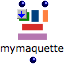
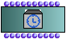
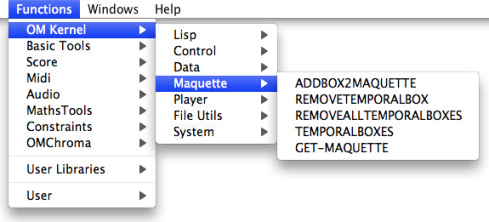

Navigation : [Previous](Maquettes%20in%20Patches1 "page
précédente\(Functional Mode\)") | [Next](addprocedure "page
suivante\(Adding TemporalBoxes\)")

# Reference Mode

## Use

|

The "[reference](RefMode)" mode can be used simultaneously with both
"build" and "functional" modes.

Objects in a maquette on "reference" mode can be :

  * added,
  * accessed,
  * removed.

  
---|---  
  
Procedure

To set a maquette on "reference" mode in a patch, select it, press `b` and
click three times on the  label to display the
 reference label.

Permanent Modifications

Any operation performed on a maquette on "reference" mode will modify the
master object permanently.

Frequently Used Commands

The manipulation of TemporalBoxes from the  **outside of the maquette**
requires the frequent use of a number of items :

  * TemporalBoxes instances
  * TemporalBox slots boxes, 
  * self input  boxes. 

Here is a resume of the commands allowing to create these items.

Object

| |

Command  
  
---|---|---  
  
** TemporalBox instance **

|

|

  * `Cmd` click and type "temporalbox".

  * select `Classes / OMKernel / Maquette / TEMPORALBOX`.

  
  
** Self Input box **

|

|

  1. `Ctrl` / right click

  2. select `TemporalBox / Self Input`.

  
  
** slots box **

|

|

  1. `Cmd` / click in a patch editor

  2. type "temporalbox"

  3. validate while keeping `SHIFT` pressed.

  
  
## Connate Functions

A number of function allow to add, access, manipulate or delete TemporalBoxes
in a maquette on "reference" mode from a patch. These functions can be
accessed via the `Functions / OM Kernel / Maquette` menu.

References :

Contents :

  * [OpenMusic Documentation](OM-Documentation)
  * [OM User Manual](OM-User-Manual)
    * [Introduction](00-Contents)
    * [System Configuration and Installation](Installation)
    * [Going Through an OM Session](Goingthrough)
    * [The OM Environment](Environment)
    * [Visual Programming I](BasicVisualProgramming)
    * [Visual Programming II](AdvancedVisualProgramming)
    * [Basic Tools](BasicObjects)
    * [Score Objects](ScoreObjects)
    * [Maquettes](Maquettes)
      * [Creating a Maquette](Maquette)
      * [TemporalBoxes](TemporalBoxes)
      * [The Maquette Editor](Editor)
      * [Maquette Programming](Programming%20Maquette)
      * [Maquettes in Patches](Maquettes%20in%20Patches)
        * [Build Mode](Build)
        * [Functional Mode](Maquettes%20in%20Patches1)
        * Reference Mode
          * [Adding TemporalBoxes](addprocedure)
          * [Examples](addexamples)
          * [Accessing Boxes](REF3)
          * [Removing Boxes](REF4)
          * [Interaction (1)](REF5)
          * [Interation (2)](Intercation2)
    * [Sheet](Sheet)
    * [MIDI](MIDI)
    * [Audio](Audio)
    * [SDIF](SDIF)
    * [Lisp Programming](Lisp)
    * [Errors and Problems](errors)
  * [OpenMusic QuickStart](QuickStart-Chapters)

Navigation : [Previous](Maquettes%20in%20Patches1 "page
précédente\(Functional Mode\)") | [Next](addprocedure "page
suivante\(Adding TemporalBoxes\)")

