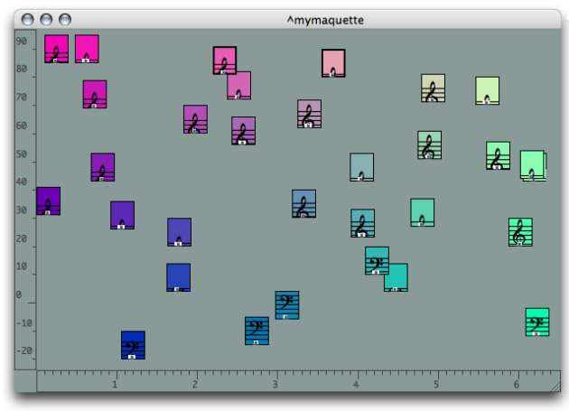

Navigation : [Previous](Import "page précédente\(Import\)") |
[Next](Maquette "Next\(Creating a Maquette\)")

A maquette is an object, which represents both a  **musical "container[1]"**
and a  **visual program** .

In a maquette, objects can be manipulated according to temporal and graphical
parameters. This includes :

  * the  **graphical and temporal organization** of objects,
  * the  **calculation of objects** , which can then be  **connected together** to interact like in a patch,
  * the  **calculation of the maquette's temporal structure**.

A maquette contains specific boxes :  **TemporalBoxes** , which have a number
of characteristics :

  * **a reference** , that is, an instance, a patch, or another maquette contained in the box,
  * **a position and duration characteristics** , which refer to the integration of the box in the maquette's  context.
  * **a "musical value** ", produced in the maquette's context. 

To a certain extent, the maquette can be considered a patch.

References :

  1. Container

In OM, a container is an object that contains a number of sub objects,
including other containers as well. For instance, a chord-seq that contains
chords, a chord that contains notes, a maquette that contains temporal
objects, etc.

Plan :

  * [OpenMusic Documentation](OM-Documentation)
  * [OM 6.6 User Manual](OM-User-Manual)
    * [Introduction](00-Sommaire)
    * [System Configuration and Installation](Installation)
    * [Going Through an OM Session](Goingthrough)
    * [The OM Environment](Environment)
    * [Visual Programming I](BasicVisualProgramming)
    * [Visual Programming II](AdvancedVisualProgramming)
    * [Basic Tools](BasicObjects)
    * [Score Objects](ScoreObjects)
    * Maquettes
      * [Creating a Maquette](Maquette)
      * [TemporalBoxes](TemporalBoxes)
      * [The Maquette Editor](Editor)
      * [Maquette Programming](Programming%20Maquette)
      * [Maquettes in Patches](Maquettes%20in%20Patches)
    * [Sheet](Sheet)
    * [MIDI](MIDI)
    * [Audio](Audio)
    * [SDIF](SDIF)
    * [Lisp Programming](Lisp)
    * [Errors and Problems](errors)
  * [OpenMusic QuickStart](QuickStart-Chapters)

Navigation : [Previous](Import "page précédente\(Import\)") |
[Next](Maquette "Next\(Creating a Maquette\)")

