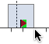
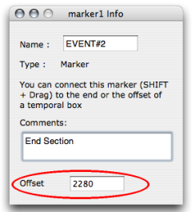
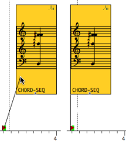

Navigation : [Previous](player "page précédente\(The Palette\)") |
[Next](Programming%20Maquette "Next\(Maquette
Programming\)")

# Markers and Temporal Anchors

Markers are designed as pivots to define the beginning or the end of
Temporalboxes. These markers are placed on the temporal axis of the editor.

## Setting Markers

Creating Markers

To create a marker, `Cmd` click on the ruler. A small red triangle
 appears.

Moving Markers

To move a marker :

  1. select it

  2. use the mouse or the `->` and `<-` keys.

Add `SHIFT` to move faster.

Deleting Markers

To delete a marker :

  1. select it by a click and drag 

  2. press `Backspace`.

## Locating and Editing Markers: the Info Window

Offset, Name, Documentation

The location, name and documentation of a marker can be specified.

  1. Open the `Info` window :

    * `Ctrl` / right click
    * press `Cmd` \+ `i` on a marker.
  2. Enter an offset in milliseconds, a name or documentation.

  3. Click somewhere outside the frames to validate the information. 

|

  
  
---|---  
  
## Using Markers as Temporal Anchors

|

To lock the temporal position of a box :

  1. `SHIFT` click on a marker 

  2. drag a connection towards the beginning or the end of a Temporalbox. 

To delete an anchor, select the connection and press `Backspace`.  
  
---|---  
  
References :

Contents :

  * [OpenMusic Documentation](OM-Documentation)
  * [OM User Manual](OM-User-Manual)
    * [Introduction](00-Contents)
    * [System Configuration and Installation](Installation)
    * [Going Through an OM Session](Goingthrough)
    * [The OM Environment](Environment)
    * [Visual Programming I](BasicVisualProgramming)
    * [Visual Programming II](AdvancedVisualProgramming)
    * [Basic Tools](BasicObjects)
    * [Score Objects](ScoreObjects)
    * [Maquettes](Maquettes)
      * [Creating a Maquette](Maquette)
      * [TemporalBoxes](TemporalBoxes)
      * [The Maquette Editor](Editor)
        * [Editor Appearance](EditorAppearance)
        * [Rulers and Grid](Grid%20and%20Rulers)
        * [The Palette](player)
        * Markers / Anchors
      * [Maquette Programming](Programming%20Maquette)
      * [Maquettes in Patches](Maquettes%20in%20Patches)
    * [Sheet](Sheet)
    * [MIDI](MIDI)
    * [Audio](Audio)
    * [SDIF](SDIF)
    * [Lisp Programming](Lisp)
    * [Reactive mode](Reactive)
    * [Errors and Problems](errors)
  * [OpenMusic QuickStart](QuickStart-Chapters)

Navigation : [Previous](player "page précédente\(The Palette\)") |
[Next](Programming%20Maquette "Next\(Maquette
Programming\)")

