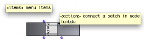

Navigation : [Previous](Slider "page précédente\(Slider Box\)") |
[Next](InterfaceExample "Next\(Examples of Use\)")

# Selecting Items and Triggering Actions: Pop-Up Menu Box

Sommaire

  1. Features
  2. Settings
  3. Uses
  4. A Musical Application : an Extended Example

The  **pop-up-menu** box allows to

  * select items of a list in a pop-up menu interface

  * trigger a computation corresponding to a selected item.

To some extent, it resembles the items-list boxes.

## Features

Inputs

|

The  pop-up-menu box has two inputs :

  * "items" : a list of menu items

  * "action" : an action to perform, represented by a lambda function or lambda patch.

  
  
---|---  
  
Outputs

The two outputs are independent from the inputs :

  * the first output returns the **index of the selected item**.

  * the second output : returns **the value of the selected item as a text**.

## Settings

Menu

To set the menu items, edit the first input, select the box and evaluate.

Selected Item Value

Click on the menu to select an item. When the box is evaluated :

  * The first output returns the number corresponding to the selected item. **Note that the first menu item is equal to 0**. 

  * The second output returns the value of the selected item as text.

Locking the Menu

Mind locking the box before the evaluation : otherwize, the selected item
might be reinitialized (by default to the first item in the list).

## Uses

Tip : Selecting Files

Using a directory to initialize the menu contents.

|

The  pop-up-menu box can be useful for selecting files in a folder.

Connect a **folder pathname** to the first output of the pop up box : the menu
items will stand for the files contained in the folder.

The  infile and outfile boxes are designed to return a  **directory pathname**
to the files contained in the `in-files` and `outfiles` folder of the current
workspace. They can be connected to the  pop-up-menu to list and select files
in these folders.  
  
---|---  
  
Triggering an Operation

The second input of the menu can be used for triggering an operation using the
selected item as parameter. This input must be connected to a function or a
[box on "lambda" mode](LambdaMode) with one input or argument.

To set or modify the function associated with the menu, connect a box or
function, then  evaluate the box .

The lambda function is called when an item is selected.

The index of this item is the number returned by the first output. It is the
argument of the function.

|

The value of the selected item - a number between 0 and 2 - is printed in the
listener at selection.  
  
---|---  
  
## A Musical Application : an Extended Example

Choosing and Listening to a Sound with a Pop-Up-Menu Box

  * [Using the Interface Boxes : Example](InterfaceExample)

References :

Plan :

  * [OpenMusic Documentation](OM-Documentation)
  * [OM 6.6 User Manual](OM-User-Manual)
    * [Introduction](00-Sommaire)
    * [System Configuration and Installation](Installation)
    * [Going Through an OM Session](Goingthrough)
    * [The OM Environment](Environment)
    * [Visual Programming I](BasicVisualProgramming)
    * [Visual Programming II](AdvancedVisualProgramming)
      * [Abstraction](Abstraction)
      * [Evaluation Modes](EvalModes)
      * [Higher-Order Functions](HighOrder)
      * [Control Structures](Control)
      * [Iterations: OMLoop](OMLoop)
      * [Instances](Instances)
      * [Interface Boxes](InterfaceBoxes)
        * [General Features](GeneralFeatures)
        * [Text Boxes](TextBoxes)
        * [Check Box](CheckBox)
        * [List Boxes](ListBoxes)
        * [Button](Button)
        * [Slider Box](Slider)
        * Pop-Up Menu Box
        * [Examples of Use](InterfaceExample)
      * [Files](Files)
    * [Basic Tools](BasicObjects)
    * [Score Objects](ScoreObjects)
    * [Maquettes](Maquettes)
    * [Sheet](Sheet)
    * [MIDI](MIDI)
    * [Audio](Audio)
    * [SDIF](SDIF)
    * [Lisp Programming](Lisp)
    * [Errors and Problems](errors)
  * [OpenMusic QuickStart](QuickStart-Chapters)

Navigation : [Previous](Slider "page précédente\(Slider Box\)") |
[Next](InterfaceExample "Next\(Examples of Use\)")

