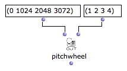
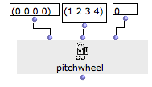

Navigation : [Previous](MIDI-Ports "page précédente\(Managing MIDI
Ports\)") | [Next](Record%20MIDI "Next\(Recording /
MIDI In\)")

# Playing Microintervals with MIDI

The MIDI pitch unit correspond to 1 semi-tone, so microintervals, in
principle, are not handled by this format.

In OM however, pitches are expressed in **midicents** , which corresponds to
MIDI pitch * 100.

Writing Microintervals

  * [Microintervals Notation](Editor-Microintervals)

Two possibilities exist to play microintervals in OM :

## Using MidiShare (The Default MIDI Player)

When playing microintervals, OpebnMusic uses a "trick" consisting in
dispatching the notes on different MIDI channels depending on their micro-
intervallic pitch.

  * 1/8 tones are sent to channel #2

  * 1/4 tones are sent to channel #3

  * 3/8 tones are sent to channel #4

As a consequence, you just need to "depitch" the corresponding channels to the
right values in order to obtain the right microintervalling rendering.

Modifying Pitches in MIDI : PitchBend

  * [Important MIDI Concepts](MIDI-Concepts)

Limitations of the Microintervals Playback

1) This techniques works **ONLY** for 1/4 and 1/8th tones (other or smaller
microintervals are not considered)

2) MIDI channels must not be set or used for other purposes : they will be
changed automatically by the OM player, so all the notes should initially be
on channel 1.

Setting the MIDI Channels for Microintervals

In order to play 1/ or 1/8th tones in OM, channels 1, 2 and 3 must be
depitched :

  * Channel 2 of 1/8 tone

  * Channel 3 of 2/8 tones (or 1/4 tone)

  * Channel 4 of 3/8 tones

Channel 1

Channel 1 does not need to be modified since 1/2 tones only will be kept on
this channel.

Procedure

The **pitchbend** and **pitchwheel** functions can be use to set the pitch of
the "microintervallic channels".

PitchBend/PitchWheel : MIDI-Send boxes

  * [MIDI Player Controls](MIDI-Controls)

Depitching with PitchWheel

The **pitchweel** function has more precision than pitchbend (this is the main
difference between the two functions).

The value range for the pitchwheel are 0 - 8192, which usually correspond to 1
tone pitch deviation.

As a consequence, 1/8th tone corresponds to pitchwheel = 1024, 2/8th tones =
2048, and 3/8th tones = 3072.

These values must be assigned respectively to channels 2, 3 and 4.

|

  
  
---|---  
  
At evaluating the **pitchwheel** box, the MIDI channels will be modified and
subsequent MIDI playback will render miucrotones accordingly.

Reset

To reset the pitchbend values pitchweel again with values = 0 for every
channel:

|

  
  
---|---  
  
## Using Another Player

The MicroPlayer allows to play MIDI objects with no microintervallic
restriction.

Changing the Player / About MicroPlayer

  * [Score Players](ScorePlayer)

References :

Contents :

  * [OpenMusic Documentation](OM-Documentation)
  * [OM User Manual](OM-User-Manual)
    * [Introduction](00-Contents)
    * [System Configuration and Installation](Installation)
    * [Going Through an OM Session](Goingthrough)
    * [The OM Environment](Environment)
    * [Visual Programming I](BasicVisualProgramming)
    * [Visual Programming II](AdvancedVisualProgramming)
    * [Basic Tools](BasicObjects)
    * [Score Objects](ScoreObjects)
    * [Maquettes](Maquettes)
    * [Sheet](Sheet)
    * [MIDI](MIDI)
      * [Introduction](Intro)
      * [Important MIDI Concepts](MIDI-Concepts)
      * [Rendering and Playback](MIDI-Playback)
        * [MIDI Parameters](MIDI-Params)
        * [MIDI Player Controls](MIDI-Controls)
        * [MIDI Selection Tools](MIDI-Utils)
        * [Managing MIDI Ports](MIDI-Ports)
        * Microintervals
        * [Recording / MIDI In](Record%20MIDI)
      * [MIDI Objects](MIDI-Objects)
    * [Audio](Audio)
    * [SDIF](SDIF)
    * [Lisp Programming](Lisp)
    * [Reactive mode](Reactive)
    * [Errors and Problems](errors)
  * [OpenMusic QuickStart](QuickStart-Chapters)

Navigation : [Previous](MIDI-Ports "page précédente\(Managing MIDI
Ports\)") | [Next](Record%20MIDI "Next\(Recording /
MIDI In\)")

