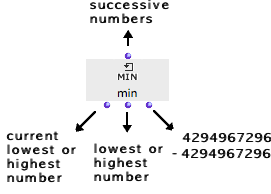

Navigation : [Previous](Sum "page précédente\(Sum\)") | 
[Next](Count "Next\(Count\)")

# Min and Max : Comparing Values

**  Min ** and **max** compare the successive
values of an iteration, and return the lowest or the highest one.

## Inputs and Outputs

|

Min and max have one default input and three outputs :

  * "what" : collects successive values coming from other boxes.
  * first output :

  1. triggers the collection and the comparison of these incoming values

  2. returns the  **current** lowest or highest collected value at each step of the loop

  * second output : returns the lowest or highest value
  * third output : reinitializes the accumulator with the highest or lowest possible numbers : 4294967296 and -4294967296. These are comparison references for the next values. 

  
  
---|---  
  
## Example : Selecting the Lowest or Higher Value of a List

  1. Listloop enumerates the numbers of a list and returns them successively to min or max.

  2. Each time, the new number is compared to the current value. 

If it is higher - max - or lower - min - than the current value, it is stored
instead of this current value.

  3. The current value is printed. 

  4. The second output of min and max returns the resulting lowest or greatest value of all the list to Finally.

References :

Contents :

  * [OpenMusic Documentation](OM-Documentation)
  * [OM User Manual](OM-User-Manual)
    * [Introduction](00-Contents)
    * [System Configuration and Installation](Installation)
    * [Going Through an OM Session](Goingthrough)
    * [The OM Environment](Environment)
    * [Visual Programming I](BasicVisualProgramming)
    * [Visual Programming II](AdvancedVisualProgramming)
      * [Abstraction](Abstraction)
      * [Evaluation Modes](EvalModes)
      * [Higher-Order Functions](HighOrder)
      * [Control Structures](Control)
      * [Iterations: OMLoop](OMLoop)
        * [Iteration](LoopIntro)
        * [General Features](LoopGeneral)
        * [Evaluators](LoopEvaluators)
        * [Iterators](LoopIterators)
        * [Accumulators](LoopAccumulators)
          * [Collect](Collect)
          * [Sum](Sum)
          * Min / Max
          * [Count](Count)
          * [Acum](Acum)
        * [Example : A Random Series](LoopExample)
      * [Instances](Instances)
      * [Interface Boxes](InterfaceBoxes)
      * [Files](Files)
    * [Basic Tools](BasicObjects)
    * [Score Objects](ScoreObjects)
    * [Maquettes](Maquettes)
    * [Sheet](Sheet)
    * [MIDI](MIDI)
    * [Audio](Audio)
    * [SDIF](SDIF)
    * [Reactive mode](Reactive)
    * [Lisp Programming](Lisp)
    * [Errors and Problems](errors)
  * [OpenMusic QuickStart](QuickStart-Chapters)

Navigation : [Previous](Sum "page précédente\(Sum\)") | [Next](Count "Next\(Count\)")

