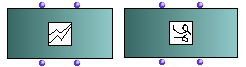
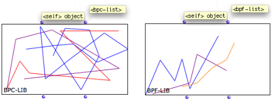
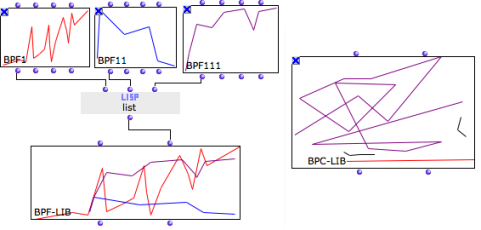

Navigation : [Previous](BPF-BPC "page précédente\(BPF / BPC\)") |
[Next](BPFEditors "Next\(Editors\)")

# Multiple Objects : BPF/BPC-Lib

|

** BPC-lib ** and  ** BPF-lib ** objects are collections of BPFs and BPCs.  
  
---|---  
  
## Properties

BPF-libs and BPC-libs have two inputs and outputs :

  1. "self" : the object itself, a BPF-Lib or BPC-Lib

  2. "bpf / bpc list" : a list of BPFs or BPCs.

## Creating BPF-Libs or BPF-Libs in a patch

BPF-lib and  BPC-lib instances can be created

  * out of existing BPFs or BPCs gathered in lists.
  * via their respective [editors](BPFEditors).

Abscissa Scale

The  BPF-lib or  BPC-lib precision is automatically adapted to the highest
"decimal" value of the BPF or BPC objects of the list.

References :

Contents :

  * [OpenMusic Documentation](OM-Documentation)
  * [OM User Manual](OM-User-Manual)
    * [Introduction](00-Contents)
    * [System Configuration and Installation](Installation)
    * [Going Through an OM Session](Goingthrough)
    * [The OM Environment](Environment)
    * [Visual Programming I](BasicVisualProgramming)
    * [Visual Programming II](AdvancedVisualProgramming)
    * [Basic Tools](BasicObjects)
      * [Curves and Functions](CurvesAndFunctions)
        * [BPF / BPC](BPF-BPC)
        * BPF/BPC-Libs
        * [Editors](BPFEditors)
        * [BPF / BPC Tools](Tools)
        * [3D Objects](3D)
      * [Array](ClassArray)
      * [TextFile](textfile)
      * [Picture](Picture)
    * [Score Objects](ScoreObjects)
    * [Maquettes](Maquettes)
    * [Sheet](Sheet)
    * [MIDI](MIDI)
    * [Audio](Audio)
    * [SDIF](SDIF)
    * [Lisp Programming](Lisp)
    * [Reactive mode](Reactive)
    * [Errors and Problems](errors)
  * [OpenMusic QuickStart](QuickStart-Chapters)

Navigation : [Previous](BPF-BPC "page précédente\(BPF / BPC\)") |
[Next](BPFEditors "Next\(Editors\)")

