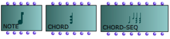
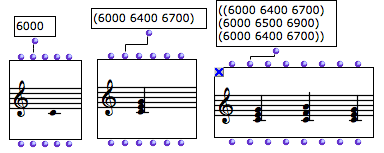
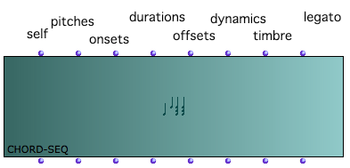
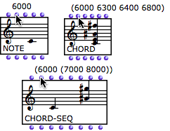
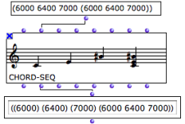
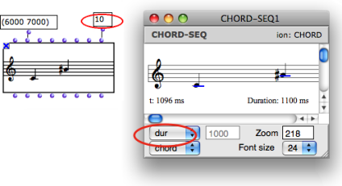

Navigation : [Previous](Score-Objects-Intro "page
précédente\(Presentation\)") | [Next](RhythmicObjects "page
suivante\(Rhythmic Objects\)")

# Notes, Chords and Chord-Seqs

|

There are three harmonic objects : notes, chords, chord-seqs.  Chord-seqs are
successions of chords.

  * A note is a unique pitch.
  * A chord is a list of notes.
  * A chord-seq is a list of chords.

  
  
---|---  
  

A note, a chord and a chord-seq.

## General Features

Parameters

Harmonic objects have a number of common parameters. Chords and chord-seqs
have specific parameters.

Objects

|

Parameter

|

Input Name

|

Value  
  
---|---|---|---  
  
All

|

Pitch

|

"midic"

|

Midicents  
  
All

|

Dynamics

|

"vel"

|

1 -> 127  
  
All

|

Duration

|

"dur"

|

Milliseconds  
  
All

|

Timbre

|

"midichannel"

|

1 -> 16  
  
Chords and  chord-seqs

|

Offset

|

"offset"

|

Milliseconds  
  
Chord-seqs

|

Onset

|

"onset"

|

Milliseconds  
  
Chord-seqs

|

Legato

|

"legato"

|

Milliseconds  
  
The inputs order varies depending on their significance to the object.

Input Values

|

  * **Note** inputs accept  **atoms** only, that is, a simple value without parenthesis. A single pitch, and its corresponding parametric values as well, must be expressed by an atom.

  * ** Chord ** inputs accept  **atoms and lists** . A chord consisting of a  **single note** is expressed by an atom. A chord consisting of a  **set of notes** must be expressed by a list.

  * ** Chord-seq ** inputs accept  **elementary lists and lists with sub lists** . A chord-seq consisting of a  **succession of notes** is expressed in an elementary list. A chord-seq consisting of a  **succession of chords** is expressed by a list with sub lists. The elements of one sub list belong to the same chord.

The " **legato** " input accepts  **atoms** only : a single legato value is
applied to all the elements of the chord-seq.

  
  
---|---  
  

|

As  chord-seqs rather expect sub lists, lists are converted into sub lists
when outputs are evaluated.

Here, the three first values of the output list stand for distinct chords.
They are converted into sub lists.  
  
---|---  
  
Note

The default data structure format can be checked by hovering the mouse over
the inputs of a box.

## Chord and Chord-Seq Specific Features

Offsets and Onsets

Chords and chord-seq have specific parameters : "offsets" and "onsets", which
can become easily confusing.

  * The  **onset** represents the position of the  **first note of a chord** .
  * The  **offset** represents the  **delay between this first note and the following note(s** ). A chord can "unfold" in time, with an arpeggio for instance.

Offsets are visible when opening the editor of a chord or chord-seq.

Each chord of the chord-seq has one onset, and one offset per note.

Legato

A chord-seq has a supplemental input : the " **legato** " input. All chords
have the same legato percentage. Hence, the "legato" input only accepts atoms.
It is displayed in the score editor via the `duration` menu item of the editor
control.

This value doesn't apply to notes or chords added subsequently via the score
editor.

Displaying Parametric Values :

  * [Harmonic Objects : Note, Chord and Chord-Seq Editors](Harmonic-Obj-Editor)

Chords and chord-seqs : Matching List Structures

The list structures of each slot of a chord or chord-seq don't have to be
strictly similar. Objects manipulate the lists assigned to each of their
parameters to produce compatible lists.

If lists don't have the same number of elements, shorter lists are completed
to fit the longest list(s) :

  * by repeating the last element
  * by applying the same time difference to all elements, in the case of  **onsets** . 

If a list has too many elements, the last elements are suppressed.

In any case, pitches is the reference list.

The object returns compatible and coherent pattern.

References :

Plan :

  * [OpenMusic Documentation](OM-Documentation)
  * [OM User Manual](OM-User-Manual)
    * [Introduction](00-Sommaire)
    * [System Configuration and Installation](Installation)
    * [Going Through an OM Session](Goingthrough)
    * [The OM Environment](Environment)
    * [Visual Programming I](BasicVisualProgramming)
    * [Visual Programming II](AdvancedVisualProgramming)
    * [Basic Tools](BasicObjects)
    * [Score Objects](ScoreObjects)
      * [Presentation](Score-Objects-Intro)
        * Harmonic Objects
        * [Rhythmic Objects](RhythmicObjects)
        * [Polyphonic Objects](Polyphonic)
      * [Rhythm Trees](RT)
      * [Score Players](ScorePlayer)
      * [Score Editors](ScoreEditors)
      * [Quantification](Quantification)
      * [Export / Import](ImportExport)
    * [Maquettes](Maquettes)
    * [Sheet](Sheet)
    * [MIDI](MIDI)
    * [Audio](Audio)
    * [SDIF](SDIF)
    * [Lisp Programming](Lisp)
    * [Errors and Problems](errors)
  * [OpenMusic QuickStart](QuickStart-Chapters)

Navigation : [Previous](Score-Objects-Intro "page
précédente\(Presentation\)") | [Next](RhythmicObjects "page
suivante\(Rhythmic Objects\)")

