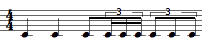

Navigation :

  * [Guide](OM-Documentation)
  * [Plan](OM-Documentation_1)
  * Glossary

# Glossary

Sommaire :  |  [A-B](#sec_ab) | [C](#sec_c) | [D-F](#sec_df) | [G-H](#sec_gh) | [I](#sec_i) | [J-L](#sec_jl) | [M](#sec_m) | [N-O](#sec_no) | [P](#sec_p) | [Q-R](#sec_qr) | [S](#sec_s) | [T-Z](#sec_tz) |

## A-B

     

### Absolute Pathname

An absolute pathname, also referred to as an absolute path or a full path, is
the location of a filesystem object - file, directory or link- relative to the
**root directory**.

Referents...

  * [Pathnames](Pathnames)

    

### Abstraction

Abstraction is a procedure that permits to abstract a program, that is, a
process, a patch, into a box that can then be used into another program. In
other words, an abstraction box represents a patch in another patch and acts
as a function.

Referents...

  * [Abstraction Boxes](AbsBoxesIntro#i4)

    

### Abstraction

A program or patch can be more or less complex, and comprise one or several
components "layers", like a tree structure. Such structures consist of patches
embedded into other patches. Processes embedded in higher-level programs are
called ** abstractions**.

Abstraction aims at using a program as a  **function** within another program.

  * From a formal view, an abstraction results from the  **conversion of one or several elements of a program into variables** . 
  * Consequently, in practical terms, an abstraction must have at least one outlet to ** communicate with the external environment **. 

Referents...

  * [Abstraction](Abstraction#i0)

    

### Argument

An argument represents a parameter upon which a function operates. For
instance, the (om+ x y) function has two arguments : x and y.

Referents...

  * [Function Boxes](FunctionBoxes#i5)
  * [Function Boxes](FunctionBoxes#i6)
  * [Function Boxes](FunctionBoxes#i10)
  * [Instantiating Objects](2-Instanciation#i7)
  * [Introduction to Lisp](LispIntro#i3)
  * [Programming a Simple Patch](2_progpatch#i4)

    

### Atom

An elementary item, number, symbol, string. An atom can be part of a list.

Referents...

  * [Formalizing a Process](4cApplication#i2)

    

### Break Point Function

A "break-point" function is a function defined by a finite number of points
(x,y).

Referents...

  * [BPF / BPC](BPF-BPC#i2)

## C

    

### CAR, CDR, CADR, CDDR, CADDR...

Elementary Lisp functions, allowing the access to one or more elements in a
list.

Lisp fonctions are actually linked list. Lists are actually "conses" (or
"pairs") made of a first element and a pointer to the rest (or "tail") of the
list (another cons). These two parts of the list are accessed with the CAR and
CDR functions, respectively.

Let the following list be : (A B C D).

CAR (A B C D) = A.

CDR (A B C D) = (B C D).

CDR (B) => NIL [this list has no CDR]

"CAR" and "CDR" are technical terms which originally refer to the way data is
handled by the computer. CAR is the acronym of "Contents of the Address part
of Register number". CDR is the acronym of "Contents of the Decrement part of
Register number".

The rest of the functions below are built upon these two kernel accessors.

CADR (A B C D) = B. CADR means CAR of the CDR.

CDDR (A B C D) = (C D). CDDR means CDR of the CDR.

CADDR (A B C D) = C. CADDR means CAR of the CDDR.

NTHCDR (A B C D) = NTH CDR of the list - N must be specified as argument.
NTHCDR 3 (A B C D) = (D).

And so on...

Referents...

  * [Type Predicates](PredTypes#i2)
  * [Type Predicates](PredTypes#i3)
  * [List Loop](ListLoop#i2)
  * [List Loop](ListLoop#i3)
  * [List Loop](ListLoop#i4)

    

### Chord-Seq

OM name of a chord sequence. By extension, a note sequence, since a single
note can be considered a chord.

Referents...

  * [Instantiating Objects](2-Instanciation#i6)

    

### Class

A category of objects sharing common properties - characteristics and
behaviour. A class specifies the internal structure and behaviour of an
object. In OM, it is represented in a patch by a factory box that can produce
an instance of a class.

See also : Object, Instance

Referents...

  * [Workspace(s) Management](Workspace\(s\)#i8)
  * [Library](Library#i0)
  * [Packages](Packages#i5)
  * [Packages](Packages#i8)
  * [Adding Boxes Into a Patch](AddingBoxes#i4)
  * [Boxes Features](GraphicFeatures#i5)
  * [Objects - Factory Boxes](FactoryBoxes#i0)
  * [Instantiating Objects](2-Instanciation#i5)
  * [Global Variables](GlobalVariables#i6)
  * [Chord & Musical Objects](4aApplication#i1)

    

### CLOS - Common Lisp Object System -

CLOS is an object-oriented programming protocol defined in the Common Lisp
language specification. It is based on classes, instances of classes, generic
functions and methods to be used in Lisp programs.

See also : Class, Function, Generic Function, Method, Instance.

Referents...

  * [Function Boxes](FunctionBoxes#i9)

    

### Conditional Operators

Conditional operators execute an operation if one or more preconditions are
fulfilled. If these conditions are not fulfilled, they can possibly execute
another operation.

OM offers two conditional operators : ** omif ** and ** **conditional** **,
which operate according to the following paradigm : "IF A, THEN do B, ELSE do
C".

Referents...

  * [Conditional Operators](ConditionalOps#i0)

    

### Container

In OM, a container is an object that contains a number of sub objects,
including other containers as well. For instance, a chord-seq that contains
chords, a chord that contains notes, a maquette that contains temporal
objects, etc.

Referents...

  * [Maquettes](Maquettes#i0)

    

### Contextual menu

A pop up menu that allows to choose actions to be performed upon an object.

⤷ `Ctrl` click or right click in an OM window or on one of its item.

Referents...

  * [Comments](5dComplete#i1)

    

### Currying

Reducing the number of arguments of a lambda function by assigning values to
some of them.

Referents...

  * [Higher-Order Functions](HighOrder#i3)

## D-F

    

### Directory

Corresponds to the "directory'' concept in many host file systems: the name of
a group of related files (typically those belonging to a single user or
project).

Referents...

  * [Pathnames](Pathnames#i9)

    

### Evaluation

In Lisp, evaluating an expression amounts to interpreting and reducing its
contents in order to return a result.

In OM, visual programs represent Lisp expressions and evaluating a box
triggers the calculus that will determine the value of these expressions.

Any kind of box can be evaluated and return something. To evaluate a box, ⤷
Click and press `v` or `Cmd` click on an outlet.

Referents...

  * [Boxes Features](GraphicFeatures#i6)
  * [Introduction to Lisp](LispIntro#i4)
  * [Programming a Simple Patch](2_progpatch#i1)
  * [Programming a Simple Patch](2_progpatch#i5)
  * [Creating an Instance](4bApplication#i1)

    

### Factory Box

A box used for creating an instance, or exemplar, of a given class within a
visual program.

Referents...

  * [Boxes](Boxes#i1)
  * [Boxes Features](GraphicFeatures#i3)
  * [Chord & Musical Objects](4aApplication#i3)

    

### First Class Object

A first-class object is an entity which can be passed as a parameter to a
function, returned from a function, or assigned into the variable of a
program.

Referents...

  * [Higher-Order Functions](HighOrder#i2)

    

### Function

A  portion of code within a larger program, which performs a specific task.
Operates upon 0 or more parameters and returns a value.

Referents...

  * [Workspace(s) Management](Workspace\(s\)#i9)
  * [Library](Library#i1)
  * [Packages](Packages#i6)
  * [Adding Boxes Into a Patch](AddingBoxes#i3)
  * [Boxes](Boxes#i0)
  * [Boxes Features](GraphicFeatures#i4)
  * [Programming a Simple Patch](2_progpatch#i2)

    

### Functional Abstraction

A functional abstraction is a program whose some elements can become
variables, via connections to the outside environment. Hence, this program
must have inputs or outputs that can be connected to external variable
elements. The resulting functional abstraction can then be embedded into other
programs to be used as a functional component.

Referents...

  * [Abstraction Boxes](AbsBoxesIntro#i2)
  * [Abstraction Boxes](AbsBoxesIntro#i3)
  * [Visual Programming II](AdvancedVisualProgramming#i0)
  * [Inputs / Outputs](AbsInOuts#i2)

## G-H

    

### Generic Function

In object oriented programming, a generic function is a collection of methods
- elementary specialized functions - with the same name and argument
structure, but with arguments typed differently.

See also : Method

Referents...

  * [Packages](Packages#i9)
  * [Function Boxes](FunctionBoxes#i8)

    

### Global variable

An instance of OM object that has been saved in order to be used in other
programs. Global variables are visible from the `Library` window and stored as
.omi files in the `Globals` folder of the workspace.

Referents...

  * [Workspace(s) Management](Workspace\(s\)#i6)
  * [Packages](Packages#i7)
  * [Import/Export](4-ImportExport#i3)
  * [Visual Programming II](AdvancedVisualProgramming#i3)
  * [Instance Boxes](InstanceBoxes#i3)
  * [The Store Object](Store#i3)

    

### Group

An internal subdivision, that is, a list of proportions within a measure. A
group can enclose a sub group. Basic examples are tuplets, groups of eighth,
sixteenth notes. Groups of quarter, semibreves, whole notes or any other
values are also admitted in rhythm trees.

For instance :

(? ((4//4 ( (2 ( 1 1)) (1 ( 1 (1 (1 1 1)))) (1 (1 1 1 1 1)) )))).

This one measure tree has one group - two quarter notes - , one group with a
sub group - one eighth note and a sixteenth notes triplet, and a last group -
a quintuplet.

Referents...

  * [Rhythm Trees Structure](RT1#i3)

## I

    

### Instance

An actual object created at runtime, out of a given class. In OM, more
specifically, an object created when evaluating a factory box. An instance can
be saved as a global variable.

⤷ `SHIFT` click on an outlet - especially the first outlet representing the
self, the whole object - of a factory box to materialize an instance.

Referents...

  * [Workspace(s) Management](Workspace\(s\)#i7)
  * [Objects - Factory Boxes](FactoryBoxes#i1)
  * [Instantiating Objects](2-Instanciation#i3)
  * [Instantiating Objects](2-Instanciation#i8)
  * [Import/Export](4-ImportExport#i2)
  * [Visual Programming II](AdvancedVisualProgramming#i2)
  * [Global Variables](GlobalVariables#i4)
  * [Global Variables](GlobalVariables#i5)
  * [Chord & Musical Objects](4aApplication#i4)

    

### Instantiation

An instance is an exemplar of a class of objects. Instantiation is the process
of creating an instance of a class using a factory box.

Referents...

  * [Instantiating Objects](2-Instanciation#i2)

    

### Internal Evaluation

Evaluation of a box by OM, triggered by a user evaluation, or by the internal
evaluation of an upstream box connected to it.

Referents...

  * [Evaluate-Once Mode](EvOnceMode#i2)
  * [Evaluate-Once Mode](EvOnceMode#i4)

    

### Iteration

The repetition of a process within a computer program.

See also : Recursion.

Referents...

  * [Visual Programming II](AdvancedVisualProgramming#i1)

    

### Iteration

Iteration is the repetition of a process in order to apply it to a series of
items.

Referents...

  * [Iteration](LoopIntro#i0)

## J-L

    

### Library

A library is a set of tools, or framework, used by an application - like OM -
to execute specific tasks.

Referents...

  * [Mac OS X](InstallationMac#i4)
  * [Windows](InstallationWindows#i4)

    

### Lisp Listener

A Lisp communication interface displaying results of computations, warnings or
error messages, and where Lisp expressions - programs - can be evaluated.

Referents...

  * [Function Boxes](FunctionBoxes#i7)
  * [Lisp Programming](Lisp#i0)
  * [Starting a Session](1_StartSession#i3)

    

### Lisp Package

In Lisp, a package is a means to gather symbols, such as functions, variables
or class names, within a same specific name space. You are always working in a
"current" package, which can be changed with the command (in-package "my-
package").

In orde to use items defined in other packages (unless these item's names are
"exported" to the current package), it is generally necessary to type the
package name (or "nickname"), separated by " : :", before the usual name ( Ex.
: om : :om+ ).

The default package in OM is "OPENMUSIC" or "OM". The default package in
Common Lisp is "CL-USER".

Referents...

  * [The Lisp Editor](LispEditor#i5)

    

### List

A finite ordered sequence of elements delineated by two parenthesis, where
each element itself is an atom or a list.

See also : Atom.

Referents...

  * [Formalizing a Process](4cApplication#i1)

## M

    

### Maquette

A hybrid of visual program and sequencer, a programming unit provided with a
time dimension, where musical material is organized in a time oriented
structure.

Referents...

  * [Workspace(s) Management](Workspace\(s\)#i5)
  * [The Workspace Window](WS-Window#i3)

    

### Matrix

A matrix is a rectangular array of m*n numbers, with m rows and n columns,
such as :

1 2 3

4 5 6

Referents...

  * [Array](ClassArray#i0)

    

### Method

An elementary function or part of a generic function defining rules for its
behaviour depending on a type of argument. Defining a generic function amounts
to defining at least one method.

For instance, the OM+ function is made of four methods : 1. number + list / 2.
list + number / 3. number + number / 4. list + list

Referents...

  * [Workspace(s) Management](Workspace\(s\)#i10)
  * [Library](Library#i2)
  * [Function Boxes](FunctionBoxes#i11)
  * [The Lisp Editor](LispEditor#i3)
  * [The Lisp Editor](LispEditor#i4)

    

### Midicent

A midicent is a unit representing one cent of the usual MIDI pitch unit, that
is, a half-tone. For instance, a C4 corresponds to 60 in MIDI, and to 6000
midicents, C4# to 61, i.e. 6100 midicents, and so on.

Referents...

  * [Patch Introduction](ProgrammingIntro#i3)
  * [Completing the Edition](5bComplete#i1)

    

### Modulo

In computing, the modulo operation finds the **remainder** of division of one
number by another. If two numbers,  a and  b , when divided by the same  n
**divisor** , have the same remainder, they are **" equal modulo  n ".**

-> If remainder ( a  /  n ) = remainder ( b /  n ),  a =  b , modulo  n . 

Referents...

  * [Test Functions](LambdaTest#i0)

## N-O

    

### n->mc

Converts a note name or list of note names into corresponding midi cents
values. The reference is the standard notation, where the medium C (6000
midicents) = C3.

Referents...

  * [Examples of Use](InterfaceExample#i2)

    

Name

The name of a group of files that can be thought of as the "same'' file

Referents...

  * [Pathnames](Pathnames#i7)

    

### Object

A thing provided with properties - characteristics and behaviour. An object is
defined by a class and shares the same characteristics with other objects
belonging to the same class.

An exemplar of a class.

For instance, the class of Note defines all possible notes by listing the
characteristics and behaviors they can have. The object A4 is a particular
note : it is an instance of the Class note, with particular versions of its
characteristics. A note has a pitch. An A4 is a 440 Hz note.

See also : Class, Instance, Object Oriented Programming.

Referents...

  * [Chord & Musical Objects](4aApplication#i2)

    

### Offset

Temporal position of an object.

In a chord, each note can have a specific offset.

Referents...

  * [Chord & Musical Objects](4aApplication#i5)

    

### OM Function

A function that has been specifically designed for OpenMusic, and that doesn't
belong to Lisp.

Referents...

  * [Programming a Simple Patch](2_progpatch#i3)

    

### Omor, Omand

Omor and omand  are ** boolean
logical operators ** that stand for the "and" and "or" coordinating
conjunctions.

  * A proposition that contains an "and" is true if  **all** its elements are true. 
  * A proposition that contains an "or" is true if  **at least one** of its elements is true. 

For instance, the following propositions are respectively true and false :

  * A : "Men are living creatures". B : "Cats are living creatures". "A and B" is true, and "A or B" is true.
  * A : "Men are human beings." B : "Cats are human beings". "A or B" is true, but "A and B" is not true. 

In OM

  * the omand box returns "true" if  ** all ** its inputs return "true". Otherwise, it returns "nil". 
  * the omor box returns "true" if one of its inputs return "true". Otherwise, it returns "nil".

Referents...

  * [Logical Operators](Logical#i2)

## P

    

### Package

Contains functions or classes components belonging to a common category of
programming items. Packages are provided at the installation of OM, but the
can also be loaded dynamically or added by the user.

Referents...

  * [Environment Windows](MainWindows#i4)
  * [Adding Boxes Into a Patch](AddingBoxes#i5)

    

### Package

A package represents a category of programming tools that encloses related
functions and classes. It can be organized in sub packages.

Referents...

  * [Packages](Packages#i4)

    

### Parent Directory

A parent directory is the directory in which a given directory is located. In
an absolute path, the parent directoy is the predecessor of the current
directory.

Referents...

  * [Pathnames](Pathnames#i5)

    

### Patch

A programming unit where objects and functions - boxes - are interconnected to
build a musical algorithm, that is, a sequence of instructions. A patch can
also be embedded as a box within another patch.

Referents...

  * [Workspace(s) Management](Workspace\(s\)#i4)
  * [The Workspace Window](WS-Window#i2)
  * [Starting a Session](1_StartSession#i1)

    

### Persistent object/document, Persistence

A persistent object corresponds to a "real" file that is kept somewhere in the
hard drive of the computer. Examples of persistent objects in OM are patches,
maquettes, or global variables. The corresponding documents are kept in the
Workspace folder. Conversely, a "non-persistent" object lays within a program
but cannot be manipulated as an independent file.

Referents...

  * [Workspace(s) Management](Workspace\(s\)#i3)
  * [Instances](Instances#i0)

    

### Predicate

The concept of predicate refers to a **property** , or to a **relation**
between the terms of a proposition.

A predicates is a  boolean operators  : it is a function which tests for a
condition involving its arguments. If the condition is fulfilled, the operator
returns "true" or "false" - "yes" or "no".

In Lisp, "nil" means "false", and "t" means "true". As a convention, any non
nil value is also interpreted as "true".

There are several types of predicates. Among these, algebraic predicates
compare numbers, equality predicates test if two objects are identical, type
predicates that test if an object belongs to a specific type, and so on.

In OM, predicates are often used as ****conditions** ****** for the execution
of a program.

Referents...

  * [Predicates](Predicates#i0)

    

### Predicate

A predicate verifies the property of a thing or a relation between two things.
It has two possible answers : "true", and "false", that is, "t", or "nil" in
Lisp.

Referents...

  * [While Loop](WhileLoop#i2)

## Q-R

    

### Recursion

In computer science, recursion is the application of a function within its own
definition. This method allows to solve complex problems.

In order no to "call itself" infinitely, a recursive function must include a
** termination condition **. A termination condition is a necessary condition
so that the function doesn't call itself.

Referents...

  * [Recursive Patches](Recursion#i1)

    

### Relative Pathname

A relative pathname tells the location of a filesystem object relative to the
directory **in which the user is currently working**.

Referents...

  * [Pathnames](Pathnames#i4)

    

### Rhythm Tree

A rhythm tree expresses a rhythmic structure as a list.

This list is made of :

  * a duration, or number of measures,

  * a list of measures.

Each measure is made of

  * a time signature 

  * a list or proportions, or rhythmic values.

For instance : (1 (((4 4) (1 1 2))) is a rhythm of one measure, signature 4/4,
with two quarter and one half note (proportions = 1/4 1/4 2/4 = 1/4 1/4 1/2).

The term of "tree" refers to a recusrive structure: each item in the
proportions list can in turn be expressed as a duration with a list of
subdivisions.

For instance the second beat in our measure could be subdivided as follows :
((4 4) (1 (1 (2 3)) 2)).

Referents...

  * [Presentation](Score-Objects-Intro#i4)
  * [Rhythmic Objects](RhythmicObjects#i2)
  * [Rhythmic Objects](RhythmicObjects#i3)

## S

    

### Slot

In object oriented programming, a slot represents and attribute of a class.
For instance, the class "note" in OM has 4 slots : pitch, duration, velocity,
and MIDI channel.

Referents...

  * [Instantiating Objects](2-Instanciation#i4)
  * [Instantiating Objects](2-Instanciation#i9)
  * [Editors](3-Editors#i3)

    

### String

A characters chain between two inverted commas.

Referents...

  * [Text Boxes](TextBoxes#i2)
  * [Pathnames](Pathnames#i6)
  * [Pathnames](Pathnames#i10)

    

### Subclass

A subclass is derived from a preexisting class, by inheritance. In object-
oriented programming, objects are defined by classes. New objects can be
created from existing objects. As objects are defined by classes, classes can
inherit other classes. Sub-classes inherit attributes and behavior of the pre-
existing classes, or super-classes. Code is compartmentalized and reused by
creating collections of attributes and behaviors called objects which can be
based on previously created objects.

Referents...

  * [Class-Array Object](ArrayObject#i4)

    

### Subdivisions of the Whole Note

Memento :

= 1,  = 2, =
4, = 8, = 16,
= 32, = 64

Referents...

  * [Rulers and Grid](Grid%20and%20Rulers#i3)

## T-Z

    

### Temporal object

In a maquette, any object provided with an explicit or computable duration,
such as an audio file, a chord object or a patch.

See also : Maquette.

Referents...

  * [Resources](resources#i3)

    

### TemporalBox

A TemporalBox refers to an object in a maquette : an instance, a patch, or
another maquette.

Referents...

  * [Creating a Maquette](Maquette#i5)

    

### User Evaluation

A user evaluation triggers one or more internal evaluation of the box and of
possible upstream boxes connected to it.

Referents...

  * [Evaluate-Once Mode](EvOnceMode#i3)

    

### Workspace

OpenMusic's working environment. Each session starts with choosing a
workspace, the equivalent of a desktop where programs are created and
organized, and where items can be stored.

Referents...

  * [Launching OM](Launching%20OM#i2)
  * [Patch Introduction](ProgrammingIntro#i2)
  * [Starting a Session](1_StartSession#i2)

[About...](OM-Documentation_3)
