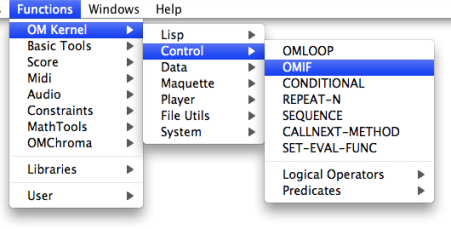
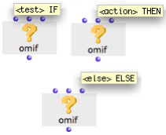
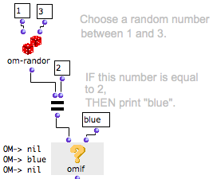
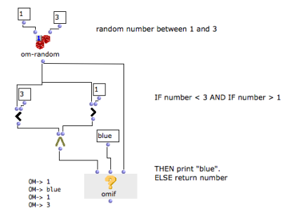

Navigation : [Previous](ConditionalOps "page
précédente\(Conditional Operators\)") | [Next](Conditional "page
suivante\(Conditional\)")

# OMif : If, Then, Else

The behaviour of omif can be described by the following proposition : "IF the
A condition is verified, THEN execute the B operation, ELSE execute the C
operation".

The omif box can be accessed via the `Functions / Kernel / Control / OMIF`
menu (or typing "OMIF" in the patch window).

Box Inputs

|

Omif has two default inputs and one optional input :

  * "test" stands for "if" : it represents the test of a condition in a given proposition. 
  * "action" stands for "then" : it represents the consequence of the test in the same proposition. 
  * "else" : allows to perform another operation if the condition is not fulfilled.

Each input accepts a function, a factory, or a data box.  
  
---|---  
  
To add or delete the optional "else" argument : press `Alt` +`<-` or `->`  /
`SHIFT` \+ `>` or `<`.

Behaviour

"Test" evaluates the box it is connected to and checks if a number of
conditions for the operation are fulfilled.

  * If the box yields something else than "nil", the conditional test is verified, and " then" evaluates the box connected to its second input.
  * It the box yields "nil", OMIF returns the same "nil" value.

Omif is evaluated like any other box, and returns the value yielded by "then"
or "else".

Example : IF, THEN

Here, "test" evaluates the om= predicate, which checks if the value returned
by om-random is equal to 2.

  * If the condition is not fulfilled, om= and OMIF return "nil".
  * If the condition is fulfilled, OMIF evaluates the data box connected to its second input, and returns "blue". 

|

  
  
---|---  
  
Here, "test" is determined by the om= predicate, but it can also be connected
to any other type of box.

For Full Information about Predicates :

  * [Predicates : Testing Relations and Properties](Predicates)

Example : IF, THEN, ELSE

In this example, "else" has been added to OMIF. If the condition is not
fulfilled, OMIF doesn't return "nil", but the random number.

Adding Optional Arguments

  * [Additional Inputs : Optional, Keyword and Rest Arguments](AdditionalInputs)

References :

Plan :

  * [OpenMusic Documentation](OM-Documentation)
  * [OM User Manual](OM-User-Manual)
    * [Introduction](00-Sommaire)
    * [System Configuration and Installation](Installation)
    * [Going Through an OM Session](Goingthrough)
    * [The OM Environment](Environment)
    * [Visual Programming I](BasicVisualProgramming)
    * [Visual Programming II](AdvancedVisualProgramming)
      * [Abstraction](Abstraction)
      * [Evaluation Modes](EvalModes)
      * [Higher-Order Functions](HighOrder)
      * [Control Structures](Control)
        * [Predicates](Predicates)
        * [Conditional Operators](ConditionalOps)
          * OMif
          * [Conditional](Conditional)
        * [Logical Operators](Logical)
        * [Sequential Operators](Sequencial)
      * [Iterations: OMLoop](OMLoop)
      * [Instances](Instances)
      * [Interface Boxes](InterfaceBoxes)
      * [Files](Files)
    * [Basic Tools](BasicObjects)
    * [Score Objects](ScoreObjects)
    * [Maquettes](Maquettes)
    * [Sheet](Sheet)
    * [MIDI](MIDI)
    * [Audio](Audio)
    * [SDIF](SDIF)
    * [Lisp Programming](Lisp)
    * [Errors and Problems](errors)
  * [OpenMusic QuickStart](QuickStart-Chapters)

Navigation : [Previous](ConditionalOps "page
précédente\(Conditional Operators\)") | [Next](Conditional "page
suivante\(Conditional\)")

