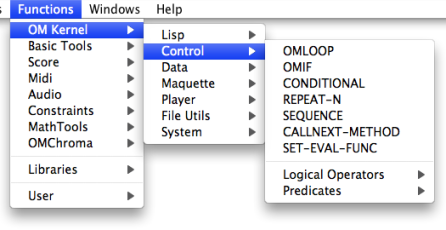

Navigation : [Previous](Sequencial "page précédente\(Sequential
Operators\)") | [Next](LoopIntro "Next\(Iteration\)")

# Iterations: OMLoop

|

A great number of compositional operations, be they basic or more complex, are
**iterative processes**. This is the case, for instance, of transposition,
combinatorial manipulations, scale building, and so on. Such processes can be
designed in OM via a specific tool : the **OMLoop module** .  
  
---|---  
  

The OMLoop module is available in the `OM Kernel / Control` menu.

Another Way of Designing Iterative Processes with Mapcar

  * [Lambda Mode Examples: Mapcar \- Iterations](Mapcar)

Text Files Iterations

  * [File-Box : Iterative File Input/Output Processes](File-Box)

References :

Contents :

  * [OpenMusic Documentation](OM-Documentation)
  * [OM User Manual](OM-User-Manual)
    * [Introduction](00-Contents)
    * [System Configuration and Installation](Installation)
    * [Going Through an OM Session](Goingthrough)
    * [The OM Environment](Environment)
    * [Visual Programming I](BasicVisualProgramming)
    * [Visual Programming II](AdvancedVisualProgramming)
      * [Abstraction](Abstraction)
      * [Evaluation Modes](EvalModes)
      * [Higher-Order Functions](HighOrder)
      * [Control Structures](Control)
      * Iterations: OMLoop
        * [Iteration](LoopIntro)
        * [General Features](LoopGeneral)
        * [Evaluators](LoopEvaluators)
        * [Iterators](LoopIterators)
        * [Accumulators](LoopAccumulators)
        * [Example : A Random Series](LoopExample)
      * [Instances](Instances)
      * [Interface Boxes](InterfaceBoxes)
      * [Files](Files)
    * [Basic Tools](BasicObjects)
    * [Score Objects](ScoreObjects)
    * [Maquettes](Maquettes)
    * [Sheet](Sheet)
    * [MIDI](MIDI)
    * [Audio](Audio)
    * [SDIF](SDIF)
    * [Reactive mode](Reactive)
    * [Lisp Programming](Lisp)
    * [Errors and Problems](errors)
  * [OpenMusic QuickStart](QuickStart-Chapters)

Navigation : [Previous](Sequencial "page précédente\(Sequential
Operators\)") | [Next](LoopIntro "Next\(Iteration\)")

