Navigation : [Previous](RT1 "(Rhythm Trees)") | [Next](RT2 "(Notation : in Practice)")

#   Rhythm Trees in details

The Rhythm Tree format ( _RT_ ) must be understood as an alternative in the description of symbolic rhythmical structures that allows a complete cohesion with  traditional to most complex musical notation. This format was issued from different attempts in rhythmical descriptions that have been explored in Patchwork and OpenMusic environments \[1\].

## A.    The syntax

An _RT_ is defined as a couple (_D S_) where

*   D is a number (integer or fractional > 0) expressing a time extent
*   S is a list of n-elements defining a set of proportions to take place in D, each item of S being either :
    *   an integer
    *   or or an _RT_ , a list having exactly (and recursively) the same structure than D.

 Here are some _RTs_ that complies with the above syntax:

> (1 (1 1 1 1)) 

 a structure whose extent is, say, a whole-note (1), and which contains 4 equally lasting values, 4 quarter notes inthat case.

> **(2** **(** (**1** (1 1 1 1)) (**1** (1 1 1 1)) **)**

 a structure lasting two whole-notes, containing two equal substructures, each lasting a whole-note. These substructures in turn contain 4 equal values i.e. quarter notes. So it can be interpreted as a voice containing 2 measures in 4/4.

## B.    The Semantics

For an _RT_ = ( _D S_ ), _D_ expresses a temporal field (a duration).  _S_ defines a group of proportions taking place in _D_. For example, for _RT_ = (1 (1 1 1 1)) and the unit being the quarter note, the represented rhythm will be the following:

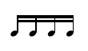

When the number _D_ is at the level of a voice, it is by convention expressed in whole-note units.

When the number _D_ is at the level of a measure, it is by convention expressed in whole-note units, and it may also be expressed by a ratio e.g.:

> 4/4, 7/8, 5/2

or a list e.g. :

> (4 4) (7 8) (5 2)

which meaning is the usual musical one for time signature. Due to a specificity of the underlying Common Lisp system, ratios like 4/4 are automatically simplified (i.e. 4/4 = 1). In that case, the list form should be chosen (i.e. (4 4)) or , alternatively, he special notation 4//4.

To avoid tedious calculations, D can be replaced by a question-mark '**?**'. In that case OM will figure out the actual value of D. Our previous example can then be rewritten as :

> **(?** **(** (**1** (1 1 1 1)) (**1** (1 1 1 1)) **)**

The _RT_ structure allows us to express in a most coherent manner different type of musical objects. Polyphonies, voices, measures, groups[\[3\]](#_ftn3) are expressed as _RT_s.

By convention, when the value of _D_ is on the measure level it will be expressed in a whole note unit[\[4\]](#_ftn4). For example, if we wish to express a measure of 3/4  containing three quarter notes, the _RT_ will be:

> ((3 4)  (1  1  1))

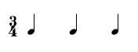

As defined previously, _S_ illustrates a set of proportions taking place in _D_. This is shown in the following example:

> ((4 4) (1   2     1))

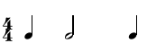

Up till now we have examined _RTs_ where _S_ was a set of simple elements (integers) that represented notes (pulses). In the following tree we will see more complex elements appearing in the place of _S_ :

> ((4 4) (1 (2 (1 1 1)) (1 (1 1 1))))

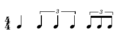

The _RTs_ recursively contained in _S_ represent what we will call groups. In general, groups are graphically represented as notes grouped by their stems. Alike measures, groups can also embed other groups as shown in the example below:

> ((4 4) (1 (1 ( 1 1 (1 (1 1 1)) 1 1)) 2))

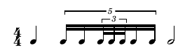

We will extend the _RT_s syntax in order to incorporate rests and ties that will be respectively represented by negative integers and floats.

> ((4 4) (1 1.0  –1   1))

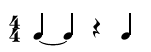

An _RT_ expresses not only an absolute rhythm (proportional durations) but also its representation (symbolic representation). As we may observe below, the two rhythms being identical in proportion are different graphically (the second _RT_ contains two groups):

> ((2 4) (2 2 2 2)) ((2 4) ((1(1 1))(1(1 1)))

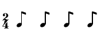
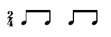

In some cases we might obtain syntactically correct _RT_s with no traditional notational equivalency. Let us take for example the following _RT_  ((5 4) (5)) that corresponds to the rhythm:

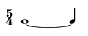

the associated _RT_ is ((5 4) (4 1.0)). OpenMusic will automatically recalculate it as so for visualization.

### Grace notes

Grace notes are expressed in the _RTs_ as follows:

A single grace note is represented as a 0 integer:
 
> (? (((4 4) (1 0 2 1))))

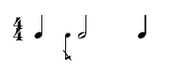

A group of grace notes will therefore be represented as an _RT_  group where _D_ is 0: 

> (? (((4 4) (1 (0 (1 1 1)) 2 1))))

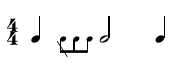

It is also possible to have a grace note before a rest as it is the case in this example:

> (1 (((4 4) (1 0 -1 (1 (1 1 1)) 1))))

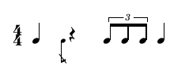

## B.     Rhythm Trees and OpenMusic editors

For rhythm trees edition in OM's score editors please see  [Rhythmic Objects](Editor-Rhythm)

## References

\[1\]    G. Assayag, C. Rueda, M. Laurson, C. Agon, and O. Delerue. "Computer assisted composition at Ircam: PatchWork & OpenMusic," _Computer Music Journal 23:3_, 1999.

\[2\]    G. Cindy. "The notation interchange file format: a Windows compliant approach," _E. Selfridge-Field, ed. Beyond MIDI  \- A Handbook of Musical Codes_. Massachusetts : MIT Press. , 1997.

\[3\]    H. Hoos, K. A. Hamel, K. Renz, J. Kilian. "The GUIDO music notation format - a novel approach for adequately representing score-level music," _ICMC'98 Proceedings_, p.451-454, Ann Arbor, 1998.

\[4\]    R. Mounce. "A brief discussion of standard music description language," _ISO/IEC Draft International Standard 10743_, 1996.

\[5\]    B. Schottstaedt. "Common music notation," _E. Selfridge-Field, ed. Beyond MIDI  \- A Handbook of Musical Codes_. Massachusetts : MIT Press. , 1997.

- - -

## Contents :

  * [OpenMusic Documentation](OM-Documentation)
  * [OM User Manual](OM-User-Manual)
    * [Introduction](00-Contents)
    * [System Configuration and Installation](Installation)
    * [Going Through an OM Session](Goingthrough)
    * [The OM Environment](Environment)
    * [Visual Programming I](BasicVisualProgramming)
    * [Visual Programming II](AdvancedVisualProgramming)
    * [Basic Tools](BasicObjects)
    * [Score Objects](ScoreObjects)
      * [Presentation](Score-Objects-Intro)
      * [Rhythm Trees](RT)
        * Rhythm Trees Structure(RT1)
        * Rhythm Trees in details
        * [Notation : in Practice](RT2)
      * [Score Players](ScorePlayer)
      * [Score Editors](ScoreEditors)
      * [Quantification](Quantification)
      * [Export / Import](ImportExport)
    * [Maquettes](Maquettes)
    * [Sheet](Sheet)
    * [MIDI](MIDI)
    * [Audio](Audio)
    * [SDIF](SDIF)
    * [Lisp Programming](Lisp)
    * [Reactive mode](Reactive)
    * [Errors and Problems](errors)
  * [OpenMusic QuickStart](QuickStart-Chapters)

Navigation : [Previous](RT1 "(Rhythm Trees)") | [Next](RT2 "(Notation : in Practice)")
