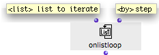
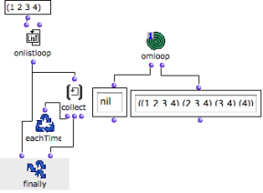
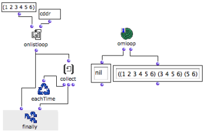

Navigation : [Previous](ListLoop "page précédente\(List Loop\)") |
[Next](ForLoop "Next\(For Loop\)")

# OnListLoop : Enumerating Subsets of Lists

## General Properties

**OnListLoop** returns a list  and then **successive smaller chunks** of the
list. The execution ends once the list is exhausted.

|

Onlistloop has one default input and one optional input :

  * "list" : a list
  * "by" : a box defining **the way the list is exhausted** .

  
  
---|---  
  
## Controling Subsets Enumeration

"By"

The default value of "by" is a cdr. This means that, at each loop, the cdr of
the list is returned.

This default value can be replaced by any other Lisp function meant to return
a small chunk of list, just as  [listloop](ListLoop) .

Examples

Here, onlistloop successively returns smaller chunks of the list, by taking
away **the first element** of the list : it returns cdrs.

The result of each loop is collected by collect and returned by the second
input of finally.

|

  
  
---|---  
  
The value of "by" is switched to cddr. Onlistloop successively returns cdrs of
cdrs : at each step, the **two first elements** of the list are left aside.

Note that the first input of finally always returns "nil" at the end of the
loop.

References :

Contents :

  * [OpenMusic Documentation](OM-Documentation)
  * [OM User Manual](OM-User-Manual)
    * [Introduction](00-Contents)
    * [System Configuration and Installation](Installation)
    * [Going Through an OM Session](Goingthrough)
    * [The OM Environment](Environment)
    * [Visual Programming I](BasicVisualProgramming)
    * [Visual Programming II](AdvancedVisualProgramming)
      * [Abstraction](Abstraction)
      * [Evaluation Modes](EvalModes)
      * [Higher-Order Functions](HighOrder)
      * [Control Structures](Control)
      * [Iterations: OMLoop](OMLoop)
        * [Iteration](LoopIntro)
        * [General Features](LoopGeneral)
        * [Evaluators](LoopEvaluators)
        * [Iterators](LoopIterators)
          * [List Loop](ListLoop)
          * OnList Loop
          * [For Loop](ForLoop)
          * [While Loop](WhileLoop)
          * [Infinite Loops](InfiniteLoops)
        * [Accumulators](LoopAccumulators)
        * [Example : A Random Series](LoopExample)
      * [Instances](Instances)
      * [Interface Boxes](InterfaceBoxes)
      * [Files](Files)
    * [Basic Tools](BasicObjects)
    * [Score Objects](ScoreObjects)
    * [Maquettes](Maquettes)
    * [Sheet](Sheet)
    * [MIDI](MIDI)
    * [Audio](Audio)
    * [SDIF](SDIF)
    * [Lisp Programming](Lisp)
    * [Reactive mode](Reactive)
    * [Errors and Problems](errors)
  * [OpenMusic QuickStart](QuickStart-Chapters)

Navigation : [Previous](ListLoop "page précédente\(List Loop\)") |
[Next](ForLoop "Next\(For Loop\)")

