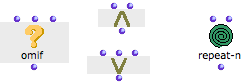
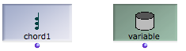

Navigation : [Previous](AbsBoxesIntro "page
précédente\(Abstraction Boxes\)") | [Next](BoxInputs "page
suivante\(Box Inputs\)")

# Other Boxes

Other types of OM boxes, related to more advanced programming concepts are
detailed in specifically sections of the [Advanced
Programming](AdvancedVisualProgramming) section.

## Control Boxes

[Control boxes](Control) are specific functions, which allow to choose
between several operations to execute, and or to control the execution of a
patch :

About Control Boxes

  * [Conditional Operators](ConditionalOps)

## Instance Boxes and Global Variables

[Instance boxes](InstanceBoxes) and [global
variables](GlobalVariables) refer to permanent objects used as reference
material.

About Instances and Global Variables

  * [Instances](Instances)

References :

Contents :

  * [OpenMusic Documentation](OM-Documentation)
  * [OM User Manual](OM-User-Manual)
    * [Introduction](00-Contents)
    * [System Configuration and Installation](Installation)
    * [Going Through an OM Session](Goingthrough)
    * [The OM Environment](Environment)
    * [Visual Programming I](BasicVisualProgramming)
      * [Patch Introduction](ProgrammingIntro)
      * [Adding Boxes Into a Patch](AddingBoxes)
      * [Elementary Manipulations](ElementaryManips)
      * [Boxes](Boxes)
        * [Boxes Features](GraphicFeatures)
        * [Data Boxes](DataBox)
        * [Function Boxes](FunctionBoxes)
        * [Objects - Factory Boxes](FactoryBoxes)
        * [Abstraction Boxes](AbsBoxesIntro)
        * Other Boxes
      * [Box Inputs](BoxInputs)
      * [Connections](Connections)
      * [Evaluation](Evaluation)
      * [Documentation and Info](DocAndInfo)
      * [Comments](Comments)
      * [Pictures](Pictures)
      * [Saving / Reloading a Patch](SavingPatch)
      * [Dead Boxes](DeadBox)
    * [Visual Programming II](AdvancedVisualProgramming)
    * [Basic Tools](BasicObjects)
    * [Score Objects](ScoreObjects)
    * [Maquettes](Maquettes)
    * [Sheet](Sheet)
    * [MIDI](MIDI)
    * [Audio](Audio)
    * [SDIF](SDIF)
    * [Lisp Programming](Lisp)
    * [Reactive mode](Reactive)
    * [Errors and Problems](errors)
  * [OpenMusic QuickStart](QuickStart-Chapters)

Navigation : [Previous](AbsBoxesIntro "page
précédente\(Abstraction Boxes\)") | [Next](BoxInputs "page
suivante\(Box Inputs\)")

