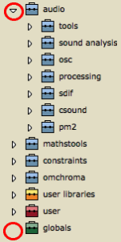
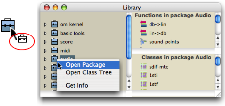
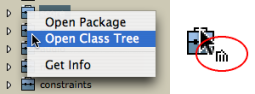
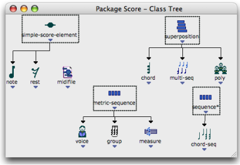
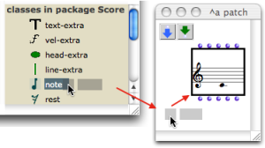

Navigation : [Previous](Library "page précédente\(Library\)") |
[Next](UserLibraries "Next\(Extra Libraries\)")

# Packages

Contents

  1. Packages of the Library Window
  2. Packages Content
  3. Using Classes and Functions from the Libary
  4. Creating / Editing the Library Items

Package

A package represents a category of programming tools that encloses related
functions and classes. It can be organized in sub packages.

## Packages of the Library Window

Each package is represented by a small suitcase.

 The OM Packages are the most numerous. They contain
classes[1] and functions[2] predefined in OM. OM Packages are defined
thematically.

For instance, the Score package contains classes that are literally dedicated
to the score domain, such as chords, notes, polyphonies, and functions that
can perform operations upon these classes.

These packages and their content are "protected" and cannot be modified by the
user.

 The User Package can receive user-defined classes and
functions, which can be dispatched in dedicated sub packages. These classes
and functions can be modified.

  The User Libraries package encloses a set of
additional libraries that can be added or loaded dynamically.

 The Globals package is a special folder that
contains user-defined global variables[3]. It cannot contain sub packages.

If a package is supposed to contain sub packages, it features an adjacent
triangle that allows to open a package on  **List mode** . When this triangle
is clicked, the package unfolds and displays its inner sub packages - see
below.

|

  
  
---|---  
  
About Global Variables

  * [Global Variables](GlobalVariables)

About User Libraries

  * [Extra Libraries](UserLibraries)

Getting Information

To get information about a select package, class or function of the library,
use the `Info` window :

  * `Ctrl` / right click on an item and choose `Get Info `
  * select `File / Get Info`
  * press `Cmd` \+ `i` .

Information related to the items of the User package can also be edited.

## Packages Content

A package gives access to both functions and classes of a common "theme", or
category of tools. Packages contents can be displayed in  **'Package' mode**
or ' **Class Tree' mode** .

The default presentation allows to get a global view of a package whole
organization in sub packages.

Classes and functions contained in the sub packages cannot be accessed,
though.

|

Displaying packages in the Library window. We can see sub packages, but
classes and functions cannot be accessed.  
  
---|---  
  
Opening Packages in Package Mode

The Package mode allows to access the set of tools contained in a package as a
whole : sub packages cannot be visualized.

  * `Ctrl` / right click on the suitcase and choose `Open Package`.
  * Double click on the ** lower part ** of the suitcase.

The window extends to display two side panels, respectively containing the
package's functions and classes.

Their content is refreshed at the selection of another package.

Opening Packages in Class Tree Mode

A " **class tree** " shows the inheritance between the classes of a common
package.

  * `Ctrl` / right click on the suitcase and choose `Open Class Tree`
  * click on the  ** upper part ** of the suitcase. 

|

  
  
---|---  
  
The class tree is displayed in a new window. Class trees of the  User sub
packages can be created and modified graphically.

More Information about Class Trees and User Defined Material

  * [Object Oriented Programming](OOP)

## Using Classes and Functions from the Libary

Dropping Items in Patches

|

Tools can be dropped in patches from the library window.  
  
---|---  
  
Using the OM menus

Note that the OM Functions and Classes menus are organized following the
Library packages structure, and can also be used to select items from the
different OM packages.

Adding boxes into a patch

  * [Adding Boxes Into a Patch](AddingBoxes)

## Creating / Editing the Library Items

New Classes[1] and Generic Functions[4] can be created in the
 user package or its sub-packages.

Additional methods can also be added to the existing functions of the OM
packages.

Creating/Editing Classes and Functions

  * [Object Oriented Programming](OOP)

References :

  1. Class

A category of objects sharing common properties - characteristics and
behaviour. A class specifies the internal structure and behaviour of an
object. In OM, it is represented in a patch by a factory box that can produce
an instance of a class.

See also : Object, Instance

  2. Function

A  portion of code within a larger program, which performs a specific task.
Operates upon 0 or more parameters and returns a value.

  3. Global variable

An instance of OM object that has been saved in order to be used in other
programs. Global variables are visible from the `Library` window and stored as
.omi files in the `Globals` folder of the workspace.

  4. Generic Function

In object oriented programming, a generic function is a collection of methods
- elementary specialized functions - with the same name and argument
structure, but with arguments typed differently.

See also : Method

Contents :

  * [OpenMusic Documentation](OM-Documentation)
  * [OM User Manual](OM-User-Manual)
    * [Introduction](00-Contents)
    * [System Configuration and Installation](Installation)
    * [Going Through an OM Session](Goingthrough)
    * [The OM Environment](Environment)
      * [Environment Windows](MainWindows)
      * [Preferences](Preferences)
      * [Workspace](Workspace)
      * [Library](Library)
        * Packages
        * [Extra Libraries](UserLibraries)
      * [Tutorials](Tutorials)
      * [Resources](resources)
    * [Visual Programming I](BasicVisualProgramming)
    * [Visual Programming II](AdvancedVisualProgramming)
    * [Basic Tools](BasicObjects)
    * [Score Objects](ScoreObjects)
    * [Maquettes](Maquettes)
    * [Sheet](Sheet)
    * [MIDI](MIDI)
    * [Audio](Audio)
    * [SDIF](SDIF)
    * [Lisp Programming](Lisp)
    * [Errors and Problems](errors)
  * [OpenMusic QuickStart](QuickStart-Chapters)

Navigation : [Previous](Library "page précédente\(Library\)") |
[Next](UserLibraries "Next\(Extra Libraries\)")

